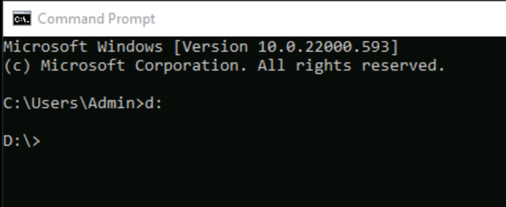
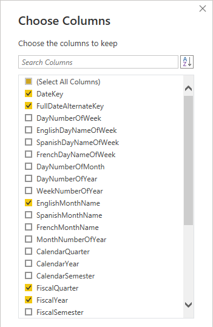

---
lab:
  title: スター スキーマ モデルを作成する
  module: Prepare data for tabular models in Power BI
---

# スター スキーマ モデルを作成する

## 概要

**このラボの推定所要時間: 30 分**

このラボでは、Power BI Desktop を使って、Azure Synapse Adventure Works データ ウェアハウスを介してデータ モデルを開発します。 データ モデルを使用すると、データ ウェアハウスを介してセマンティック レイヤーを公開できます。

このラボでは、次の作業を行う方法について説明します。

- Azure Synapse Analytics SQL プールへの Power BI 接続を作成する。

- モデル クエリを開発する。

- モデル図を整理する。

## はじめに

この演習では、環境を準備します。

### Azure Synapse Analytics にデータを読み込む

   > **注**: git クローンを使ってデータを Azure Synapse Analytics に既に読み込んでいる場合は、このタスクをスキップして **Power BI のセットアップ**に進んでかまいません。

1. 組織の資格情報 (または提供されたもの) を使用して、[Azure portal](https://portal.azure.com) にサインインします。
2. ページ上部の検索バーの右側にある **[\>_]** ボタンを使用して、Azure portal に新しい Cloud Shell を作成します。メッセージが表示された場合は、***PowerShell*** 環境を選択して、ストレージを作成します。 次に示すように、Azure portal の下部にあるペインに、Cloud Shell のコマンド ライン インターフェイスが表示されます。

    

    > **注**: 前に *Bash* 環境を使ってクラウド シェルを作成している場合は、そのクラウド シェル ペインの左上にあるドロップダウン メニューを使って、***PowerShell*** に変更します。

3. ペインの上部にある区分線をドラッグして Cloud Shell のサイズを変更したり、ペインの右上にある **&#8212;** 、 **&#9723;** 、**X** アイコンを使用して、ペインを最小化または最大化したり、閉じたりすることができます。 Azure Cloud Shell の使い方について詳しくは、[Azure Cloud Shell のドキュメント](https://docs.microsoft.com/azure/cloud-shell/overview)をご覧ください。

4. PowerShell ペインで、次のコマンドを入力して、このリポジトリをクローンします。

    ```
    rm -r dp500 -f
    git clone https://github.com/MicrosoftLearning/DP-500-Azure-Data-Analyst dp500
    ```

5. リポジトリがクローンされたら、次のコマンドを入力して **setup** フォルダーに変更し、そこに含まれている **setup.ps1** スクリプトを実行します。

    ```
    cd dp500/Allfiles/04
    ./setup.ps1
    ```

6. メッセージが表示されたら、Azure Synapse SQL プールに設定する適切なパスワードを入力します。

    > **注**: このパスワードは忘れないようにしてください。

7. スクリプトの完了まで待ちます。通常、約 20 分かかりますが、さらに時間がかかる場合もあります。
8. Synapse ワークスペースと SQL プールを作成して、データを読み込んだ後、Azure の不要な料金を防ぐため、プールはスクリプトによって一時停止されます。 Azure Synapse Analytics でデータを使用する準備ができたら、SQL プールを再開する必要があります。

### このコースのリポジトリを複製する

1. スタート メニューで、コマンド プロンプトを開きます

    
2. コマンド プロンプト ウィンドウで、次のように入力して D ドライブに移動します。

    `d:`

   Enter キーを押します。

    

3. コマンド プロンプト ウィンドウで、次のコマンドを入力して、コース ファイルをダウンロードし、DP500 という名前のフォルダーに保存します。

   `git clone https://github.com/MicrosoftLearning/DP-500-Azure-Data-Analyst DP500`

4. リポジトリが複製されたら、エクスプローラーで D ドライブを開き、ファイルがダウンロードされていることを確認します。

### Power BI を設定する

このタスクでは、Power BI を設定します。

1. Power BI Desktop を開くには、タスク バーにある **Power BI Desktop** のショートカットを選択します。

2. 右上にある **[X]** を選択して、作業の開始ウィンドウを閉じます。

3. まだサインインしていない場合は、Power BI Desktop の右上隅にある **[サインイン]** を選択します。 組織の資格情報 (または提供されたラボの資格情報) を使用して、サインイン プロセスを完了します。

4. Microsoft Edge の Power BI サインアップ ページにリダイレクトされます。 **[続行]** を選択してサインアップを完了します。

   

5. 10 桁の電話番号を入力し、 **[開始]** を選択します。 **[開始]** をもう一度選択します。 Power BI にリダイレクトされます。

6. 右上にあるプロファイル アイコンを選択し、 **[無料体験する]** を選択します。

   

7. メッセージが表示されたら、 **[無料体験する]** を選択します。

8. 残りのタスクをすべて行って、試用版のセットアップを完了します。

   "ヒント: Power BI の Web ブラウザー エクスペリエンスは、**Power BI サービス**と呼ばれます。"**

9. [ワークスペース] を選択し、 **[ワークスペースの作成]** を選択します。

    

10. DP500 labs という名前のワークスペースを作成し、 **[保存]** を選択します。

    "*注: ワークスペース名は、テナント内で一意である必要があります。エラーが発生した場合は、ワークスペース名を変更します。* "

11. Power BI Desktop に戻ります。 画面の右上隅に "**サインイン**" が表示されたら、ラボ環境の [リソース] タブで提供されている資格情報を使用してもう一度サインインします。 既にサインインしている場合は、次の手順に進みます。

12. Power BI Desktop に移動し、 **[ファイル]** 、 **[オプションと設定]** 、 **[オプション]** 、 **[セキュリティ]** の順に選択し、[認証ブラウザー] で **[既定の Web ブラウザーを使用する]** をオンにして **[OK]** を選択します。 Power BI Desktop を閉じます。 ファイルを保存しないでください。

    "次の演習で Power BI Desktop をもう一度開きます。"**

### SQL プールを開始する

このタスクでは、SQL プールを開始します。

1. Microsoft Edge で、[https://portal.azure.com](https://portal.azure.com/) に移動します。

1. ラボの資格情報を使用してサインイン プロセスを完了します。

1. Azure サービスから **[Azure Synapse Analytics]** を選択します。 Synapse ワークスペースを選択します。

   

1. 専用の SQL プールを見つけて選択します。

   

1. SQL プールを再開します。

   

   "重要: SQL プールはコストのかかるリソースです。このラボで作業する場合は、このリソースの使用を制限してください。このラボの最後のタスクには、リソースの一時停止を促す指示があります。"**

### Power BI ワークスペースを Azure Synapse Analytics にリンクする

このタスクでは、既存の Power BI ワークスペースを Azure Synapse Analytics ワークスペースにリンクします。

1. Azure portal の専用 SQL プールから、リボンの **[Synapse Studio で開く]** を選択します。

1. Azure Synapse Studio のホーム ページで、 **[視覚化]** を選択して Power BI ワークスペースをリンクします。

   

1. **[ワークスペース名]** ドロップダウンから、前のタスクで作成したワークスペースを選択し、 **[作成]** を選択します。

 


1. **[管理]** に移動し、 **[すべて発行]** を選択して、変更が発行されていることを確認します。

## データ モデルを開発する

この演習では、データ ウェアハウス リセラーの販売サブジェクトの Power BI 分析とレポート作成をサポートする DirectQuery モデルを開発します。

### データ ファイルをダウンロードする

このタスクでは、Synapse Studio から Power BI データ ソース ファイルをダウンロードします。

1. 左側にある **Synapse Studio** で、 **[開発]** ハブを選択します。

 

2. **[開発]** ペインで、 **[Power BI]** を展開し、ワークスペースを展開して、 **[Power BI データ セット]** を選択します。 表示されない場合は、 **[すべて公開]** をクリックしてワークスペースを公開し、ブラウザーを更新します。

 

 *注: ここにデータが表示されない場合は、専用の SQL プールが実行されていること、および Power BI ワークスペースが Synapse ワークスペースにリンクされていることを確認します。*

3. **[Power BI データ セット]** ペインで、 **[新しい Power BI データセット]** を選択します。

 

4. 左側のペインの下部にある **[開始]** を選択します。

 

5. お使いの SQL プールを選択し、 **[sqldw]** 、 **[続行]** の順に選択します。

 

6. .pbids ファイルをダウンロードするには、 **[ダウンロード]** を選択します。

 

 ".pbids ファイルには、SQL プールへの接続が含まれます。これは、プロジェクトを開始するための便利な方法です。プロジェクトを開くと、SQL プールへの接続の詳細が既に格納されている新しい Power BI Desktop ソリューションが作成されます。"**

7. .pbids ファイルがダウンロードされたら、それを開きます。

 "ファイルが開くと、接続を使用してクエリを作成するように求められます。次のタスクでは、これらのクエリを定義します。"**

### モデル クエリを作成する

このタスクでは、それぞれがテーブルとしてモデルに読み込まれる 5 つの Power Query クエリを作成します。

1. Power BI Desktop の **[SQL Server データベース]** ウィンドウで、左側にある **[Microsoft アカウント]** を選択します。

 

2. **[サインイン]** を選択します。

3. 提供されたラボの Azure 資格情報を使用してサインインします。

4. **[接続]** を選択します。

 

5. **[ナビゲーター]** ウィンドウで、 **[DimDate]** テーブルを選択します (オンにしないでください)。

6. 右側のペインで、テーブル行のサブセットを示すプレビュー結果を確認します。

 

7. (モデル テーブルになる) クエリを作成するには、次の 7 つのテーブルをオンにします。

- DimDate

- DimProduct
  
- DimProductCategory
  
- DimProductSubcategory

- DimReseller

- DimSalesTerritory

- FactResellerSales

8. クエリに変換を適用するには、右下にある **[データの変換]** を選択します。

 

 "データを変換すると、モデルで使用できるデータを定義できます。"**

9. **[接続設定]** ウィンドウで、 **[DirectQuery]** オプションを選択します。

 

 "この決定は重要です。DirectQuery はストレージ モードです。DirectQuery ストレージ モードを使用するモデル テーブルにデータは格納されません。このため、Power BI レポート ビジュアルで DirectQuery テーブルのクエリを実行すると、Power BI によってネイティブ クエリがデータ ソースに送信されます。このストレージ モードは、Azure Synapse Analytics などの大規模なデータ ストアに対して (大量のデータをインポートすることは非現実的または非経済的である可能性があるため)、または凖リアルタイムの結果が必要な場合に使用できます。"**

10. **[OK]** を選択します。

 

11. **Power Query エディター** ウィンドウの **[クエリ]** ペイン (左側にあります) で、オンにしたテーブルごとに 1 つのクエリがあることを確認します。

 "次に、各クエリの定義を変更します。各クエリは、モデルに適用されるとモデル テーブルになります。次に、クエリの名前を、クエリをわかりやすくかつ簡潔に説明する名前に変更し、変換を適用して、既知のレポート要件で必要な列を提供します。"**

12. **[DimDate]** クエリを選択します。

 

13. クエリの名前を変更するには、 **[クエリの設定]** ペイン (右側にあります) で、 **[名前]** ボックスのテキストを「**Date**」に置き換えて、**Enter** キーを押します。

 

14. 必要のない列を削除するには、 **[ホーム]** リボン タブの **[列の管理]** グループ内から、 **[列の選択]** アイコンを選びます。

 

15. **[列の選択]** ウィンドウで、すべてのチェックボックスをオフにするには、先頭のチェックボックスをオフにします。

 

16. 次の 5 つの列をオンにします。

- DateKey

- FullDateAlternateKey

- EnglishMonthName

- FiscalQuarter

- FiscalYear

 

 "この列の選択によって、モデルで何を使用できるかが決まります。"**

17. **[OK]** を選択します。

 

18. **[クエリの設定]** ウィンドウの **[適用したステップ]** の一覧で、他の列を削除するためのステップが追加されたことを確認します。

 

 Power Query により、目的の構造とデータを実現するための手順が定義されます。各変換は、クエリ ロジックのステップになります。**

19. **FullDateAlternateKey** 列の名前を変更するには、**FullDateAlternateKey** 列のヘッダーをダブルクリックします。

20. テキストを「**Date**」に置き換えて、**Enter** キーを押します。

 

21. 適用される新しいステップがクエリに追加されていることを確認します。

 

22. 次の列の名前を変更します。

- **EnglishMonthName** を **Month**

- **FiscalQuarter** を **Quarter**

- **FiscalYear** を **Year**

23. クエリのデザインを検証するには、ステータス バー (ウィンドウの下部にあります) で、クエリに 5 つの列があることを確認します。

 

 "重要: クエリのデザインが一致しない場合は、演習の手順を確認して修正します。"**

 "以上で、**Date** クエリのデザインが完了しました。"**

24. **[適用されたステップ]** ペインで、最後のステップを右クリックし、 **[ネイティブ クエリを表示]** を選択します。

 

25. **[ネイティブ クエリ]** ウィンドウで、SELECT ステートメントでクエリのデザインが反映されていることを確認します。

 "この概念は重要です。ネイティブ クエリは、Power BI でデータ ソースのクエリに使用されるクエリです。最適なパフォーマンスを確保するために、データベース開発者は、適切なインデックスなどを作成して、このクエリを確実に最適化する必要があります。"**

26. **[ネイティブ クエリ]** ウィンドウを閉じるには、 **[OK]** を選択します。

 

27. **DimProductCategory** テーブルを選択します。

28. クエリの名前を「**Product Details**」に変更します。

29. リボンの [ホーム] タブの [結合] グループで、 **[クエリのマージ]** を選択します。

 *注: 製品の詳細、カテゴリ、サブカテゴリを取得するためにクエリをマージしています。これは Product ディメンションで使用されます。*

30. **[DimProductSubcategory]** テーブルを選択し、各テーブルの **[ProductCategoryKey]** 列を選択します。 **[OK]** を選択します。

 

 *注: このマージには、既定の結合の左外部結合を使用します。*

31. **[DimProductSubcategory]** 列を展開します。 **[ProductSubcategoryKey]** と **[EnglishProductSubcategoryName]** 列を選択します。 **[元の列名をプレフィックスとして使用します]** をオフにします。

 

 *この展開機能を使用すると、テーブルをソース データの外部キー制約に基づいて結合できます。このラボで使用している設計アプローチでは、snowflake ディメンション テーブルを結合してデータの非正規化表現を生成します。*

32. **[OK]** を選択します。

33. **DimProductSubcategory.ProductSubcategoryKey** 列の名前を **ProductSubcategoryKey** に、**DimProductSubcategory.EnglishProductSubcategoryName** 列の名前を **EnglishProductSubcategoryName** に変更します。

34. 以下を除くすべての列を削除します。

   - ProductSubcategoryKey

   - EnglishProductCategoryName

   - EnglishProductSubcategoryName

   これで、37 行の列が 3 つ作成されます。

35. **DimProduct** クエリを選択します。

 

36. クエリの名前を「**Product**」に変更します。

 

37. リボンの [ホーム] タブの [結合] グループで、 **[クエリのマージ]** を選択します。

38. **[製品の詳細]** テーブルを選択し、Product テーブルと Product details テーブルの両方で **[ProductSubcategoryKey]** 列を選択します。

    

39. **[OK]** を選択します。

40. [製品の詳細] 列を展開し、 **[EnglishProductSubcategoryName]** と **[EnglishProductCategoryName]** の列を選択します。

    

41. **[OK]** を選択します。

42. クエリをフィルター処理するには、**FinishedGoodsFlag** 列のヘッダーでドロップダウン メニューを開き、 **[FALSE]** をオフにします。

 

43. **[OK]** を選択します。

44. 次の列の名前を変更します。

- **EnglishProductName** を **Product**

- **Product Details.EnglishProductCategoryName** を**カテゴリ**として

- **Product Details.EnglishProductSubcategoryName** を**サブカテゴリ**として

45. 以下を除くすべての列を削除します。

- ProductKey

- Product

- Color

- サブカテゴリ

- カテゴリ

46. **[適用されたステップ]** ペインで、最後のステップを右クリックし、 **[ネイティブ クエリを表示]** を選択します。

 

47. **[ネイティブ クエリ]** ウィンドウで、SELECT ステートメントでクエリのデザインが反映されていることを確認します。

48. **[ネイティブ クエリ]** ウィンドウを閉じるには、 **[OK]** を選択します。

49. クエリに 5 つの列があることを確認します。

 "以上で、**Product** クエリのデザインが完了しました。"**

50. **DimReseller** クエリを選択します。

 

51. クエリの名前を「**Reseller**」に変更します。

52. 以下を除くすべての列を削除します。

- ResellerKey

- BusinessType

- ResellerName

53. 次の列の名前を変更します。

- **BusinessType** を **Business Type** (スペースで区切ります)

- **ResellerName** を **Reseller**

54. クエリに 3 つの列があることを確認します。

 "以上で、**Reseller** クエリのデザインが完了しました。"**

55. **DimSalesTerritory** クエリを選択します。

 

56. クエリの名前を「**Territory**」に変更します。

57. 以下を除くすべての列を削除します。

- SalesTerritoryKey

- SalesTerritoryRegion

- SalesTerritoryCountry

- SalesTerritoryGroup

58. 次の列の名前を変更します。

- **SalesTerritoryRegion** を **Region**

- **SalesTerritoryCountry** を **Country**

- **SalesTerritoryGroup** を **Group**

59. クエリに 4 つの列があることを確認します。

 "以上で、**Territory** クエリのデザインが完了しました。"**

60. **FactResellerSales** クエリを選択します。

 

61. クエリの名前を「**Sales**」に変更します。

62. 以下を除くすべての列を削除します。

- ResellerKey

- ProductKey

- OrderDateKey

- SalesTerritoryKey

- OrderQuantity

- UnitPrice

 

63. 次の列の名前を変更します。

- **OrderQuantity** を **Quantity**

- **UnitPrice** を **Price**

64. 計算列を追加するには、 **[列の追加]** リボン タブの **[全般]** グループ内から、 **[カスタム列]** を選択します。

 

65. **[カスタム列]** ウィンドウの **[新しい列名]** ボックスで、テキストを「**Revenue**」に置き換えます。

 

66. **[カスタム列の式]** ボックスに、次の数式を入力します。

 ```
 [Quantity] * [Price]
 ```

67. **[OK]** を選択します。

68. 列のデータ型を変更するには、**Revenue** 列のヘッダーで **[ABC123]** を選択し、 **[10 進数]** を選択します。

 

69. **Revenue** 列の計算ロジックに注意して、ネイティブ クエリを確認します。

70. クエリに 7 つの列があることを確認します。

 "以上で、**Sales** クエリのデザインが完了しました。"**

71. **[製品の詳細]** テーブルを右クリックし、 **[読み込みを有効にする]** をオフにします。 これにより、Product Details テーブルはデータ モデルに読み込まれず、レポートには表示されません。

 

72. この手順を、**DimProductSubcategory** テーブルに対して [読み込みを有効にする] をオフにして繰り返します。

73. クエリを適用するには、 **[ホーム]** リボン タブの **[閉じる]** グループ内から、 **[閉じて適用]** アイコンを選択します。

 

 "各クエリが適用されてモデル テーブルが作成されます。データ接続では DirectQuery ストレージ モードが使用されているため、モデル構造のみが作成されます。データはインポートされません。モデルは、クエリごとに 1 つのテーブルで構成されます。"**

74. クエリが適用されたら、Power BI Desktop のステータス バーの左下隅で、ストレージ モードが DirectQuery であることを確認します。

 

### モデル図を整理する

このタスクでは、スター スキーマ デザインを簡単に理解できるようにモデル図を整理します。

1. Power BI Desktop で、左側にある **[モデル]** ビューを選択します。

 

2. 画面に合わせてモデル図のサイズを変更するには、右下にある **[画面に合わせる]** アイコンを選択します。

 

3. テーブルをドラッグして、**Sales** ファクト テーブルが図の中央に配置され、残りのテーブル (ディメンション テーブル) がファクト テーブルの周囲に配置されるように位置を合わせます。

4. いずれかのディメンション テーブルがファクト テーブルに関連付けられていない場合、次の手順に従ってリレーションシップを作成します。

- ディメンション キー列 (たとえば、**ProductKey** など) をドラッグし、**Sales** テーブルの対応する列にドロップします。

- **[リレーションシップの作成]** ウィンドウで、 **[OK]** を選択します。

5. モデル図の最終的なレイアウトを確認します。

 

 "以上で、スター スキーマ モデルの作成が完了しました。階層の追加、計算、列表示などのプロパティの設定など、多数のモデリング構成を適用できるようになりました。"**

6. ソリューションを保存するには、左上にある **[ファイル]** を選択し、そこで **[名前を付けて保存]** を選択します。

7. **[名前を付けて保存]** ウィンドウで、**D:\DP500\Allfiles\04\MySolution** フォルダーに移動します。

8. **[ファイル名]** ボックスに「**Sales Analysis**」と入力します。

 

9. **[保存]** を選択します。

10. Power BI Desktop を閉じます。

### SQL プールを一時停止する

このタスクでは、SQL プールを停止します。

1. Web ブラウザーで、[https://portal.azure.com](https://portal.azure.com/) にアクセスします。

2. SQL プールを見つけます。

3. SQL プールを一時停止します。
