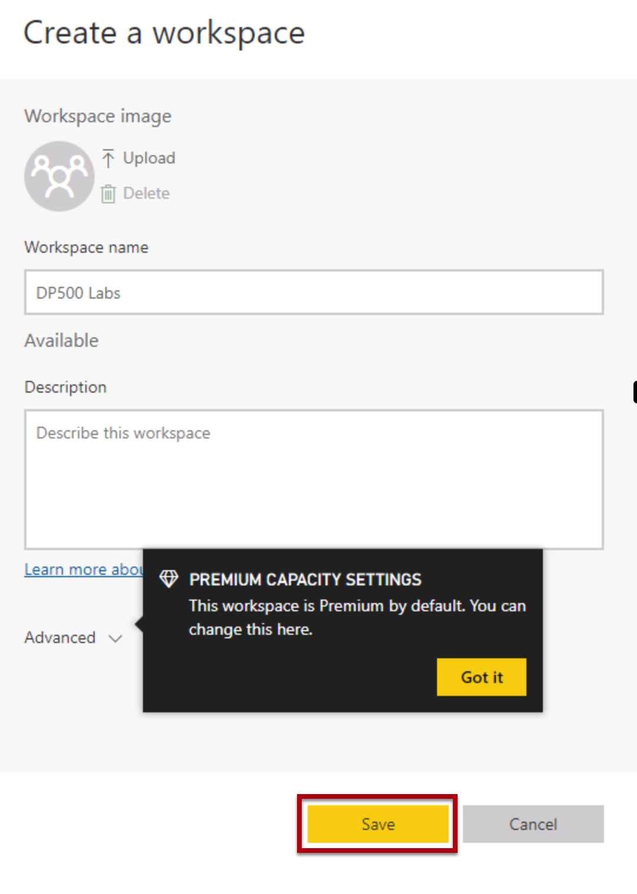
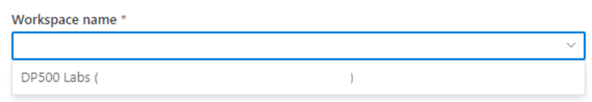
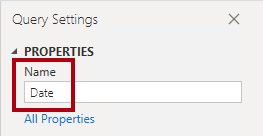
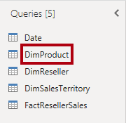
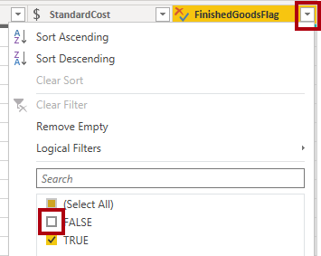
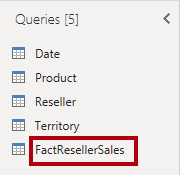
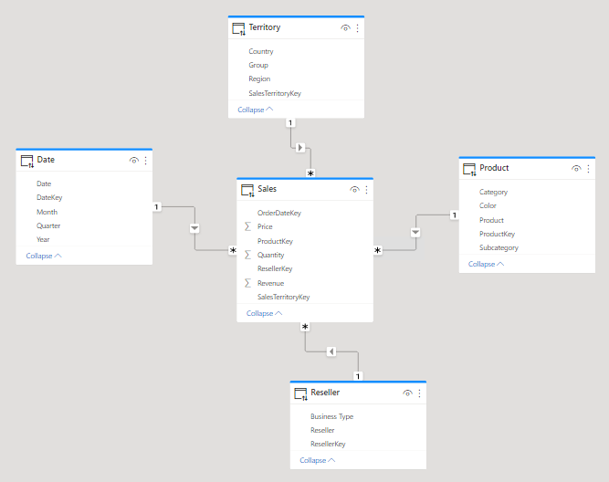

---
lab:
  title: スター スキーマ モデルを作成する
  module: Prepare data for tabular models in Power BI
---

# <a name="create-a-star-schema-model"></a>スター スキーマ モデルを作成する

## <a name="overview"></a>概要

**このラボの推定所要時間: 30 分**

In this lab, you will use Power BI Desktop to develop a data model over the Azure Synapse Adventure Works data warehouse. The data model will allow you to publish a semantic layer over the data warehouse.

このラボでは、次の作業を行う方法について説明します。

- Azure Synapse Analytics SQL プールへの Power BI 接続を作成する。

- モデル クエリを開発する。

- モデル図を整理する。

## <a name="get-started"></a>はじめに

この演習では、環境を準備します。

### <a name="load-data-into-azure-synapse-analytics"></a>Azure Synapse Analytics にデータを読み込む

   > **注**: Git クローンを使ってデータを Azure Synapse Analytics に既に読み込んでいる場合は、このタスクをスキップして、「**Power BI を設定する**」に進むことができます。

1. VM の右側にある [リソース] タブのログイン情報を使って、[Azure portal](https://portal.azure.com) にサインインします。
2. Use the <bpt id="p1">**</bpt>[<ph id="ph1">\&gt;</ph>_]<ept id="p1">**</ept> button to the right of the search bar at the top of the page to create a new Cloud Shell in the Azure portal, selecting a <bpt id="p2">***</bpt>PowerShell<ept id="p2">***</ept> environment and creating storage if prompted. The cloud shell provides a command line interface in a pane at the bottom of the Azure portal, as shown here:

    

    > **注**: 前に *Bash* 環境を使ってクラウド シェルを作成した場合は、そのクラウド シェル ペインの左上にあるドロップダウン メニューを使って、***PowerShell*** に変更します。

3. Note that you can resize the cloud shell by dragging the separator bar at the top of the pane, or by using the <bpt id="p1">**</bpt>&amp;#8212;<ept id="p1">**</ept>, <bpt id="p2">**</bpt>&amp;#9723;<ept id="p2">**</ept>, and <bpt id="p3">**</bpt>X<ept id="p3">**</ept> icons at the top right of the pane to minimize, maximize, and close the pane. For more information about using the Azure Cloud Shell, see the <bpt id="p1">[</bpt>Azure Cloud Shell documentation<ept id="p1">](https://docs.microsoft.com/azure/cloud-shell/overview)</ept>.

4. PowerShell ペインで、次のコマンドを入力して、このリポジトリを複製します。

    ```
    rm -r dp500 -f
    git clone https://github.com/MicrosoftLearning/DP-500-Azure-Data-Analyst dp500
    ```

5. リポジトリが複製されたら、次のコマンドを入力して **setup** フォルダーに変更し、そこに含まれている **setup.ps1** スクリプトを実行します。

    ```
    cd dp500/Allfiles/04
    ./setup.ps1
    ```

6. メッセージが表示されたら、Azure Synapse SQL プールに設定する適切なパスワードを入力します。

    > **注**: このパスワードは忘れないようにしてください。

7. スクリプトの完了まで待ちます。通常、約 20 分かかりますが、さらに時間がかかる場合もあります。
8. After creating the Synapse workspace and SQL Pool and loading the data, the script pauses the pool to prevent unnecessary Azure charges. When you're ready to work with your data in Azure Synapse Analytics, you'll need to resume the SQL Pool.

### <a name="clone-the-repository-for-this-course"></a>このコースのリポジトリを複製する

1. スタート メニューで、コマンド プロンプトを開きます

    
1. コマンド プロンプト ウィンドウで、次のように入力して D ドライブに移動します。

    `d:` 

   Enter キーを押します。

    


1. コマンド プロンプト ウィンドウで、次のコマンドを入力して、コース ファイルをダウンロードし、DP500 という名前のフォルダーに保存します。
    
    `git clone https://github.com/MicrosoftLearning/DP-500-Azure-Data-Analyst DP500`
   

1. リポジトリが複製されたら、エクスプローラーで D ドライブを開き、ファイルがダウンロードされていることを確認します。

### <a name="set-up-power-bi"></a>Power BI を設定する

このタスクでは、Power BI を設定します。

1. Power BI Desktop を開くには、タスク バーにある **Power BI Desktop** のショートカットを選択します。

    

2. [作業の開始] ウィンドウの右側にある **[X]** を選択します。

    

3. At the top-right corner of Power BI Desktop, if you're not already signed in, select <bpt id="p1">**</bpt>Sign In<ept id="p1">**</ept>. Use the lab credentials to complete the sign in process.

    
4. このラボでは、Power BI Desktop を使って、Azure Synapse Adventure Works データ ウェアハウスを介してデータ モデルを開発します。

    

5. データ モデルを使用すると、データ ウェアハウスを介してセマンティック レイヤーを公開できます。

1. 右上にあるプロファイル アイコンを選択し、 **[無料体験する]** を選択します。

    

1. メッセージが表示されたら、 **[無料体験する]** を選択します。

    

1. 残りのタスクをすべて行って、試用版のセットアップを完了します。

    "ヒント: Power BI の Web ブラウザー エクスペリエンスは、**Power BI サービス**と呼ばれます。"**
    
1. [ワークスペース] を選択し、 **[ワークスペースの作成]** を選択します。
    
    

1. DP500 labs という名前のワークスペースを作成し、 **[保存]** を選択します。

    "注: ワークスペース名は一意である必要があります。エラーが発生した場合は、ワークスペース名を更新します。"**

    

1. Navigate back to Power BI Desktop. If you see <bpt id="p1">**</bpt>Sign in<ept id="p1">**</ept> in the top right corner of the screen, sign-in again using the credentials provided on the Resources tab of the lab environment. If you are already signed in, proceed to the next step.

    

1. Go to Power BI Desktop and select <bpt id="p1">**</bpt>File<ept id="p1">**</ept> then <bpt id="p2">**</bpt>Options and settings<ept id="p2">**</ept> then <bpt id="p3">**</bpt>Options<ept id="p3">**</ept> then <bpt id="p4">**</bpt>Security<ept id="p4">**</ept> and under Authentication Browser check <bpt id="p5">**</bpt>Use my default web browser<ept id="p5">**</ept> and select <bpt id="p6">**</bpt>OK<ept id="p6">**</ept>. Close Power BI Desktop. Do not save your file.

    "次の演習で Power BI Desktop をもう一度開きます。"**

### <a name="start-the-sql-pool"></a>SQL プールを開始する

このタスクでは、SQL プールを開始します。

1. Microsoft Edge で、[https://portal.azure.com](https://portal.azure.com/) に移動します。

1. ラボの資格情報を使用してサインイン プロセスを完了します。

1. Select <bpt id="p1">**</bpt>Azure Synapse Analytics<ept id="p1">**</ept> from Azure services. Select your Synapse workspace.

   

1. 専用の SQL プールを見つけて選択します。

   

1. SQL プールを再開します。

    

    "重要: SQL プールはコストのかかるリソースです。このラボで作業する場合は、このリソースの使用を制限してください。このラボの最後のタスクには、リソースの一時停止を促す指示があります。"**

### <a name="link-your-power-bi-workspace-to-azure-synapse-analytics"></a>Power BI ワークスペースを Azure Synapse Analytics にリンクする

このタスクでは、既存の Power BI ワークスペースを Azure Synapse Analytics ワークスペースにリンクします。
1. Azure portal の専用 SQL プールから、リボンの **[Synapse Studio で開く]** を選択します。

1. Azure Synapse Studio のホーム ページで、 **[視覚化]** を選択して Power BI ワークスペースをリンクします。

    

1. **[ワークスペース名]** ドロップダウンから、前のタスクで作成したワークスペースを選択し、 **[作成]** を選択します。

    

    

1. メッセージが表示されたら、 **[公開]** を選択します。

## <a name="develop-a-data-model"></a>データ モデルを開発する

この演習では、データ ウェアハウス リセラーの販売サブジェクトの Power BI 分析とレポート作成をサポートする DirectQuery モデルを開発します。

### <a name="download-a-dataset-file"></a>データ ファイルをダウンロードする

このタスクでは、Synapse Studio から Power BI データ ソース ファイルをダウンロードします。

1. Microsoft Edge で、**Synapse Studio**に移動します。

    

2. 左側にある **[開発]** ハブを選択します。

    

3. In the <bpt id="p1">**</bpt>Develop<ept id="p1">**</ept> pane, expand <bpt id="p2">**</bpt>Power BI<ept id="p2">**</ept>, then expand the workspace, and then select <bpt id="p3">**</bpt>Power BI datasets<ept id="p3">**</ept>. If not present, Click <bpt id="p1">**</bpt>Publish all<ept id="p1">**</ept> to publish Workspace and refresh the browser.

    

4. **[Power BI データ セット]** ペインで、 **[新しい Power BI データセット]** を選択します。

    

5. 左側のペインの下部にある **[開始]** を選択します。

    

6. お使いの SQL プールを選択し、 **[sqldw]** 、 **[続行]** の順に選択します。

    

7. .pbids ファイルをダウンロードするには、 **[ダウンロード]** を選択します。

    

    ".pbids ファイルには、SQL プールへの接続が含まれます。これは、プロジェクトを開始するための便利な方法です。プロジェクトを開くと、SQL プールへの接続の詳細が既に格納されている新しい Power BI Desktop ソリューションが作成されます。"**

8. .pbids ファイルがダウンロードされたら、それを開きます。

    "ファイルが開くと、接続を使用してクエリを作成するように求められます。次のタスクでは、これらのクエリを定義します。"**

### <a name="create-model-queries"></a>モデル クエリを作成する

このタスクでは、それぞれがテーブルとしてモデルに読み込まれる 5 つの Power Query クエリを作成します。

1. Power BI Desktop の **[SQL Server データベース]** ウィンドウで、左側にある **[Microsoft アカウント]** を選択します。

    

2. **[サインイン]** を選択します。

3. 提供されたラボの Azure 資格情報を使用してサインインします。

4. **[接続]** を選択します。

    

5. **[ナビゲーター]** ウィンドウで、 **[DimDate]** テーブルを選択します (オンにしないでください)。

6. 右側のペインで、テーブル行のサブセットを示すプレビュー結果を確認します。

    

7. (モデル テーブルになる) クエリを作成するには、次の 5 つのテーブルをオンにします。

    - DimDate

    - DimProduct

    - DimReseller

    - DimSalesTerritory

    - FactResellerSales

8. クエリに変換を適用するには、右下にある **[データの変換]** を選択します。

    

    "データを変換すると、モデルで使用できるデータを定義できます。"**


9. **[接続設定]** ウィンドウで、 **[DirectQuery]** オプションを選択します。

    

    "この決定は重要です。DirectQuery はストレージ モードです。DirectQuery ストレージ モードを使用するモデル テーブルにデータは格納されません。このため、Power BI レポート ビジュアルで DirectQuery テーブルのクエリを実行すると、Power BI によってネイティブ クエリがデータ ソースに送信されます。このストレージ モードは、Azure Synapse Analytics などの大規模なデータ ストアに対して (大量のデータをインポートすることは非現実的または非経済的である可能性があるため)、または凖リアルタイムの結果が必要な場合に使用できます。"**

10. **[OK]** を選択します。

    


11. **Power Query エディター** ウィンドウの **[クエリ]** ペイン (左側にあります) で、オンにしたテーブルごとに 1 つのクエリがあることを確認します。

    

    "次に、各クエリの定義を変更します。各クエリは、モデルに適用されるとモデル テーブルになります。次に、クエリの名前を、クエリをわかりやすくかつ簡潔に説明する名前に変更し、変換を適用して、既知のレポート要件で必要な列を提供します。"**

12. **[DimDate]** クエリを選択します。

    

13. クエリの名前を変更するには、 **[クエリの設定]** ペイン (右側にあります) で、 **[名前]** ボックスのテキストを「**Date**」に置き換えて、**Enter** キーを押します。

    


14. 不要な列を削除するには、 **[ホーム]** リボン タブの **[列の管理]** グループ内から、 **[列の選択]** アイコンを選択します。

    

15. **[列の選択]** ウィンドウで、すべてのチェックボックスをオフにするには、先頭のチェックボックスをオフにします。

    


16. 次の 5 つの列をオンにします。

    - DateKey

    - FullDateAlternateKey

    - EnglishMonthName

    - FiscalQuarter

    - FiscalYear

    

    "この列の選択によって、モデルで何を使用できるかが決まります。"**

17. **[OK]** を選択します。

    

18. **[クエリの設定]** ペインの **[適用されたステップ]** の一覧で、他の列を削除するためのステップが追加されたことを確認します。

    

    "Power Query により、目的の構造とデータを実現するためのステップが定義されます。各変換は、クエリ ロジックのステップになります。"**

19. **FullDateAlternateKey** 列の名前を変更するには、**FullDateAlternateKey** 列のヘッダーをダブルクリックします。

20. テキストを「**Date**」に置き換えて、**Enter** キーを押します。

    

21. 適用される新しいステップがクエリに追加されていることを確認します。

    

22. 次の列の名前を変更します。

    - **EnglishMonthName** を **Month**

    - **FiscalQuarter** を **Quarter**

    - **FiscalYear** を **Year**


23. クエリのデザインを検証するには、ステータス バー (ウィンドウの下部にあります) で、クエリに 5 つの列があることを確認します。

    

    "重要: クエリのデザインが一致しない場合は、演習の手順を確認して修正します。"**

    "以上で、**Date** クエリのデザインが完了しました。"**

24. **[適用されたステップ]** ペインで、最後のステップを右クリックし、 **[ネイティブ クエリを表示]** を選択します。

    

25. **[ネイティブ クエリ]** ウィンドウで、SELECT ステートメントでクエリのデザインが反映されていることを確認します。

    "この概念は重要です。ネイティブ クエリは、Power BI でデータ ソースのクエリに使用されるクエリです。最適なパフォーマンスを確保するために、データベース開発者は、適切なインデックスなどを作成して、このクエリを確実に最適化する必要があります。"**

26. **[ネイティブ クエリ]** ウィンドウを閉じるには、 **[OK]** を選択します。

    


27. **DimProduct** クエリを選択します。

    

28. クエリの名前を「**Product**」に変更します。

    

29. クエリをフィルター処理するには、**FinishedGoodsFlag** 列のヘッダーでドロップダウン メニューを開き、 **[FALSE]** をオフにします。

    

30. **[OK]** を選択します。


31. 以下を除くすべての列を削除します。

    - ProductKey

    - EnglishProductName

    - Color

    - DimProductSubcategory

32. テーブルを結合するようにクエリを構成するには、**DimProductSubcategory** 列のヘッダーで、 **[展開]** ボタンを選択し、 **[(すべての列の選択)]** をオフにします。

    "この機能を使用すると、ソース データの外部キー制約に基づいてテーブルを結合できます。このラボで使用する設計アプローチでは、snowflake ディメンション テーブルを結合してデータの非正規化表現を生成します。"**

33. **[元の列名をプレフィックスとして使用します]** をオフにします。

    

34. 次の 2 つの列をオンにします。

    - EnglishProductSubcategoryName

    - DimProductCategory

35. **[OK]** を選択します。

36. 前の手順を繰り返して、**DimProductCategory** を展開し、**EnglishProductCategoryName** 列を導入します。


37. 次の列の名前を変更します。

    - **EnglishProductName** を **Product**

    - **EnglishProductSubcategoryName** を **Subcategory**

    - **EnglishProductCategoryName** を **Category**

38. **[適用されたステップ]** ペインで、最後のステップを右クリックし、 **[ネイティブ クエリを表示]** を選択します。

    

39. **[ネイティブ クエリ]** ウィンドウで、SELECT ステートメントでクエリのデザインが反映されていることを確認します。

    "このステートメントには、非正規化されたクエリ結果を生成するための入れ子になったサブディレクトリが含まれます。"**

40. **[ネイティブ クエリ]** ウィンドウを閉じるには、 **[OK]** を選択します。

41. クエリに 5 つの列があることを確認します。

    "以上で、**Product** クエリのデザインが完了しました。"**

42. **DimReseller** クエリを選択します。

    

43. クエリの名前を「**Reseller**」に変更します。

44. 以下を除くすべての列を削除します。

    - ResellerKey

    - BusinessType

    - ResellerName

45. 次の列の名前を変更します。

    - **BusinessType** を **Business Type** (スペースで区切ります)

    - **ResellerName** を **Reseller**

46. クエリに 3 つの列があることを確認します。

    "以上で、**Reseller** クエリのデザインが完了しました。"**

47. **DimSalesTerritory** クエリを選択します。

    

48. クエリの名前を「**Territory**」に変更します。

49. 以下を除くすべての列を削除します。

    - SalesTerritoryKey

    - SalesTerritoryRegion

    - SalesTerritoryCountry

    - SalesTerritoryGroup

50. 次の列の名前を変更します。

    - **SalesTerritoryRegion** を **Region**

    - **SalesTerritoryCountry** を **Country**

    - **SalesTerritoryGroup** を **Group**

51. クエリに 4 つの列があることを確認します。

    "以上で、**Territory** クエリのデザインが完了しました。"**

52. **FactResellerSales** クエリを選択します。

    

53. クエリの名前を「**Sales**」に変更します。

54. 以下を除くすべての列を削除します。

    - ResellerKey

    - ProductKey

    - OrderDateKey

    - SalesTerritoryKey

    - OrderQuantity

    - UnitPrice

    

55. 次の列の名前を変更します。

    - **OrderQuantity** を **Quantity**

    - **UnitPrice** を **Price**

56. 計算列を追加するには、 **[列の追加]** リボン タブの **[全般]** グループ内から、 **[カスタム列]** を選択します。

    


57. **[カスタム列]** ウィンドウの **[新しい列名]** ボックスで、テキストを「**Revenue**」に置き換えます。

    

58. **[カスタム列の式]** ボックスに、次の数式を入力します。

    ```
    [Quantity] * [Price]
    ```


59. **[OK]** を選択します。

60. 列のデータ型を変更するには、**Revenue** 列のヘッダーで **[ABC123]** を選択し、 **[10 進数]** を選択します。

    

61. **Revenue** 列の計算ロジックに注意して、ネイティブ クエリを確認します。

62. クエリに 7 つの列があることを確認します。

    "以上で、**Sales** クエリのデザインが完了しました。"**


63. クエリを適用するには、 **[ホーム]** リボン タブの **[閉じる]** グループ内から、 **[閉じて適用]** アイコンを選択します。

    

    "各クエリが適用されてモデル テーブルが作成されます。データ接続では DirectQuery ストレージ モードが使用されているため、モデル構造のみが作成されます。データはインポートされません。モデルは、クエリごとに 1 つのテーブルで構成されます。"**

64. クエリが適用されたら、Power BI Desktop のステータス バーの左下隅で、ストレージ モードが DirectQuery であることを確認します。

    

### <a name="organize-the-model-diagram"></a>モデル図を整理する

このタスクでは、スター スキーマ デザインを簡単に理解できるようにモデル図を整理します。

1. Power BI Desktop で、左側にある **[モデル]** ビューを選択します。

    

2. 画面に合わせてモデル図のサイズを変更するには、右下にある **[画面に合わせる]** アイコンを選択します。

    

3. テーブルをドラッグして、**Sales** ファクト テーブルが図の中央に配置され、残りのテーブル (ディメンション テーブル) がファクト テーブルの周囲に配置されるように位置を合わせます。

4. いずれかのディメンション テーブルがファクト テーブルに関連付けられていない場合、次の手順に従ってリレーションシップを作成します。

    - ディメンション キー列 (たとえば、**ProductKey** など) をドラッグし、**Sales** テーブルの対応する列にドロップします。

    - **[リレーションシップの作成]** ウィンドウで、 **[OK]** を選択します。


5. モデル図の最終的なレイアウトを確認します。

    

    "以上で、スター スキーマ モデルの作成が完了しました。階層の追加、計算、列表示などのプロパティの設定など、多数のモデリング構成を適用できるようになりました。"**

6. 必要に応じて、ソリューションを保存するには、左上にあるディスク アイコンを選択します。

7. **[名前を付けて保存]** ウィンドウで、**D:\DP500\Allfiles\04\MySolution** フォルダーに移動します。

8. **[ファイル名]** ボックスに「**Sales Analysis**」と入力します。

    

9. **[保存]** を選択します。

10. Power BI Desktop を閉じます。

### <a name="pause-the-sql-pool"></a>SQL プールを一時停止する

このタスクでは、SQL プールを停止します。

1. Web ブラウザーで、[https://portal.azure.com](https://portal.azure.com/) にアクセスします。

2. SQL プールを見つけます。

3. SQL プールを一時停止します。

