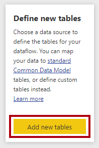
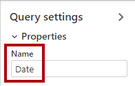
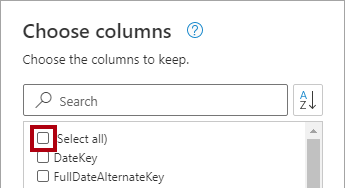
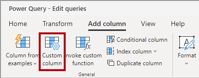
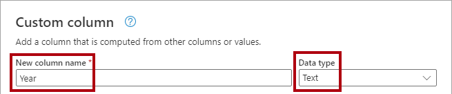
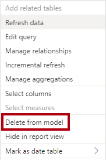
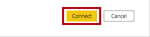

---
lab:
  title: データフローを作成する
  module: Prepare data for tabular models in Power BI
---

# <a name="create-a-dataflow"></a>データフローを作成する

## <a name="overview"></a>概要

**このラボの推定所要時間: 45 分**

このラボでは、Azure Synapse の Adventure Works データ ウェアハウスから供給された日付ディメンション データを配信するデータフローを作成します。 このデータフローは、組織のビジネス アナリストが使用する日付関連データの一貫した定義を提供します。

このラボでは、次の作業を行う方法について説明します。

- Power Query Online を使ってデータフローを開発します。

- Power BI Desktop を使ってデータフローを使用します。

## <a name="get-started"></a>はじめに

この演習では、環境を準備します。

### <a name="load-data-into-azure-synapse-analytics"></a>Azure Synapse Analytics にデータを読み込む

   > **注**: git クローンを使ってデータを Azure Synapse Analytics に既に読み込んでいる場合は、このタスクをスキップして **Power BI のセットアップ**に進んでかまいません。

1. VM の右側にある [リソース] タブのログイン情報を使って、[Azure portal](https://portal.azure.com) にサインインします。
2. ページ上部の検索バーの右側にある **[\>_]** ボタンを使用して、Azure portal に新しい Cloud Shell を作成します。メッセージが表示されたら、***PowerShell*** 環境を選んで、ストレージを作成します。 次に示すように、Azure portal の下部にあるペインに、Cloud Shell のコマンド ライン インターフェイスが表示されます。

    

    > **注**: 前に *Bash* 環境を使ってクラウド シェルを作成している場合は、そのクラウド シェル ペインの左上にあるドロップダウン メニューを使って、***PowerShell*** に変更します。

3. ペインの上部にある区分線をドラッグして Cloud Shell のサイズを変更したり、ペインの右上にある **&#8212;** 、 **&#9723;** 、**X** アイコンを使用して、ペインを最小化または最大化したり、閉じたりすることができます。 Azure Cloud Shell の使い方について詳しくは、[Azure Cloud Shell のドキュメント](https://docs.microsoft.com/azure/cloud-shell/overview)をご覧ください。

4. PowerShell ペインで、次のコマンドを入力して、このリポジトリをクローンします。

    ```
    rm -r dp500 -f
    git clone https://github.com/MicrosoftLearning/DP-500-Azure-Data-Analyst dp500
    ```

5. リポジトリがクローンされたら、次のコマンドを入力して **setup** フォルダーに変更し、そこに含まれている **setup.ps1** スクリプトを実行します。

    ```
    cd dp500/Allfiles/04
    ./setup.ps1
    ```

6. メッセージが表示されたら、Azure Synapse SQL プールに設定する適切なパスワードを入力します。

    > **注**: このパスワードは忘れないようにしてください。

7. スクリプトの完了まで待ちます。通常、約 20 分かかりますが、さらに時間がかかる場合もあります。

1. Synapse ワークスペースと SQL プールを作成して、データを読み込んだ後、Azure の不要な料金を防ぐため、プールはスクリプトによって一時停止されます。 Azure Synapse Analytics でデータを使用する準備ができたら、SQL プールを再開する必要があります。

### <a name="clone-the-repository-for-this-course"></a>このコースのリポジトリを複製する

1. スタート メニューで、コマンド プロンプトを開きます

    

1. コマンド プロンプト ウィンドウで、次のように入力して D ドライブに移動します。

    `d:` 

   Enter キーを押します。

    


1. コマンド プロンプト ウィンドウで、次のコマンドを入力して、コース ファイルをダウンロードし、DP500 という名前のフォルダーに保存します。
    
    `
    git clone https://github.com/MicrosoftLearning/DP-500-Azure-Data-Analyst DP500
    `
   
2. リポジトリが複製されたら、コマンド プロンプト ウィンドウを閉じます。 
   
3. エクスプローラーで D ドライブを開き、ファイルがダウンロードされていることを確認します。

### <a name="set-up-power-bi-desktop"></a>Power BI Desktop を設定する

このタスクでは、Power BI Desktop を設定します。

1. エクスプローラーを開くには、タスク バーの **[エクスプローラー]** ショートカットを選びます。

    

1. **D:\DP500\Allfiles\05\Starter** フォルダーに移動します。

1. 開発済みの Power BI Desktop ファイルを開くには、**Sales Analysis - Create a dataflow.pbix** ファイルをダブルクリックします。

1. まだサインインしていない場合は、Power BI Desktop の右上隅にある **[サインイン]** を選びます。 ラボの資格情報を使ってサインイン プロセスを完了します。

    

1. ファイルを保存するには、 **[ファイル]** リボンの **[名前を付けて保存]** を選びます。

1. **[名前を付けて保存]** ウィンドウで、**D:\DP500\Allfiles\05\MySolution** フォルダーに移動します。

1. Power BI Desktop に移動し、 **[ファイル]** 、 **[オプションと設定]** 、 **[オプション]** 、 **[セキュリティ]** の順に選び、[認証ブラウザー] で **[既定の Web ブラウザーを使用します]** をオンにして、 **[保存]** を選びます。

    データフローを使って日付ディメンション データを供給するように、Power BI Desktop ソリューションを更新します。**

### <a name="sign-in-to-the-power-bi-service"></a>Power BI サービスにサインインする

このタスクでは、Power BI サービスにサインインし、試用版ライセンスを開始して、ワークスペースを作成します。

重要: VM 環境に Power BI を既にセットアップしてある場合は、次のタスクに進みます。**

1. Web ブラウザーで、[https://powerbi.com](https://powerbi.com/) にアクセスします。

1. ラボの資格情報を使ってサインイン プロセスを完了します。

    重要: Power BI Desktop からのサインインに使ったのと場合と同じ資格情報を使う必要があります。**

1. 右上にあるプロファイル アイコンを選んでから、 **[無料体験する]** を選びます。

    

1. メッセージが表示されたら、 **[無料体験する]** を選択します。

    

1. 残りのタスクをすべて行って、試用版のセットアップを完了します。

    "ヒント: Power BI の Web ブラウザー エクスペリエンスは、**Power BI サービス**と呼ばれます。"**

  

### <a name="create-a-workspace"></a>ワークスペースの作成

このタスクでは、ワークスペースを作成します。

1. Power BI サービスでワークスペースを作成するには、**ナビゲーション** ウィンドウ (左側) で **[ワークスペース]** を選んでから、 **[ワークスペースの作成]** を選びます。

    


1. **[ワークスペースの作成]** ペイン (右側) で、 **[ワークスペース名]** ボックスにワークスペースの名前を入力します。

    ワークスペース名はテナント内で一意である必要があります。**

    

1. **[保存]** を選択します。

    

    作成されると、ワークスペースが開きます。後の演習では、このワークスペース用のデータフローを作成します。**

### <a name="start-the-sql-pool"></a>SQL プールを開始する

このタスクでは、SQL プールを開始します。

1. Web ブラウザーで、[https://portal.azure.com](https://portal.azure.com/) にアクセスします。

1. ラボの資格情報を使ってサインイン プロセスを完了します。

1. 検索バーを使って、Azure Synapse Analytics を見つけます。 

1. Azure Synapse Analytics のインスタンスを選びます。
    

1. 専用の SQL プールを見つけて選びます。
    

1. 専用の SQL プールを再開します。

    

    重要: SQL プールはコストのかかるリソースです。このラボで作業する場合は、このリソースの使用を制限してください。このラボの最後のタスクには、リソースの一時停止を促す指示があります。**

## <a name="develop-a-dataflow"></a>データフローを開発する

この演習では、Power BI モデルの開発をサポートするデータフローを開発します。 データ ウェアハウスの日付ディメンション テーブルの一貫した表現が提供されます。

### <a name="review-the-data-model"></a>データ モデルを確認する

このタスクでは、Power BI Desktop で開発したデータ モデルを確認します。

1. Power BI Desktop ソリューションに切り替えます。

1. 左側で、 **[モデル]** ビューに切り替えます。

    

1. モデル図の **Date** テーブルに注意してください。

    

    **Date** テーブルはビジネス アナリストによって作成されました。日付関連データの一貫した定義を表してはおらず、相対日付フィルターをサポートするのに役立つオフセット列は含まれません。後の演習で、このテーブルをデータフローから供給される新しいテーブルに置き換えます。**

### <a name="create-a-dataflow"></a>データフローを作成する

このタスクでは、日付関連データの一貫した定義を表すデータフローを作成します。

1. Power BI サービスで、 **[新規]** 、 **[データフロー]** の順に選びます。

    

1. データフローを作成するには、 **[データフロー]** タイルを選びます。

    

1. **[新しいテーブルの定義]** タイルで、 **[新しいテーブルの追加]** を選びます。

    

    新しいテーブルを追加するには、Power Query Online を使ってクエリを定義する必要があります。**

1. データ ソースを選ぶには、 **[Azure Synapse Analytics (SQL DW)]** を選びます。

    

    ヒント: 検索ボックス (右上) を使って、データ ソースを見つけることができます。**

1. Synapse 接続の設定を入力します。

     - Azure Portal からサーバー名を入力します 
     
     
     
      サーバー名は次のようになっているはずです。
      
      synapsewsxxxxx.sql.azuresynapse.net
      
     - 認証の種類が **[組織アカウント]** であることを確認します。 サインインを求められたら、ラボで指定された資格情報を使います。
     

1. 右下にある **[次へ]** を選びます。

    

1. Power Query のナビゲーション ウィンドウで、sqldw を展開し、**DimDate** テーブルを選びます (オンにしないでください)。

    

1. テーブル データのプレビューに注意してください。

1. クエリを作成するには、**DimDate** テーブルをオンにします。

    

1. 右下にある **[データの変換]** を選びます。

    

    次に、Power Query Online を使って、テーブルに変換を適用します。これにより、Power BI Desktop の Power Query エディターとほぼ同じエクスペリエンスが提供されます。**

1. クエリの名前を変更するには、 **[クエリの設定]** ペイン (右側) で、 **[名前]** ボックスのテキストを「**Date**」に置き換えて、**Enter** キーを押します。

    

1. 必要のない列を削除するには、 **[ホーム]** リボン タブの **[列の管理]** グループ内から、 **[列の選択]** アイコンを選びます。

    

1. **[列の選択]** ウィンドウで、すべてのチェックボックスをオフにするには、先頭のチェックボックスをオフにします。

    


1. 次の 5 つの列をオンにします。

    - DateKey

    - FullDateAlternateKey

    - MonthNumberOfYear

    - FiscalQuarter

    - FiscalYear

    

1. **[OK]** を選択します。

    

  
1. **[クエリの設定]** ウィンドウの **[適用したステップ]** の一覧で、他の列を削除するためのステップが追加されたことを確認します。

    

    Power Query により、目的の構造とデータを実現するための手順が定義されます。各変換は、クエリ ロジックのステップになります。**

1. **FullDateAlternateKey** 列の名前を変更するには、**FullDateAlternateKey** 列のヘッダーをダブルクリックします。

1. テキストを「**Date**」に置き換えてから、**Enter** キーを押します。

    

1. 計算列を追加するには、 **[列の追加]** リボン タブの **[全般]** グループ内から、 **[カスタム列]** を選びます。

    

   

1. **[カスタム列]** ウィンドウの **[新しい列名]** ボックスで、テキストを「**Year**」に置き換えます。

1. **[データ型]** ドロップダウン リストから **[テキスト]** を選びます。

    

1. **[カスタム列の式]** ボックスに、次の式を入力します。

    ヒント: すべての式は、**D:\DP500\Allfiles\05\Assets\Snippets.txt** からコピーして貼り付けることができます。**


    ```
    "FY" & Number.ToText([FiscalYear])
    ```


1. **[OK]** を選択します。

    さらに 4 つのカスタム列を追加します。**

1. 次の式を使って、**Quarter** という名前で**テキスト** データ型の別のカスタム列を追加します。


    ```
    [Year] & " Q" & Number.ToText([FiscalQuarter])
    ```


1. 次の式を使って、**Month** という名前で**テキスト** データ型の別のカスタム列を追加します。


    ```
    Date.ToText([Date], "yyyy-MM")
    ```

1. 次の式を使って、**Month Offset** という名前 (単語間にスペースを含む) で**整数**データ型の別のカスタム列を追加します。


    ```
    ((Date.Year([Date]) * 12) + Date.Month([Date])) - ((Date.Year(DateTime.LocalNow()) * 12) + Date.Month(DateTime.LocalNow()))
    ```


    この式は、現在の月からの月数を決定します。現在の月はゼロ、過去の月は負、将来の月は正です。たとえば、先月の値は -1 です。**

   

1. 次の式を使って、**Month Offset Filter** という名前 (単語間にスペースを含む) で**テキスト** データ型の別のカスタム列を追加します。


    ```
    if [Month Offset] > 0 then Number.ToText([Month Offset]) & " month(s) future"

    else if [Month Offset] = 0 then "Current month"

    else Number.ToText(-[Month Offset]) & " month(s) ago"
    ```


    この式は、数値オフセットをわかりやすいテキスト形式に変換します。**

    ヒント: すべての式は、**D:\DP500\Allfiles\05\Assets\Snippets.txt** からコピーして貼り付けることができます。**

1. 必要のない列を削除するには、 **[ホーム]** リボン タブの **[列の管理]** グループ内から、 **[列の選択]** アイコンを選びます。

    

1. **[列の選択]** ウィンドウで、次の列をオフにします。

    - MonthNumberOfYear

    - FiscalQuarter

    - FiscalYear

    

1. **[OK]** を選択します。

1. 右下にある **[保存して閉じる]** を選びます。

    

1. **[データフローの保存]** ウィンドウで、 **[名前]** ボックスに「**Corporate Date**」と入力します。

1. **[説明]** ボックスに、「**Consistent date definition for use in all Adventure Works datasets**」と入力します

1. ヒント: 説明は、**D:\DP500\Allfiles\05\Assets\Snippets.txt** からコピーして貼り付けることができます。

    

1. **[保存]** を選択します。

    

1. Power BI サービスの**ナビゲーション** ウィンドウで、自分のワークスペースの名前を選びます。

    これにより、ワークスペースのランディング ページが開きます。**

1. データフローを更新するには、**Corporate Date** データフローをカーソルでポイントし、 **[今すぐ更新]** アイコンを選びます。

    

  

1. データフローの設定に移動するには、**Corporate Date** データフローをカーソルでポイントし、省略記号を選んでから、 **[設定]** を選びます。

    

1. 構成オプションに注意してください。

    

    2 つの設定を構成する必要があります。1 つ目として、データフローのデータを毎日更新するようにスケジュールされた更新を構成する必要があります。これにより、現在の日付を使って月のオフセットが計算されます。2 つ目として、データフローを (承認されたレビュー担当者が) 認定済みとして承認する必要があります。認定されたデータフローは、品質基準を満たし信頼できることを、他のユーザーに宣言します。**

    設定の構成に加えて、すべてのコンテンツ作成者にデータフローを使用するアクセス許可を付与する必要があります。**

## <a name="consume-a-dataflow"></a>データフローを使用する

この演習では、Power BI Desktop ソリューションで既存の **Date** テーブルをデータフローからデータを供給する新しいテーブルに置き換えます。

### <a name="remove-the-original-date-table"></a>元の Date テーブルを削除する

このタスクでは、基の **Date** テーブルを削除します。

1. Power BI Desktop ソリューションに切り替えます。

1. モデル図で **Date** テーブルを右クリックし、 **[モデルから削除]** を選びます。

    

1. テーブルの削除の確認を求められたら、 **[OK]** を選びます。

    

  


### <a name="add-a-new-date-table"></a>新しい Date テーブルを追加する

このタスクでは、データフローからデータを供給される新しい **Date** テーブルを追加します。

1. **[ホーム]** リボンで、 **[データ]** グループ内から **[データの取得]** アイコンを選びます。

    

1. **[データの取得]** ウィンドウの左側で **[Power Platform]** を選んでから、 **[Power BI データフロー]** を選びます。

    

1. **[接続]** を選択します。

    

  

1. **[Power BI データフロー]** ウィンドウで、 **[サインイン]** を選びます。

    

1. ラボの資格情報を使ってサインイン プロセスを完了します。

    重要: Power BI サービスへのサインインに使ったのと同じ資格情報を使う必要があります。**

1. **[接続]** を選択します。

    

1. **ナビゲーター** ウィンドウの左側のペインで、ワークスペース フォルダーを展開し、**Corporate Date** データフロー フォルダーを展開します。

    


1. **Date** テーブルをオンにします。

    

1. **[読み込み]** を選択します。

    

    Power Query エディターを使ってデータを変換できます。**

1. 新しいテーブルがモデルに追加されたら、**Date** テーブルの **DateKey** 列を **Sales** テーブルの **OrderDateKey** 列にドラッグして、リレーションシップを作成します。

    

    列の非表示や階層の作成など、他にも多くのモデル構成を行うことができます。**

### <a name="validate-the-model"></a>モデルを検証する

このタスクでは、簡単なレポート レイアウトを作成してモデルをテストします。

1. 左側で **[レポート]** ビューに切り替えます。

    

1. ページにビジュアルを追加するには、 **[視覚化]** ペインで、積み上げ横棒グラフ視覚化の種類を選びます。

    

1. レポート ページいっぱいになるようにビジュアルのサイズを変更します。

  

1. **[フィールド]** ペインで、**Date** テーブルを展開し、**Month Offset Filter** フィールドを横棒グラフのビジュアルにドラッグします。

    

1. **[フィールド]** ペインで、**Sales** テーブルを展開し、**Sales Amount** フィールドを横棒グラフのビジュアルにドラッグします。

    


1. 縦軸を並べ替えるには、ビジュアルの右上にある省略記号を選んで、 **[軸のソート]**  > **Month Offset Filter** を選びます。

    

1. Month Offset Filter の値を時系列で並べ替えるには、 **[フィールド]** ペインで **Month Offset Filter** フィールドを選びます。

1. **[列ツール]** リボン タブで、 **[並べ替え]** グループ内から **[並べ替え]** を選んで、 **[Month Offset]** を選びます。

    

1. 更新されて時系列順になった横棒グラフのビジュアルを確認します。

    日付オフセット列を使う主な利点は、レポートの相対日付によるフィルター処理を、カスタマイズされた方法で実行できることです。(スライサーとフィルターおよび相対的な日付と期間でのフィルター。ただし、この動作はカスタマイズできません。また、四半期でのフィルター処理もできません。)**

1. Power BI Desktop ファイルを保存します。

1. Power BI Desktop を閉じます。

### <a name="pause-the-sql-pool"></a>SQL プールを一時停止する

このタスクでは、SQL プールを停止します。

1. Web ブラウザーで、[https://portal.azure.com](https://portal.azure.com/) にアクセスします。

1. SQL プールを見つけます。

1. SQL プールを一時停止します。
