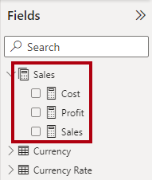
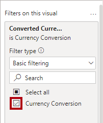
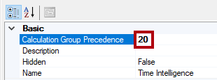

---
lab:
  title: 計算グループを作成する
  module: Design and build tabular models
---
# <a name="create-calculation-groups"></a>計算グループを作成する

## <a name="overview"></a>概要

このラボの推定所要時間: 45 分

このラボでは、Power BI Desktop と Tabular Editor 2 を使用して計算グループを作成します。

このラボでは、次の作業を行う方法について説明します。

-   計算グループを作成する。
-   計算項目の書式を設定する。
-   計算グループの優先順位を設定する。
-   計算グループを使用するようにビジュアルを構成する。

## <a name="get-started"></a>はじめに
### <a name="clone-the-repository-for-this-course"></a>このコースのリポジトリを複製する

1. スタート メニューで、コマンド プロンプトを開きます

    

1. コマンド プロンプト ウィンドウで、次のように入力して D ドライブに移動します。

    `d:` 

   Enter キーを押します。

    


1. コマンド プロンプト ウィンドウで、次のコマンドを入力して、コース ファイルをダウンロードし、DP500 という名前のフォルダーに保存します。
    
    `git clone https://github.com/MicrosoftLearning/DP-500-Azure-Data-Analyst DP500`
   
1. リポジトリが複製されたら、コマンド プロンプト ウィンドウを閉じます。 
   
1. エクスプローラーで D ドライブを開き、ファイルがダウンロードされていることを確認します。

## <a name="prepare-your-environment"></a>環境を準備する

Tabular Editor 2 のインストール、Power BI Desktop の設定、データ モデルの確認、メジャーの作成を行って、ラボ環境を準備します。

### <a name="download-and-install-tabular-editor-2"></a>Tabular Editor 2 をダウンロードしてインストールする

計算グループを作成できるようにするために、Tabular Editor 2 をダウンロードしてインストールします。

**重要:** *VM 環境に Tabular Editor 2 が既にインストールされている場合は、次のタスクに進みます。*

"Tabular Editor は、Analysis Services と Power BI 用の表形式モデルを作成するためのエディター代替ツールです。Tabular Editor 2 は、モデル内のデータにアクセスせずに BIM ファイルを編集できるオープンソース プロジェクトです。"**

1.  Power BI Desktop が閉じられていることを確認します。

1.  Microsoft Edge で、Tabular Editor のリリース ページに移動します。

    ```https://github.com/TabularEditor/TabularEditor/releases```
    
1. **アセット**のセクションまで下にスクロールし、**TabularEditor.Installer.msi** ファイルを選択します。 これにより、ファイルのインストールが開始されます。

1. 完了したら、 **[ファイルを開く]** を選択してインストーラーを実行します。

    

1.  Tabular Editor インストーラー ウィンドウで、 **[次へ]** を選択します。

    

1.  **使用許諾契約書**のステップで、同意する場合は **[I agree] (同意する)** を選択し、 **[次へ]** を選択します。

    

1.  **インストール フォルダーの選択**のステップで、 **[次へ]** を選択します。

    

1.  **アプリケーション ショートカット**のステップで、 **[次へ]** を選択します。

    

1. **[インストールの確認]** ステップで、 **[次へ]** を選択します。

    

1. **[ユーザー アカウント制御]** ポップアップ ウィンドウが表示されたら、 **[はい]** を選択します。

1. インストールが完了したら、**[閉じる]** を選択します。

    

    "Tabular Editor がインストールされ、Power BI Desktop 外部ツールとして登録されました。"**

### <a name="set-up-power-bi-desktop"></a>Power BI Desktop を設定する

次に、事前に開発された Power BI Desktop ソリューションを開きます。

1.  エクスプローラーで、**D:\\DP500\\Allfiles\\07\\Starter** フォルダーに移動します。

2.  事前に作成された Power BI Desktop ファイルを開くには、**Sales Analysis - Create a dataflow.pbix** ファイルをダブルクリックします。

3.  ファイルを保存するには、 **[ファイル]** リボン タブで **[名前を付けて保存]** を選択します。

4.  **[名前を付けて保存]** ウィンドウで、**D:\\DP500\\Allfiles\\07\\MySolution** フォルダーに移動します。

5.  **[保存]** を選択します。

6.  **[外部ツール]** リボン タブを選択します。

    

7.  このリボン タブから Tabular Editor を起動できることに注意してください。

    

    "次の演習では、Tabular Editor を使用して計算グループを作成します。"**

### <a name="review-the-data-model"></a>データ モデルを確認する

計算グループがこのモデルにどのように適用されるかを理解するために、データ モデルを確認します。

1.  Power BI Desktop で、左側にある **[モデル]** ビューに切り替えます。

    

2.  モデル図を使って、モデルのデザインを確認します。

    

    "モデルは 7 つのディメンション テーブルと 2 つのファクト テーブルで構成されます。**Sales** ファクト テーブルには販売注文の詳細が格納されます。**Currency Rate** ファクト テーブルには、複数の通貨の為替レートが格納されます。これは、クラシック スター スキーマ設計です。"**

3.  **レポート** ビューに切り替えます。

    

4.  **[フィールド]** ペイン (右側にあります) で、 **[Sales]** テーブルを展開してフィールドを確認します。

    

5.  **Sales** テーブルの 2 つのフィールドは、シグマ記号 (∑) で修飾されていることに注意してください。

    "シグマ記号は、sum、count、average などの集計関数を使用してフィールドが自動的に集計されることを示します。"**

    "ただし、計算グループをモデルに追加する場合、この自動的な動作を無効にする必要があります。つまり、集計は、データ分析式 (DAX) 式を使用して定義されるメジャーによってのみ実現できます。次のタスクでは、モデルにメジャーを追加します。"**

### <a name="create-measures"></a>メジャーを作成する

計算グループの作成の準備として、売上に関係する 3 つのメジャーを作成します。

1.  **[フィールド]** ペインで、 **[Sales]** テーブルを右クリックし、 **[新しいメジャー]** を選択します。

    

2.  数式バー (リボンの下にあります) で、テキストを次のメジャー定義に置き換え、**Enter** キーを押します。

    ヒント: すべての数式は、**D:\\DP500\\Allfiles\\07\\Assets\\Snippets.txt** からコピーして貼り付けることができます。

    DAX

    ```Sales = SUM ( 'Sales'[Sales Amount] )```

3.  **[メジャー ツール]** コンテキスト リボンの **[書式設定]** グループ内で、小数点以下の桁数を **2** に設定します。

    

4.  次の定義を使用して、**Cost** という名前の 2 番目のメジャーを作成し、同様に書式設定します。

    DAX

    ```Cost = SUM ( 'Sales'[Total Product Cost] )```

5.  次の定義を使用して、**Profit** という名前の 3 番目のメジャーを作成し、同様に書式設定します。

    DAX

    ```Profit = [Sales] - [Cost]```

6.  **[フィールド]** ペインで、 **[Sales Amount]** フィールドを右クリックし、 **[非表示]** を選択します。

    

7.  **Total Product Cost** フィールドも非表示にします。

8.  以上で、**Sales** テーブルが **[フィールド]** ペインの一覧で最初に表示され、複数の電卓アイコンで修飾されます。

    

    "テーブルが表示可能なメジャーのみで構成されている場合、ペインの上部に表示されます。これにより、メジャー グループ (多次元モデルのオブジェクト) のように動作します。この表形式モデルの外観と DAX 計算グループを混同しないでください。"**

## <a name="create-a-calculation-group"></a>計算フィールドを作成する

次に、2 つの計算グループを作成します。 1 つ目は、タイム インテリジェンスをサポートします。 2 つ目は、為替換算をサポートします。

### <a name="create-the-time-intelligence-calculation-group"></a>Time Intelligence 計算グループを作成する

Tabular Editor を使用して、**Time Intelligence** 計算グループを作成します。 これにより、PY (前年度)、YoY (前年度比)、YoY % (対前年度変化率) など、多くの時間関連の計算を簡単に作成できます。 この計算グループを使用すると、さまざまなタイム インテリジェンス計算を使用してメジャーを分析できます。

"Power BI Desktop では、計算グループの作成または管理はサポートされていません。"**

   > **ヒント**: すべての構文は、D:\DP500\Allfiles\07\Assets\Snippets.txt からコピーして貼り付けることができます。

1.  **[外部ツール]** リボンで、**[Tabular Editor]** を選択します。

    

    "Tabular Editor が新しいウィンドウで開き、Power BI Desktop でホストされているデータ モデルにライブ接続されます。Tabular Editor でモデルに加えた変更は、保存するまで Power BI Desktop に反映されません。"**

2.  [Tabular Editor] ウィンドウの左側のペインで、 **[Tables]** フォルダーを右クリックし、 **[新規作成]** \> **[計算グループ]** の順に選択します。

    

3.  左側のペインで、既定の名前を「**Time Intelligence**」に置き換え、**Enter** キーを押します。

4.  **Time Intelligence** テーブルを展開して開きます。

5.  **[Name]** 列を選択します。

    

    "計算グループは、この単一の列で構成されますが、データ行は計算のグループを定義します。計算のテーマを反映するように列の名前を変更することをお勧めします。"**

6.  **[プロパティ]** ペイン (右下にあります) で、 **[名前]** プロパティを選択し、名前を「**Time Calculation**」に変更します。

    

7.  計算項目を作成するには、 **[Time Intelligence]** テーブルを右クリックし、 **[新規作成]** \> **[計算項目]** の順に選択します。

    

8.  左側のペインで、既定の名前を「**Current**」に置き換え、**Enter** キーを押します。

9.  **[式エディター]** ペイン (**[プロパティ]** ペインの上にあります) に次の式を入力します。

    DAX

    ```SELECTEDMEASURE ()```

    

    "SELECTEDMEASURE 関数は、計算項目が評価されるときに、現在コンテキスト内にあるメジャーへの参照を返します。"**

10. **[式エディター]** ペインのツール バーで、最初のボタンを選択して変更を受け入れます。

    

11. 次の数式を使用して、**PY** という名前の 2 番目の項目を作成します。

    DAX

    ```CALCULATE ( SELECTEDMEASURE (), SAMEPERIODLASTYEAR ( 'Date'[Date] ) )```

    "PY (前年度) 数式は、選択されたメジャーの前年度の値を計算します。"**

12. 次の数式を使用して、**YoY** という名前の 3 番目の項目を作成します。

    DAX
    ```
    SELECTEDMEASURE () 
        - CALCULATE ( SELECTEDMEASURE (), 'Time Intelligence'[Time Calculation] = "PY" )
    ```

    *前年度比 (YoY) 式は、選択したメジャーについて当年度と前年度の差を計算します。*

13. 次の数式を使用して、**YoY %** という名前の 4 番目の項目を作成します。

    DAX
    ```
    DIVIDE (
        CALCULATE ( SELECTEDMEASURE (), 'Time Intelligence'[Time Calculation] = "YoY" ),
        CALCULATE ( SELECTEDMEASURE (), 'Time Intelligence'[Time Calculation] = "PY" )
    )
    ```
    *対前年度変化率 (YoY %) 式は、選択したメジャーの前年度に対する変化率を計算します。*

14. **[プロパティ]** ペインで、 **[書式設定文字列式]** プロパティを次のように設定します。 
    ```
    "0.00%;-0.00%;0.00%"
    ```

    ヒント: 書式設定文字列式は、**D:\\DP500\\Allfiles\\07\\Assets\\Snippets.txt** からコピーして貼り付けることができます。

    

15. **[Time Intelligence]** 計算グループに 4 つの計算項目があることを確認します。

    

16. Power BI Desktop モデルへの変更を保存するには、 **[ファイル]** メニューで、 **[保存]** を選択します。

    

    **ヒント:** ツール バー ボタンを選択するか、**Ctrl + S** キーを押すこともできます。**

17. Power BI Desktop に切り替えます。

18. レポート デザイナーの上に表示された黄色のバナーに注意してください。

    

19. バナーの右側にある **[今すぐ更新]** を選択します。

    

    "更新では、計算グループをモデル テーブルとして作成することで、変更が適用されます。その後、計算項目がデータ行として読み込まれます。"**

20. **[フィールド]** ペインで、**Time Intelligence** テーブルを展開して開きます。

    

### <a name="update-the-matrix-visual"></a>マトリックス ビジュアルを更新する

次に、**Time Calculation** 列を使用するようにマトリックス ビジュアルを変更します。

1.  レポートで、マトリックス ビジュアルを選択します。

2.  次に、 **[視覚化]** ペインの **[値]** ウェルで、 **[X]** を選択し、 **[Sales Amount]** フィールドを削除します。

    

3.  **[フィールド]** ペインの **[Sales]** テーブル内から **[値]** ウェルに **[Sales]** フィールドをドラッグします。

    

4.  **[フィールド]** ペインの **[Time Intelligence]** テーブル内から **[列]** ウェルに **[Time Calculation]** フィールドをドラッグします。

    

5.  マトリックス ビジュアルに、時間関係の **Sales** メジャー値が月別にグループ化されて表示されることを確認します。

    

    "値の書式は、選択されたメジャーから派生します。ただし、パーセンテージ書式を生成するように **YoY %** の書式設定文字列式を設定したことを思い出してください。"**

### <a name="create-the-currency-conversion-calculation-group"></a>Currency Conversion 計算グループを作成する

次に、**Currency Conversion** 計算グループを作成します。 これにより、**Sales** テーブルメジャーを、選択された通貨に変換する柔軟性が提供されます。 また、選択された通貨に適した書式が適用されます。

1.  Power BI Desktop で、**データ** ビューに切り替えます。

    

2.  **[フィールド]** ペインで、**Currency** テーブルを選択します。

3.  書式設定文字列式を含む非表示列 **FormatString** が列値であることに注意してください。

    

    "DAX 式を使用して、選択された通貨の書式設定文字列を適用します。"**

4.  Tabular Editor に切り替えます。

5.  **Currency Conversion**という名前の計算グループを作成します。

    "タスクの繰り返しにより、簡単な手順が提供されます。必要に応じて、この演習の最初のタスクの手順を参照できます。"**

    

6.  **Name** 列の名前を **Converted Currency** に変更します。

    

7.  次の数式を使用して、**Currency Conversion** という名前の計算項目を作成します。

    DAX
    ```
    IF (
        HASONEVALUE ( 'Currency'[Currency] ),
        SUMX (
            VALUES ( 'Date'[Date] ),    CALCULATE (
                DIVIDE ( SELECTEDMEASURE (), MAX ( 'Currency Rate'[EndOfDayRate] ) )
            )
        )
    )
    ```
    "フィルター コンテキストに通貨が 1 つしかない場合、数式では、選択されたメジャーの日単位の値をその日の終わりのレートで除算してその合計を計算します。"**

8.  **[プロパティ]** ペインで、**[書式設定文字列式]** プロパティを次の数式に設定します。

    DAX
    ```
    SELECTEDVALUE ( 'Currency'[FormatString] )
    ```
    この数式は、選択された通貨の書式設定文字列を返します。 このように、書式設定は、**[Currency]** ディメンション テーブル内のデータによって動的に駆動されます。

9.  Power BI Desktop モデルへの変更を保存します。

10. Power BI Desktop に切り替えて、変更を更新します。

    

11. **レポート** ビューに切り替えます。

    

12. マトリックス ビジュアルを選択します。

13. **[フィールド]** ペインで、 **[Currency Conversion]** テーブル内の **Converted Currency** フィールドを **[フィルター]** ペインの **[このビジュアルのフィルター]** グループにドラッグします。

    

14. フィルター カードで、**[通貨の換算]** をオンにします。

    

15. 値の書式が、米ドルの金額をわかりやすく説明するように更新されたことを確認します。

    

16. **[通貨]** スライサーで別の通貨を選択し、マトリックス ビジュアルで、更新された値と書式を確認します。

17. **[通貨]** スライサーを **[米ドル]** に戻します。

    

18. ただし、**YoY %** 値はパーセンテージではなくなったことに注意してください。

    "問題があります。**Time Intelligence** 計算グループと **Currency Conversion** 計算グループの両方が適用されますが、計算の順序が正しくありません。現時点では、**YoY %** 計算が行われます。その後、為替換算によって月間の日次計算結果が追加されます。正しい結果を生成するには、計算の順序を逆にする必要があります。優先順位の値を設定することで、計算の順序を制御できます。"**

### <a name="modify-calculation-group-precedence"></a>計算グループの優先順位を変更する

次に、2 つの計算グループの優先順位を変更します。

1.  Tabular Editor に切り替えます。

2.  左側のペインで、**Time Intelligence** 計算グループを選択します。

    

3.  **[プロパティ]** ペインで、**[計算グループの優先順位]** プロパティを **20** に設定します。

    

    "値が大きいほど、適用の優先順位は高くなります。したがって、優先順位が高い計算グループが先に適用されます。"**

4.  **[Currency Conversion]** 計算グループの[計算グループの優先順位] を **10** に設定します。

    

    "これらの構成により、**Time Intelligence** 計算が後で実行されることが保証されます。"**

5.  Power BI Desktop モデルへの変更を保存します。

6.  Power BI Desktop に切り替えます。

7.  **YoY %** 値がパーセンテージになったことに注意してください。

    

### <a name="finish-up"></a>仕上げ

このタスクでは、完了作業を行います。

1.  Power BI Desktop ファイルを保存します。

    

2.  Power BI Desktop を閉じます。

3.  Tabular Editor を閉じます。
