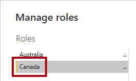
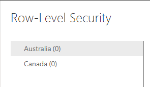
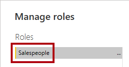

---
lab:
  title: モデル セキュリティを適用する
  module: Design and build tabular models
---

# モデル セキュリティを適用する

## 概要

**このラボの推定所要時間: 45 分**

このラボでは、事前に開発されているデータ モデルを更新してセキュリティを適用します。 具体的には、Adventure Works 社の営業担当者は、割り当てられた営業地域に関連する売上データのみを表示できる必要があります。

このラボでは、次の作業を行う方法について説明します。

- 静的ロールを作成します。

- 動的ロールを作成します。

- ロールを検証します。

- セキュリティ プリンシパルをデータセットのロールにマップします。

## はじめに

この演習では、環境を準備します。

### このコースのリポジトリを複製する

1. スタート メニューで、コマンド プロンプトを開きます

    

1. コマンド プロンプト ウィンドウで、次のように入力して D ドライブに移動します。

    `d:` 

   Enter キーを押します。

    

1. コマンド プロンプト ウィンドウで、次のコマンドを入力して、コース ファイルをダウンロードし、DP500 という名前のフォルダーに保存します。
    
    `git clone https://github.com/MicrosoftLearning/DP-500-Azure-Data-Analyst DP500`
   
1. リポジトリが複製されたら、コマンド プロンプト ウィンドウを閉じます。 
   
1. エクスプローラーで D ドライブを開き、ファイルがダウンロードされていることを確認します。

### Power BI Desktop を設定する

このタスクでは、Power BI Desktop を設定します。

1. エクスプローラーを開くには、タスク バーの **[エクスプローラー]** ショートカットを選びます。

    

2. **D:\DP500\Allfiles\09\Starter** フォルダーに移動します。

3. 開発済みの Power BI Desktop ファイルを開くには、**Sales Analysis - Enforce model security.pbix** ファイルをダブルクリックします。

4. まだサインインしていない場合は、Power BI Desktop の右上隅にある **[サインイン]** を選びます。 ラボの資格情報を使ってサインイン プロセスを完了します。

    

5. ファイルを保存するには、 **[ファイル]** リボンの **[名前を付けて保存]** を選びます。

6. **[名前を付けて保存]** ウィンドウで、**D:\DP500\Allfiles\09\MySolution** フォルダーに移動します。

7. **[保存]** を選択します。

    行レベル セキュリティを適用するように、Power BI Desktop ソリューションを更新します。**

### Power BI サービスにサインインする

このタスクでは、Power BI サービスにサインインし、試用版ライセンスを開始して、ワークスペースを作成します。

重要: VM 環境に Power BI を既にセットアップしてある場合は、次のタスクに進みます。**

1. Web ブラウザーで、[https://powerbi.com](https://powerbi.com/) にアクセスします。

2. ラボの資格情報を使ってサインイン プロセスを完了します。

    重要: Power BI Desktop からのサインインに使ったのと場合と同じ資格情報を使う必要があります。**

3. 右上にあるプロファイル アイコンを選んでから、 **[無料体験する]** を選びます。

    

4. メッセージが表示されたら、 **[無料体験する]** を選択します。

    

5. 残りのタスクをすべて行って、試用版のセットアップを完了します。

    ヒント: Power BI の Web ブラウザー エクスペリエンスは、**Power BI サービス**と呼ばれます。**

### ワークスペースの作成

このタスクでは、ワークスペースを作成します。

1. Power BI サービスでワークスペースを作成するには、**ナビゲーション** ウィンドウ (左側) で **[ワークスペース]** を選んでから、 **[ワークスペースの作成]** を選びます。

    

2. **[ワークスペースの作成]** ペイン (右側) で、 **[ワークスペース名]** ボックスにワークスペースの名前を入力します。

    ワークスペース名はテナント内で一意である必要があります。**

    

3. **[保存]** を選択します。

    

    作成されると、ワークスペースが開きます。後の演習では、データセットをこのワークスペースに発行します。**

### データ モデルを確認する

このタスクでは、データ モデルを確認します。

1. Power BI Desktop の左側で、 **[モデル]** ビューに切り替えます。

    

2. モデル図を使って、モデルの設計を確認します。

    

    モデルは、6 つのディメンション テーブルと 1 つのファクト テーブルで構成されます。**Sales** ファクト テーブルには販売注文の詳細が格納されます。これは、クラシック スター スキーマ設計です。**

3. **Sales Territory** テーブルを展開して開きます。

    

4. テーブルに **Region** 列が含まれていることがわかります。

    **Region** 列には、Adventure Works の営業地域が格納されます。この組織では、営業担当者は、割り当てられた営業地域に関連するデータのみを表示できます。このラボでは、データのアクセス許可を適用するために、2 つの異なる行レベル セキュリティ手法を実装します。**

## 静的ロールを作成する

この演習では、静的ロールを作成して検証した後、セキュリティ プリンシパルをデータセットのロールにマップする方法を説明します。

### 静的ロールを作成する

このタスクでは、2 つの静的ロールを作成します。

1. **レポート** ビューに切り替えます。

    

2. 積み上げ縦棒グラフ ビジュアルの凡例で、(現在は) 多くの地域を表示できることに注意してください。

    

    現状のグラフは、必要以上に繁雑に見えます。これは、すべての地域を表示できるためです。ソリューションで行レベル セキュリティを適用すると、レポートのユーザーには 1 つの地域のみが表示されるようになります。**

3. セキュリティ ロールを追加するには、 **[モデリング]** リボン タブで、 **[セキュリティ]** グループ内から **[ロールの管理]** を選びます。

    

4. **[ロールの管理]** ウィンドウで、 **[作成]** を選びます。

    

5. ロールに名前を付けるには、選んだテキストを **Australia** に置き換えて、**Enter** キーを押します。

    

6. **[テーブル]** の一覧で、**Sales Territory** テーブルの省略記号を選び、 **[フィルターの追加]**  >  **[[Region]]** を選びます。

    

7. **[テーブル フィルターの DAX 式]** ボックスで、**Value** を **Australia** に置き換えます。

    

    この式は、**Region** 列を値 **Australia** でフィルター処理します。**

8. 別のロールを作成するには、 **[作成]** を選びます。

    

9. このタスクの手順を繰り返して、**Canada** で **Region** 列をフィルター処理する **Canada** という名前のロールを作成します。

    

    このラボでは、ロールを 2 つだけ作ります。ただし、実際のソリューションでは、Adventure Works の 11 の地域ごとにロールを作成する必要があることを検討してください。**

10. **[保存]** を選択します。

    

### 静的ロールを検証する

このタスクでは、静的ロールの 1 つを検証します。

1. **[モデリング]** リボン タブで、 **[セキュリティ]** グループ内から **[表示方法]** を選びます。

    

2. **[ロールとして表示]** ウィンドウで、**Australia** ロールを選びます。

    

3. **[OK]** を選択します。

    

4. レポート ページで、積み上げ縦棒グラフ ビジュアルに表示されるデータが Australia のみであることに注意してください。

    

5. レポートの上部に、適用されているロールを示す黄色のバナーが表示されることに注意してください。

    

6. ロールを使った表示を止めるには、黄色いバナーの右側にある **[表示の停止]** を選びます。

    

### レポートを発行する

このタスクでは、レポートを発行します。

1. Power BI Desktop ファイルを保存します。

    
 

2. レポートを発行するには、 **[ホーム]** リボン タブの **[発行]** を選びます。

    

3. **[Power BI へ発行]** ウィンドウで、自分のワークスペースを選んで **[選択]** を選びます。

    

4. 発行が成功したら、 **[了解]** を選びます。

    

### 行レベルのセキュリティを構成する ("省略可能")**

このタスクでは、Power BI サービスで行レベル セキュリティを構成する方法について説明します。 

このタスクを行うには、作業中のテナントに **Salespeople_Australia** セキュリティ グループが存在している必要があります。 このセキュリティ グループは、テナントに自動的には存在しません。 テナントに対するアクセス許可がある場合は、次の手順に従うことができます。 トレーニングで提供されたテナントを使用している場合、セキュリティ グループを作成するための適切なアクセス許可はありません。 タスクをお読みください。ただし、セキュリティ グループが存在しない場合はタスクを完了できないことに注意してください。 **読んだ後、クリーンアップ タスクに進みます。**

1. Power BI サービス (Web ブラウザー) に切り替えます。

2. ワークスペースのランディング ページで、**Sales Analysis - Enforce model security** データセットに注目してください。

    

3. データセットをカーソルでポイントし、省略記号が表示されたら、省略記号を選んで、 **[セキュリティ]** を選びます。

    

    **[セキュリティ]** オプションは、セキュリティ グループとユーザーを含む Microsoft Azure Active Directory (Azure AD) セキュリティ プリンシパルのマッピングをサポートします。**

4. 左側のロールの一覧で **Australia** が選択されていることに注意してください。

    

5. **[メンバー]** ボックスに「**Salespeople_Australia**」と入力します。 

    ステップ 5 から 8 は、Salespeople_Australia セキュリティ グループの作成または存在に依存するため、デモンストレーションのみを目的としています。セキュリティ グループを作成するためのアクセス許可と知識がある場合は、そのまま続けてください。それ以外の場合は、クリーンアップ タスクに進んでください。**

    

6. **[追加]** を選択します。

    

7. ロールのマッピングを完了するには、 **[保存]** を選びます。

    

    これで、**Salespeople_Australia** セキュリティ グループのすべてのメンバーが **Australia** ロールにマップされ、オーストラリアの売上のみが表示されるようにデータ アクセスが制限されます。**

    実際のソリューションでは、各ロールをセキュリティ グループにマップする必要があります。**

    この設計アプローチは、地域ごとにセキュリティ グループが存在する場合に簡単で効果的です。ただし、欠点があり、作成と設定に必要な作業が増えます。また、新しい地域がオンボードされたら、データセットを更新して再発行する必要もあります。**

    次の演習では、データドリブンの動的ロールを作成します。この設計アプローチは、これらの欠点に対処するのに役立ちます。**

8. ワークスペースのランディング ページに戻るには、**ナビゲーション** ウィンドウでワークスペースを選びます。

### ソリューションをクリーンアップする

このタスクでは、データセットとモデルのロールを削除してソリューションをクリーンアップします。

1. データセットを削除するには、データセットをカーソルでポイントし、省略記号が表示されたら、省略記号を選んで、 **[削除]** を選びます。

    

    次の演習では、変更されたデータセットを再発行します。**

2. 削除するかどうかを確認するメッセージが表示されたら、**[削除]** を選択します。

    

3. Power BI Desktop に切り替えます。
 

4. セキュリティ ロールを削除するには、 **[モデリング]** リボン タブで、 **[セキュリティ]** グループ内から **[ロールの管理]** を選びます。

    

5. **[ロールの管理]** ウィンドウで最初のロールを削除するには、 **[削除]** を選びます。

    

6. 削除の確認を求められたら、 **[はい、削除します]** を選びます。

    

7. 2 番目のロールも削除します。

8. **[保存]** を選択します。

    

## 動的ロールを作成する

この演習では、モデルにテーブルを追加し、動的ロールを作成して検証してから、セキュリティ プリンシパルをデータセットのロールにマップします。

### Salesperson テーブルを追加する

このタスクでは、**Salesperson** テーブルをモデルに追加します。

1. **[モデル]** ビューに切り替えます。

    

2. **[ホーム]** リボン タブの **[クエリ]** グループ内から、 **[データの変換]** アイコンを選びます。

    

3. **[Power Query エディター]** ウィンドウの **[クエリ]** ペイン (左側) で、**Customer** クエリを右クリックして、 **[複製]** を選びます。

    

    **Customer** クエリにはデータ ウェアハウスを接続する手順が既に含まれているため、新しいクエリの作成を始めるには、それを複製するのが効率的な方法です。**

4. **[クエリの設定]** ペイン (右側) で、 **[名前]** ボックスのテキストを「**Salesperson**」に置き換えます。

    

5. **[適用したステップ]** の一覧で、 **[削除された他の列]** ステップ (3 番目のステップ) を右クリックして、 **[最後まで削除]** を選びます。

    

6. ステップの削除を確認するメッセージが表示されたら、 **[削除]** を選びます。

    

7. 別のデータ ウェアハウスのテーブルからデータを取得するには、 **[適用したステップ]** の一覧の **[ナビゲーション]** ステップ (2 番目のステップ) で、歯車アイコン (右側) を選びます。

    

8. **[ナビゲーション]** ウィンドウで、**DimEmployee** テーブルを選びます。

    

9. **[OK]** を選択します。

    

10. 必要のない列を削除するには、 **[ホーム]** リボン タブの **[列の管理]** グループ内から、 **[列の選択]** アイコンを選びます。

    

11. **[列の選択]** ウィンドウで、すべての列のチェック ボックスをオフにするには、 **[(すべての列を選択)]** 項目のチェック ボックスをオフにします。

    

12. 次の 3 つの列をオンにします。

    - EmployeeKey

    - SalesTerritoryKey

    - EmailAddress

13. **[OK]** を選択します。

    

14. **EmailAddress** 列の名前を変更するには、**EmailAddress** 列のヘッダーをダブルクリックします。

15. テキストを「**UPN**」に置き換えてから、**Enter** キーを押します。

    UPN は、ユーザー プリンシパル名の頭字語です。この列の値は、Azure AD アカウント名と一致します。**

    

16. テーブルをモデルに読み込むには、 **[ホーム]** リボン タブで **[閉じて適用]** アイコンを選びます。

    

17. テーブルがモデルに追加されると、**Sales Territory** テーブルへのリレーションシップが自動的に作成されることに注意してください。

### リレーションシップを構成する

このタスクでは、新しいリレーションシップのプロパティを構成します。

1. **Salesperson** と **Sales Territory** テーブルの間のリレーションシップを右クリックして、 **[プロパティ]** を選びます。

    

2. **[リレーションシップの編集]** ウィンドウの **[クロス フィルター方向]** ドロップダウン リストで、 **[両方]** を選びます。

3. **[両方向にセキュリティ フィルターを適用する]** チェック ボックスをオンにします。

    

    **Sales Territory** テーブルから **Salesperson** テーブルには 1 対多のリレーションシップがあるため、フィルターは **Sales Territory** テーブルから **Salesperson** テーブルに対してのみ伝達されます。他方の方向に伝達を強制するには、クロス フィルターの方向を両方に設定する必要があります。**

4. **[OK]** を選択します。

    

5. テーブルを非表示にするには、**Salesperson** テーブルの右上にある目のアイコンを選びます。

    

    **Salesperson** テーブルの目的は、データのアクセス許可を適用することです。非表示にすると、レポート作成者と Q&A エクスペリエンスにテーブルまたはそのフィールドは表示されません。**
 

### 動的ロールを作成する

このタスクでは、モデル内のデータに基づいてアクセス許可を適用する動的ロールを作成します。

1. **レポート** ビューに切り替えます。

    

2. セキュリティ ロールを追加するには、 **[モデリング]** リボン タブで、 **[セキュリティ]** グループ内から **[ロールの管理]** を選びます。

    

3. **[ロールの管理]** ウィンドウで、 **[作成]** を選びます。

    

4. ロールの名前を指定するには、選んだテキストを **Salespeople** に置き換えます。

    

    今回は、作成する必要があるロールは 1 つだけです。**

5. **Salesperson** テーブルの **UPN** 列にフィルターを追加します。

    

6. **[テーブル フィルターの DAX 式]** ボックスで、 **"Value"** を **USERPRINCIPALNAME()** に置き換えます。

    

    この式は、USERPRINCIPALNAME 関数で UPN 列をフィルター処理します。これにより、認証されたユーザーのユーザー プリンシパル名 (**UPN**) が返されます。**

    UPN で **Salesperson** テーブルをフィルター処理すると、**Sales Territory** テーブルがフィルター処理され、さらに **Sales** テーブルがフィルター処理されます。これにより、認証されたユーザーに、割り当てられた地域の売上データのみが表示されます。**

7. **[保存]** を選択します。

    

### 動的ロールを検証する

このタスクでは、動的ロールを検証します。

1. **[モデリング]** リボン タブで、 **[セキュリティ]** グループ内から **[表示方法]** を選びます。

    

2. **[ロールとして表示]** ウィンドウで **[その他のユーザー]** をオンにしてから、対応するボックスに「 **michael9@adventure-works.com** 」と入力します

    

    テストのため、 **[その他のユーザー]** を USERPRINCIPALNAME 関数によって返される値にします。この営業担当者は **Northeast** 地域に割り当てられていることに注意してください。**

3. **[営業担当者]** ロールを確認します。

    

4. **[OK]** を選択します。

    

5. レポート ページで、積み上げ縦棒グラフ ビジュアルに表示されるデータが Northeast のみであることに注意してください。

    

6. レポートの上部に、適用されているロールを示す黄色のバナーが表示されることに注意してください。

    

7. ロールを使った表示を止めるには、黄色いバナーの右側にある **[表示の停止]** を選びます。

    

### 設計を完成させる

このタスクでは、レポートを発行し、セキュリティ グループをロールにマッピングすることで、設計を完成させます。

このタスクの手順は、意図的に簡単にしてあります。手順について詳しくは、前の演習のタスクの手順をご覧ください。**

1. Power BI Desktop ファイルを保存します。

    

2. ラボの最初に作成したワークスペースにレポートを発行します。 

3. Power BI Desktop を閉じます。

4. Power BI サービス (Web ブラウザー) に切り替えます。

5. **Sales Analysis - Enforce model security** データセットのセキュリティ設定に移動します。

6. **Salespeople** セキュリティ グループを **Salespeople** ロールにマップします。

    

    これで、**Salespeople** セキュリティ グループのすべてのメンバーが **Salespeople** ロールにマップされます。認証されたユーザーが **Salesperson** テーブル内の行で表されていると、その割り当てられた営業区域が販売テーブルのフィルター処理に使われます。**

    この設計アプローチは、データ モデルにユーザー プリンシパル名の値が格納されている場合に、簡単で効果的です。営業担当者が追加または削除されたり、異なる営業区域に割り当てられたりしたとき、この設計アプローチは簡単に機能します。**
