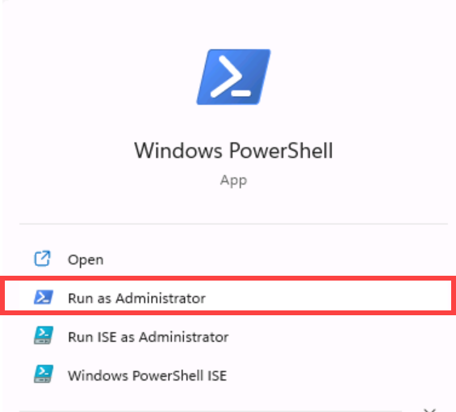
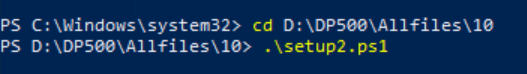
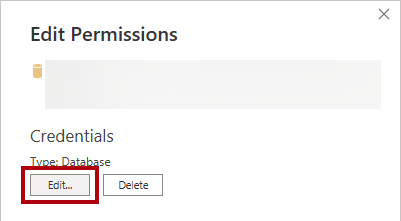
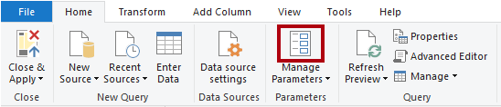
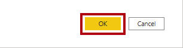
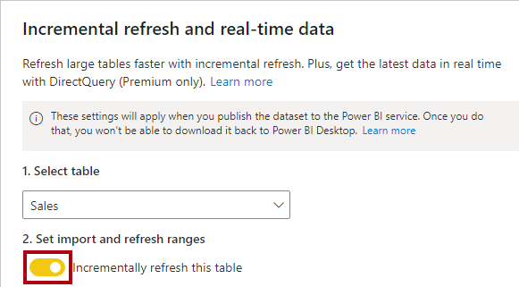

---
lab:
  title: ハイブリッド テーブルを使用してパフォーマンスを向上させる
  module: Optimize enterprise-scale tabular models
---

# ハイブリッド テーブルを使用してパフォーマンスを向上させる

## 概要

**このラボの推定所要時間: 45 分**

このラボでは、増分更新を設定し、DirectQuery パーティションを有効にして、リアルタイムの更新を提供し、更新とクエリのパフォーマンスを向上させます。

このラボでは、次の作業を行う方法について説明します。

- 増分更新を設定する。

- テーブル パーティションを確認する。

## はじめに

この演習では、環境を準備します。

### このコースのリポジトリを複製する

1. スタート メニューで、コマンド プロンプトを開きます。

    

1. コマンド プロンプト ウィンドウで、次のように入力して D ドライブに移動します。

    `d:` 

   Enter キーを押します。

    

1. コマンド プロンプト ウィンドウで、次のコマンドを入力して、コース ファイルをダウンロードし、DP500 という名前のフォルダーに保存します。
    
    `git clone https://github.com/MicrosoftLearning/DP-500-Azure-Data-Analyst DP500`
   
1. リポジトリが複製されたら、エクスプローラーで D ドライブを開き、ファイルがダウンロードされていることを確認します。 **コマンド プロンプト ウィンドウを閉じます**。

### Azure SQL Database をデプロイする 

このタスクでは、Power BI のデータ ソースとして使用する Azure SQL データベースを作成します。 セットアップ スクリプトを実行すると、Azure SQL データベース サーバーが作成され、AdventureWorksDW2022 データベースが読み込まれます。

1. エクスプローラーを開くには、タスク バーで**エクスプローラー**のショートカットを選択します。

    

2. **D:\DP500\Allfiles\10** フォルダーに移動します。

3. **setup2.ps1** ファイル スクリプトをダブルクリックして開きます。
    - スクリプトによって設定されるリソースを理解したい場合は、メモ帳でスクリプトをお読みください。 # で始まる行は、スクリプトの実行内容を示しています。
    - スクリプトを閉じます。

5. タスク バーの検索ボックスに、「`PowerShell`」と入力します。  
   
   検索結果が表示されたら、 **[管理者として実行]** を選択します
    
    
    
    "メッセージが表示されたら、[はい] を選択して、このアプリによるデバイスの変更を許可します。"**
1. PowerShell で、次の 2 行のテキストを入力してスクリプトを実行します。 
    
    ` cd D:\DP500\Allfiles\10`

    **Enter** キーを押します。

    `.\setup2.ps1`
    
    **Enter** キーを押します

    

2. メッセージが表示されたら、**Azure アカウントのユーザー名**、**パスワード**、**リソース グループ名**を入力します。 **Enter** キーを押します。 

    

    このスクリプトの実行には、約 10 から 15 分かかります。

    "注: このラボでは、Azure SQL データベースを作成するためのリソース グループが必要です。ホストされているラボ環境にリソース グループが用意されていない場合は、Azure サブスクリプションに[リソース グループを作成](https://docs.microsoft.com/azure/azure-resource-manager/management/manage-resource-groups-portal#create-resource-groups)します。"**
3. スクリプトが完了したら、PowerShell ウィンドウを閉じます。

### Azure SQL Database を設定する

このタスクでは、Azure SQL Database を、仮想マシン (VM) の IP アドレスからの接続を許可するように設定します。 ユーザー名、パスワード、リソース グループを入力した後、このスクリプトの実行には約 10 分かかります。

1. Web ブラウザーで、[https://portal.azure.com](https://portal.azure.com/) にアクセスします。

2. ツアーの開始を求めるメッセージが表示されたら、 **[後で行う]** を選択します。

    

3. **[SQL データベース]** タイルを選択します。

    

4. SQL データベースの一覧で、**AdventureWorksDW2022-DP500** データベースを選択します。

5. [概要] タブのアクション バーで、 **[サーバー ファイアウォールの設定]** を選択します。

    

6. [パブリック アクセス] タブで、[選択されたネットワーク] を選択します。

7. **[クライアント IPv4 アドレスの追加]** を選択します。

    

7. **[保存]** を選択します。

    

8. Azure portal Web ブラウザー セッションを開いたままにしておきます。 **「Power BI Desktop を設定する」タスク**でデータベース接続文字列をコピーする必要があります。

### Power BI サービスを設定する

このタスクでは、Power BI サービスにサインインして、試用版ライセンスを開始します。

"重要: VM 環境に Power BI を既にセットアップしてある場合は、次のタスクに進みます。"**

1. Web ブラウザーで、[https://powerbi.com](https://powerbi.com/) にアクセスします。

2. ラボの資格情報を使用してサインイン プロセスを完了します。

3. 右上にあるプロファイル アイコンを選択し、 **[無料体験する]** を選択します。

    

4. メッセージが表示されたら、 **[無料体験する]** を選択します。

    

    "このラボを完了するには、Power BI Premium Per User (PPU) ライセンスが必要です。試用版ライセンスで十分です。"**

5. 残りのタスクをすべて行って、試用版のセットアップを完了します。

    "ヒント: Power BI の Web ブラウザー エクスペリエンスは、**Power BI サービス**と呼ばれます。"**

### ワークスペースの作成

このタスクでは、ワークスペースを作成します。

1. Power BI サービスでワークスペースを作成するには、**ナビゲーション** ウィンドウ (左側) で **[ワークスペース]** を選んでから、 **[ワークスペースの作成]** を選びます。

    

2. **[ワークスペースの作成]** ペイン (右側) で、 **[ワークスペース名]** ボックスにワークスペースの名前を入力します。

    "ワークスペース名はテナント内で一意である必要があります。"**

    

3. **[説明]** ボックスの下にある **[詳細]** セクションを展開して開きます。

    

4. **[ライセンス モード]** オプションを **[Premium per user]** に設定します。

    

    "Power BI では、Premium ワークスペースの増分更新とハイブリッド テーブルのみがサポートされます。"**

5. **[保存]** を選択します。

    

    "作成されると、Power BI サービスによってワークスペースが開かれます。このワークスペースには、このラボで後ほど戻ります。"**

### Power BI Desktop を設定する

このタスクでは、事前に開発された Power BI Desktop ソリューションを開き、データ ソースの設定とアクセス許可を設定し、データ モデルを更新します。

1. エクスプローラーを開くには、タスク バーで**エクスプローラー**のショートカットを選択します。

    

2. **D:\DP500\Allfiles\10\Starter** フォルダーに移動します。

3. 事前に作成された Power BI Desktop ファイルを開くには、**Sales Analysis - Improve performance with hybrid tables.pbix** ファイルをダブルクリックします。

4. データベースのデータ ソースを編集するには、 **[ホーム]** リボン タブの **[クエリ]** グループ内で **[データの変換]** ドロップダウンを選択し、 **[データ ソース設定]** を選択します。

    

5. **[データ ソース設定]** ウィンドウで、 **[ソースの変更]** を選択します。

    

6. **[SQL Server データベース]** ウィンドウの **[サーバー]** ボックスで、テキストをラボの Azure SQL Database サーバーに置き換えます。 これは、Azure portal の [SQL データベース] にあります。

    

7. **[OK]** を選択します。

    

8. **[Edit Permissions](アクセス許可の編集)** を選択します。

    

9. **[アクセス許可の編集]** ウィンドウで、データベース資格情報を編集するには、 **[編集]** を選択します。

    

10. **[SQL Server データベース]** ウィンドウで、SQL Server データベースのユーザー名とパスワードを入力して保存します。 

    ユーザー名: `sqladmin`

    パスワード: `P@ssw0rd01`

    

11.  **[OK]** を選択します。
    

12. **[データ ソース設定]** ウィンドウで、 **[閉じる]** を選択します。

    

13. **[ホーム]** リボン タブの **[クエリ]** グループ内から、 **[更新]** を選択します。

    

14. データの更新が完了するまで待ちます。

15. ファイルを保存するには、 **[ファイル]** リボン タブで **[名前を付けて保存]** を選択します。

16. **[名前を付けて保存]** ウィンドウで、**D:\DP500\Allfiles\10\MySolution** フォルダーに移動します。

17. **[保存]** を選択します。

18. まだサインインしていない場合は、Power BI Desktop の右上隅にある **[サインイン]** を選びます。 ラボの資格情報を使用してサインイン プロセスを完了します。

    "重要: Power BI サービスへのサインインに使用したものと同じ資格情報を使用する必要があります。"**

    

### レポートを確認する

このタスクでは、事前に作成されたレポートを確認します。

1. Power BI Desktop で、レポート デザインを確認します。

    

    "このレポート ページには、タイトルと 2 つのビジュアルがあります。スライサー ビジュアルを使用すると、単一の会計年度でフィルター処理を行うことができ、縦棒グラフ ビジュアルでは、月別の売上高が表示されます。このラボでは、増分更新とハイブリッド テーブルを設定することでレポートのパフォーマンスを向上させます。"**

### データ モデルを確認する

このタスクでは、事前に作成されたデータ モデルを確認します。

1. **[モデル]** ビューに切り替えます。

    

2. モデル図を使って、モデルのデザインを確認します。

    

    "このモデルは、5 つのディメンション テーブルと 1 つのファクト テーブルで構成されます。各テーブルでは、インポート ストレージ モードが使用されます。**Sales** ファクト テーブルには販売注文の詳細が格納されます。これは、クラシック スター スキーマ設計です。"**

    "このラボでは、増分更新を使用してハイブリッド テーブルになるように **Sales** テーブルを設定します。ハイブリッド テーブルには、最新の期間を表す DirectQuery パーティションが含まれます。このパーティションにより、データ ソースからの現在のデータを Power BI レポートで確実に使用できるようになります。"**

## 増分更新を設定する

この演習では、増分更新を設定します。

"増分更新では、新しいデータや更新されたデータを頻繁に読み込むデータセット テーブルのパーティションの作成と管理を自動化することで、スケジュールされた更新操作が拡張されます。これは、更新時間を短縮し、ソース データと Power BI への負担を軽減するのに役立ちます。また、現在のデータを Power BI レポートにより迅速に表示するためにも役立ちます。"**

### パラメーターを追加する

このタスクでは、2 つのパラメーターを追加します。

1. Power Query エディター ウィンドウを開くには、 **[ホーム]** リボン タブの **[クエリ]** グループ内で、 **[データの変換]** アイコンをクリックします。

    

2. Power Query エディター ウィンドウの **[クエリ]** ペイン内で、 **[Sales]** クエリを選択します。

    

3. プレビュー ペインで、**OrderDate** 列に注意してください。これは、日付/時刻列です。

    "増分更新では、テーブルに、値が yyyymmdd として書式設定された日付/時刻または整数データ型の日付列が含まれている必要があります。"**

    "増分更新を設定するには、この列をフィルター処理してテーブル パーティションを作成するために Power BI で使用されるパラメーターを作成する必要があります。"**

4. パラメーターを作成するには、 **[ホーム]** リボン タブで、 **[マネージャー パラメーター]** アイコンを選択します。

    

5. **[マネージャー パラメーター]** ウィンドウで、 **[新規]** を選択します。

    

6. **[名前]** ボックスで、テキストを「**RangeStart**」に置き換えます。

7. **[型]** ドロップダウン リストで、 **[日付/時刻]** を選択します。

8. **[現在の値]** ボックスに、「**6/1/2022**」 (2022 年 5 月 1 日 - VM では米国の日付形式が使用されます) と入力します。 

    "MM-DD-YYY 以外の形式の場所の場合、データは 1/6/2022 として入力する必要があることに注意してください"**

    "パラメーターの設定中に、任意の値を使用できます。Power BI では、パーティションを作成および管理するときに、パラメーター値が更新されます。このラボでは、月の範囲を 2022 年 6 月に設定します。"**

    

9. 2 番目のパラメーターを作成するには、 **[新規]** を選択します。

10. 次のパラメーター プロパティを設定します。

    - 名前: **RangeEnd**

    - 型: **日付/時刻**

    - 現在の値: **7/1/2022** (2022 年 7 月 1 日)

     "MM-DD-YYY 以外の形式の場所の場合、データは 1/7/2022 として入力する必要があることに注意してください"**

    

11. **[OK]** を選択します。

    

###  クエリのフィルター処理

このタスクでは、**Sales** クエリにフィルターを追加します。

1. **[クエリ]** ペインで、 **[Sales]** クエリを選択します。

2. **OrderDate** 列のヘッダーで、下矢印を選択し、 **[日付/時刻フィルター]**  >  **[次の値の間]** を選択します。

    

3. **[行のフィルター処理]** ウィンドウで、最初のカレンダー アイコンのドロップダウン リストを選択し、 **[パラメーター]** を選択します。

    

4. 隣接するドロップダウン リストで、**RangeStart** パラメーターが設定されていることに注意してください。

    "既定のパラメーター選択は正しい選択です。"**

5. 2 番目の [範囲] ドロップダウン リストで、 **[次の日付より前]** を選択します。

    

6. 対応するドロップダウン リストで、 **[RangeEnd]** パラメーターを選択します。

    

7. **[OK]** を選択します。

    

8. **[ホーム]** リボン タブの **[閉じる]** グループ内から、 **[閉じて適用]** アイコンをクリックします。

    

9. Power BI Desktop によって新しいテーブルに 5,134 行が **Sales** テーブルに読み込まれたことを確認します。

    

    "これらは、2022 年 6 月でフィルター処理された行です。"**

10. Power BI Desktop ファイルを保存します。

    

### 増分更新を設定する

このタスクでは、**Sales** テーブルの増分更新ポリシーを設定します。

1. モデル図で、**Sales** テーブルのヘッダーを右クリックし、 **[増分更新]** を選択します。

    

2. **[増分更新とリアルタイム データ]** ウィンドウの手順 2 で、増分更新をオンにします。

    

3. 更新日の **2 年**前からデータのアーカイブを開始するように設定します。

    

    "この設定により、履歴期間が決まります。この場合、Power BI では履歴データ用に 2 つの年間パーティションを作成します。"**

4. 更新日の **7 日**前からデータの増分更新を開始するように設定します。

    

    "この設定により、増分更新期間が決まります。その期間内の日付/時刻を含むすべての行が更新パーティションに含められ、更新操作のたびに更新されます。"**

5. 手順 3 で、 **[DirectQuery を使用して最新のデータをリアルタイムで取得する]** オプションをオンにします。

    

    "この設定により、DirectQuery を使用して、増分更新期間を超えるデータ ソースで選択したテーブルから最新の変更をフェッチできます。増分更新期間より後の日付/時刻を含むすべての行は DirectQuery パーティションに含まれており、すべてのデータセット クエリを使用してデータ ソースからフェッチされます。インポート パーティションと 1 つの DirectQuery パーティションが含まれるため、この設定により、テーブルはハイブリッド テーブルになります。"**

6. **[適用]** を選択します。

    

7. Power BI Desktop ファイルを保存します。

    

### データセットを発行する

このタスクでは、データセットを発行します。

1. レポートを発行するには、 **[ホーム]** リボン タブの **[発行]** を選びます。

    

2. **[Power BI に発行]** ウィンドウで、このラボで作成したワークスペースを選択し、[選択] を選択します。

    

3. 発行が成功したら、 **[了解]** を選びます。

    

4. Power BI Desktop を閉じます。

5. 変更を保存するかどうかを確認するウィンドウで、 **[保存]** を選びます。

    

### データセットを設定する

このタスクでは、データ ソースの資格情報を設定し、データセットを更新します。

1. Power BI サービス Web ブラウザー セッションに切り替えます。

2. ワークスペースのランディング ページで、レポートとデータセットを見つけます。

    

3. データセットをカーソルでポイントし、省略記号が表示されたら、省略記号を選んで、 **[設定]** を選択します。

    

4. **[データ ソースの資格情報]** セクションで、 **[資格情報の編集]** リンクを選択します。

    

5. このウィンドウで、ユーザー名とパスワードを入力し、プライバシー レベルを [組織] に設定します。
       
    ユーザー名: `sqladmin`

    パスワード: `P@ssw0rd01`

    

6. **[サインイン]** を選択します。

    

8. **[スケジュールされた更新とパフォーマンスの最適化]** セクションを展開して開きます。

    

9. 確認するだけで、どの設定も変更しないでください。

    "実際の設定では、Power BI でパーティションを定期的に更新および管理できるようにデータの更新をスケジュールします。"**

    "このラボでは、オンデマンド更新を実行します。"**

10. **[ナビゲーション]** ペイン (左側にあります) で、お使いのワークスペースを選択します。

11. ワークスペース ランディング ページで、データセットをカーソルでポイントし、 **[更新]** アイコンを選択します。

    

12. **Refreshed** 列で、回転するアイコンを確認し、それが停止するまで待ちます (停止すると、更新が完了したことを示します)。

    

13. ワークスペースの設定を開くには、右上にある **[設定]** を選択します。

    

14. **[設定]** ペインで、 **[Premium]** タブを選択します。

    

15. ワークスペース接続をクリップボードにコピーするには、 **[コピー]** を選択します。

    

    "SQL Server Management Studio (SSMS) で、このワークスペース接続を使用してワークスペースに接続します。"**

16. ペインを閉じるには、 **[キャンセル]** を選択します。

    

### テーブル パーティションを確認する

このタスクでは、SSMS を使用してテーブル パーティションを確認します。

1. SSMS を開くには、タスク バーで、**SSMS** のショートカットを選択します。

    

2. **[サーバーに接続]** ウィンドウの **[サーバーの種類]** ドロップダウン リストで、 **[Analysis Services]** を選択します。

    

    "XMLA 読み取り/書き込みエンドポイントを使用すると、SSMS を使用してワークスペースに接続できます。このエンドポイントは、Premium ワークスペースでのみ使用できます。"**

3. **[サーバー名]** ボックスで、ワークスペース接続を貼り付けて (**Ctrl + V** キーを押して) テキストを置き換えます。

4. **[認証]** ドロップダウン リストで、 **[Azure Active Directory - パスワード]** を選択します。

5. ラボの資格情報を入力します。

6. **[接続]** を選択します。

    

7. オブジェクト エクスプローラー (左側にあります) で、**Databases** フォルダー、 **[Sales Analysis...]** データベース (データセット)、**Tables** フォルダーの順に展開して開きます。

    

8. **Sales** テーブルを右クリックし、 **[パーティション]** を選択します。

    

9. **[パーティション]** ウィンドウで、2 年間の履歴のパーティション、その後に続く四半期パーティションと日単位のパーティションの一覧を確認します。

10. 一覧を下方にスクロールし、最後のパーティションが、現在および将来の日付の DirectQuery パーティションであることを確認します。

    "Power BI では、これらのすべてのパーティションが自動的に作成および管理されます。"**

11. **[キャンセル]** を選択します。

    

## ハイブリッド テーブルをテストする

この演習では、レポートを開き、販売注文を追加し、レポート データの更新を確認します。

### レポートを開く

このタスクでは、レポートを開きます。

1. Power BI サービス Web ブラウザー セッションに切り替えます。

2. ワークスペース ランディング ページで、レポートを選択します。

    

3. 必要に応じて、 **[会計年度]** スライサーで、現在の月 (今日の日付に基づく) を含む会計年度を選択します。

    "現在の月は、横棒グラフの横棒として表示されます。"**

    "2022 年 8 月以降は、スライサーの既定値である 2022 年度には含まれていないことに注意してください。"**

### 注文をデータベースに追加する

このタスクでは、注文をデータベースに追加します。

1. SSMS に切り替えます。

2. スクリプト ファイルを開くには、 **[ファイル]** メニューで、 **[開く]**  >  **[ファイル]** を選択します。

3. **[ファイルを開く]** ウィンドウで、**D:\DP500\Allfiles\10\Assets** フォルダーに移動します。

4. **1-InsertOrder.sql** ファイルを選択し、 **[開く]** を選択します。

    

5. **[データベース エンジンに接続]** ウィンドウで、 **[サーバー名]** ドロップダウン リストがラボの Azure SQL Database サーバーに設定されていることを確認します。

6. **[認証]** ドロップダウン リストで、 **[SQL Server 認証]** を選択します。

7. ユーザー名 **sqladmin** とパスワードを入力します。

8. **[接続]** を選択します。

    

9. スクリプトを確認します。

    "このスクリプトでは、今日を注文日として使用して、1 件の注文を **FactInternetSales** テーブルに挿入します。"**

10. スクリプトを実行するには、ツール バーで **[実行]** を選択します (または **F5** キーを押します)。

    

11. ファイルを閉じるには、 **[ファイル]** メニューで **[閉じる]** を選択します。

### レポートを更新する

このタスクでは、レポートを更新します。

1. Power BI サービス Web ブラウザー セッションに切り替えます。

2. レポートで、現在の月の売上金額をメモします。

3. アクション バーで、 **[更新]** コマンドを選択します。

    

4. レポートの更新が完了したら、現在の月の売上金額が 10,000 ドル増加したことを確認します。

    "Power BI では **Sales** テーブルのクエリを実行したときに、Azure SQL データベースに直接クエリを実行した DirectQuery パーティションから現在のデータを取得しました。"**

    "ヒント: ハイブリッド テーブルは、ページの自動更新 (Power BI レポートを自動的に更新する機能) を使用する場合に特に適しています。"**

### 仕上げ

このタスクでは、完了作業を行います。 SSMS を開き、データベース AdventureWorksDW2022-DP500 に接続していることを確認します。

1. SSMS で、**2-Cleanup.sql** ファイルを開きます。

    

    このスクリプトは、挿入した注文を削除します。

2. スクリプトを実行します。

3. SSMS を閉じます。
