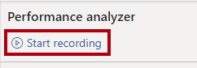
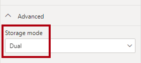
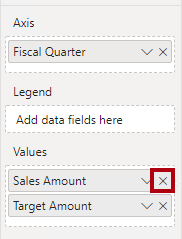

---
lab:
  title: デュアル ストレージ モードを使用してクエリのパフォーマンスを向上させる
  module: Optimize enterprise-scale tabular models
---

# デュアル ストレージ モードを使用してクエリのパフォーマンスを向上させる

## 概要

**このラボの推定所要時間: 30 分**

このラボでは、一部のテーブルを、デュアル ストレージ モードを使用するように設定することで、複合モデルのパフォーマンスを向上させます。

このラボでは、次の作業を行う方法について説明します。

- デュアル ストレージ モードを設定します。

- パフォーマンス アナライザーを使用して更新アクティビティを確認します。

## はじめに

この演習では、環境を準備します。

### このコースのリポジトリを複製する

1. スタート メニューで、コマンド プロンプトを開きます

    

1. コマンド プロンプト ウィンドウで、次のように入力して D ドライブに移動します。

    `d:` 

   Enter キーを押します。

    

1. コマンド プロンプト ウィンドウで、次のコマンドを入力して、コース ファイルをダウンロードし、DP500 という名前のフォルダーに保存します。
    
    `git clone https://github.com/MicrosoftLearning/DP-500-Azure-Data-Analyst DP500`
   
1. リポジトリが複製されたら、コマンド プロンプト ウィンドウを閉じます。 
   
1. エクスプローラーで D ドライブを開き、ファイルがダウンロードされていることを確認します。

### Power BI Desktop を設定する

このタスクでは、事前に開発された Power BI Desktop ソリューションを開きます。

1. エクスプローラーを開くには、タスク バーで**エクスプローラー**のショートカットを選択します。

    

2. **D:\DP500\Allfiles\11\Starter** フォルダーに移動します。

3. 事前に作成された Power BI Desktop ファイルを開くには、**Sales Analysis - Use tools to optimize Power BI performance.pbix** ファイルをダブルクリックします。

4. 潜在的なセキュリティ リスクに関するメッセージが表示されたら、 **[OK]** を選択します。

    

5. ネイティブ データベース クエリの実行の承認を求めるメッセージが表示されたら、 **[実行]** を選択します。

6. ファイルを保存するには、 **[ファイル]** リボン タブで **[名前を付けて保存]** を選択します。

7. **[名前を付けて保存]** ウィンドウで、**D:\DP500\Allfiles\11\MySolution** フォルダーに移動します。

8. **[保存]** を選択します。

### レポートを確認する

このタスクでは、事前に作成されたレポートを確認します。

1. Power BI Desktop のステータス バーの右下隅にある [ストレージ モード] が [混合] に設定されていることに注意してください。

    

    混合モデルは、異なるソース グループのテーブルで構成されます。このモデルには、Excel ブックをデータ ソースとするインポート テーブルが 1 つあります。残りのテーブルでは、データ ウェアハウスである SQL Server データベースへの DirectQuery 接続が使用されます。

2. レポートのデザインを確認します。

    

    このレポート ページには、タイトルと 2 つのビジュアルがあります。スライサー ビジュアルを使用すると、単一の会計年度でフィルター処理を行うことができ、縦棒グラフ ビジュアルでは、四半期ごとの売上高と目標金額が表示されます。一部のテーブルを、デュアル ストレージ モードを使用するように設定して、レポートのパフォーマンスを向上させます。

### データ モデルを確認する

このタスクでは、事前に作成されたデータ モデルを確認します。

1. **[モデル]** ビューに切り替えます。

    

2. モデル図を使って、モデルのデザインを確認します。

    

    このモデルは、3 つのディメンション テーブルと 2 つのファクト テーブルで構成されます。**Sales** ファクト テーブルは販売注文の詳細を表し、**Targets** テーブルは四半期ごとの売上目標を表します。これは、従来のスター スキーマ設計です。一部のテーブルの上部にあるバーは、それらが DirectQuery ストレージ モードを使用していることを示します。青色のバーがあるすべてのテーブルは、同じソース グループに属します。

    このラボでは、一部のテーブルを、デュアル ストレージ モードを使用するように設定します。

## デュアル ストレージ モードを設定する

この演習では、デュアル ストレージ モードを設定します。

デュアル ストレージ モードを使用するモデル テーブルでは、インポートと DirectQuery の両方のストレージ モードが同時に使用されます。Power BI では、クエリで使用する最も効率的なストレージ モードをクエリごとに決定しますが、インポート モードの方が高速であるため、可能な限りこのモードを使用するように努めます。

### パフォーマンス アナライザーを使用する

このタスクでは、パフォーマンス アナライザーを開き、それを使用して更新イベントを検査します。

1. **レポート** ビューに切り替えます。

    

2. ビジュアル更新イベントを検査するには、 **[表示]** リボン タブの **[表示]** ペイン グループで、 **[パフォーマンス アナライザー]** を選択します。

    

3. **[パフォーマンス アナライザー]** ペイン ( **[視覚化]** ペインの左側にあります) で、 **[記録の開始]** を選択します。

    

    パフォーマンス アナライザーでは、ビジュアルの更新に必要な期間を検査して表示します。各ビジュアルでは、少なくとも 1 つのクエリがソース データベースに発行されます。詳細については、「[パフォーマンス アナライザーを使用してレポート要素のパフォーマンスを確認する](https://docs.microsoft.com/power-bi/create-reports/desktop-performance-analyzer)」を参照してください。

4. **[ビジュアルを更新する]** を選択します。

    

5. **[パフォーマンス アナライザー]** ペインで、 **[スライサー]** ビジュアルを展開して開き、DirectQuery イベントに注意してください。

    

    Direct query イベントが表示される度に、Power BI で DirectQuery ストレージ モードを使用してソース データベースからデータが取得されたことが通知されます。

6. **Sales Result by Fiscal Quarter** ビジュアルを展開して開き、Direct query イベントも記録されていることを確認します。

    

    スライス ビジュアルを設定する場合は必ず同じテーブルの 1 つ以上のフィールドを使用します。異なるテーブルのフィールドを使用してスライサーを設定することはできません。さらに、スライサーでは、ほとんどの場合、ディメンション テーブルのフィールドが使用されます。このため、スライサー ビジュアルのクエリ パフォーマンスを向上するには、インポートされたデータが格納されていることを確認する必要があります。この場合、ディメンション テーブルでは DirectQuery ストレージ モードが使用されるため、これらのテーブルをデュアル ストレージ モードに設定できます。ディメンション テーブルに格納される行の数は、(ファクト テーブルと比べて) 少ないため、モデル キャッシュが過度に大きくなることはありません。

### デュアル ストレージ モードを設定する

このタスクでは、すべてのディメンション テーブルを、デュアル ストレージ モードを使用するように設定します。

1. **[モデル]** ビューに切り替えます。

2. **Product** テーブルのヘッダーを選択します。

3. **Ctrl** キーを押しながら、**Order Date** テーブルと **Sales Territory** テーブルのヘッダーも選択します。

4. **[プロパティ]** ペインで、 **[詳細]** セクションを展開して開きます。

    

5. **[ストレージ モード]** ドロップダウン リストで、 **[デュアル]** を選択します。

    

6. 更新の確認を求めるメッセージが表示されたら、 **[OK]** を選択します。

    

    この警告は、Power BI Desktop でデータをモデル テーブルにインポートするのにかなりの時間がかかる可能性があることを通知します。

7. モデル図で、各ディメンション テーブルの上部にあるストライプ バーに注意してください。

    

    ストライプ バーは、デュアル ストレージ モードを示します。

### レポートを確認する

このタスクでは、事前に作成されたレポートを確認します。

1. **レポート** ビューに切り替えます。

    

2. **[パフォーマンス アナライザー]** ペインで、 **[クリア]** を選択します。

    

3. ビジュアルを更新します。

    

4. スライサー ビジュアルではDirectQuery接続が使用されなくなったことに注意してください。

    Power BI では、インポートされたデータのモデル キャッシュに対してクエリが実行されるため、スライサーはより迅速に更新されるようになります。

5. ただし、縦棒グラフ ビジュアルでは引き続きDirectQuery接続が使用されることに注意してください。

    これは、**Sales Amount** フィールドが **Sales** テーブルの列であり、これは DirectQuery ストア モードを使用するためです。

6. 縦棒グラフ ビジュアルを選択し、 **[視覚化]** ペインの **[値]** ウェル内から **[Sales Amount]** フィールドを削除します。

    

7. さらに、 **[ヒント]** ウェルから 2 つのフィールドを削除します。

    

    これらの両方のメジャーは、**Sales Amount** 列によって異なります。

8. **[パフォーマンス アナライザー]** ペインで、最後の更新イベントを展開して開き、縦棒グラフ ビジュアルでDirectQuery接続が使用されなくなったことに注意してください。

    これは、縦棒グラフ ビジュアルでは、2 つのテーブルしか使用されなくなり、これらは両方ともモデルにキャッシュされているためです。**Order Date** テーブルではデュアル ストレージ モードが使用され、**Targets** テーブルではインポート ストレージ モードが使用されます。

    以上で、Power BI でモデル キャッシュからデータを取得できる特定のクエリのパフォーマンスが向上しました。重要なポイントは、DirectQuery ファクト テーブルに関連するディメンション テーブルは、通常、デュアル ストレージ モードに設定する必要があることです。そうすることで、スライサーによってクエリを実行すると、クエリが迅速になります。

    集計を追加すると、モデルをさらに最適化してクエリのパフォーマンスを向上させることができます。ただし、この強化機能は、別のラボの学習目的です。

### 仕上げ

このタスクでは、完了作業を行います。

1. Power BI Desktop ファイルを保存します。

    

2. Power BI Desktop を閉じます。
