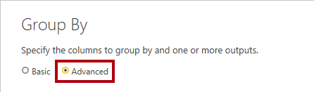
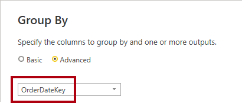
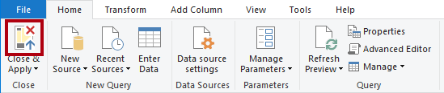
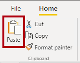

---
lab:
  title: 集計を使用してクエリのパフォーマンスを向上させる
  module: Optimize enterprise-scale tabular models
---

# 集計を使用してクエリのパフォーマンスを向上させる

## 概要

**このラボの推定所要時間: 30 分**

このラボでは、集計を追加して **Sales** ファクト テーブルのクエリ パフォーマンスを向上させます。

このラボでは、次の作業を行う方法について説明します。

- 集計を設定する。

- パフォーマンス アナライザーを使用して、Power BI が集計を使用しているかどうかを判断する。

## はじめに

この演習では、環境を準備します。

### このコースのリポジトリを複製する

1. スタート メニューで、コマンド プロンプトを開きます

    

1. コマンド プロンプト ウィンドウで、次のように入力して D ドライブに移動します。

    `d:` 

   Enter キーを押します。

    

1. コマンド プロンプト ウィンドウで、次のコマンドを入力して、コース ファイルをダウンロードし、DP500 という名前のフォルダーに保存します。
    
    `git clone https://github.com/MicrosoftLearning/DP-500-Azure-Data-Analyst DP500`
   
1. リポジトリが複製されたら、コマンド プロンプト ウィンドウを閉じます。 
   
1. エクスプローラーで D ドライブを開き、ファイルがダウンロードされていることを確認します。

### Power BI Desktop を設定する

このタスクでは、事前に開発された Power BI Desktop ソリューションを開きます。

1. エクスプローラーを開くには、タスク バーで**エクスプローラー**のショートカットを選択します。

    

2. **D:\DP500\Allfiles\12\Starter** フォルダーに移動します。

3. 事前に作成された Power BI Desktop ファイルを開くには、**Sales Analysis - Improve query performance with aggregations.pbix** ファイルをダブルクリックします。

    *潜在的なセキュリティ リスク警告を受け取った場合は、**[OK] を選択します**。*
    
    ネイティブ データベース クエリの実行の承認を求めるメッセージが表示されたら、 **[実行] を選択します**。

4. ファイルを保存するには、 **[ファイル]** リボン タブで **[名前を付けて保存]** を選択します。

5. **[名前を付けて保存]** ウィンドウで、**D:\DP500\Allfiles\12\MySolution** フォルダーに移動します。

6. **[保存]** を選択します。

### レポートを確認する

このタスクでは、事前に作成されたレポートを確認します。

1. Power BI Desktop のステータス バーの右下隅にある [ストレージ モード] が **[混合]** に設定されていることを確認してください。

    

    混合モード モデルは、異なるソース グループのテーブルで構成されます。このモデルには、Excel ブックをデータ ソースとするインポート テーブルが 1 つあります。残りのテーブルでは、データ ウェアハウスである SQL Server データベースへの DirectQuery 接続が使用されます。

2. レポートのデザインを確認します。

    

    このレポート ページには、タイトルと 2 つのビジュアルがあります。スライサー ビジュアルを使用すると、単一の会計年度でフィルター処理を行うことができ、縦棒グラフ ビジュアルでは、四半期ごとの売上高と目標金額が表示されます。このラボでは、集計を追加することでレポートのパフォーマンスを向上させます。

### データ モデルを確認する

このタスクでは、事前に作成されたデータ モデルを確認します。

1. **[モデル]** ビューに切り替えます。

    

2. モデル図を使って、モデルのデザインを確認します。

    

    このモデルは、3 つのディメンション テーブルと 2 つのファクト テーブルで構成されます。**Sales** ファクト テーブルは販売注文の詳細を表し、**Targets** テーブルは四半期ごとの売上目標を表します。これは、従来のスター スキーマ設計です。一部のテーブルの上部にあるバーは、それらが DirectQuery ストレージ モードを使用していることを示します。青色のバーがあるすべてのテーブルは、同じソース グループに属します。

    3 つのディメンション テーブルには、デュアル ストレージ モードを使用していることを示すストライプ バーがあります。つまり、テーブルではインポートと DirectQuery の両方のストレージ モードが使用されます。Power BI は、クエリごとに使用する最も効率的なストレージ モードを決定し、可能な限り高速なインポート モードを使用するように努めています。

    このラボでは、集計を追加して、特定の **Sales** テーブル クエリのパフォーマンスを向上させます。

### パフォーマンス アナライザーを使用する

このタスクでは、パフォーマンス アナライザーを開き、それを使用して更新イベントを検査します。

1. **レポート** ビューに切り替えます。

    

2. ビジュアル更新イベントを検査するには、 **[表示]** リボン タブの **[表示]** ペイン グループで、 **[パフォーマンス アナライザー]** を選択します。

    

3. **[パフォーマンス アナライザー]** ペイン ( **[視覚化]** ペインの左側にあります) で、 **[記録の開始]** を選択します。

    

    パフォーマンス アナライザーでは、ビジュアルの更新に必要な期間を検査して表示します。各ビジュアルでは、少なくとも 1 つのクエリがソース データベースに発行されます。詳細については、「[パフォーマンス アナライザーを使用してレポート要素のパフォーマンスを確認する](https://docs.microsoft.com/power-bi/create-reports/desktop-performance-analyzer)」を参照してください。

4. **[ビジュアルを更新する]** を選択します。

    

5. **[パフォーマンス アナライザー]** ペインで、 **[Sales Result by Fiscal Quarter]** ビジュアルを展開して開き、DirectQuery イベントを確認してください。

6. このラボの後半で比較の基準として使用できるように、合計時間 (ミリ秒単位) をメモしておきます。

    

    DirectQuery イベントが表示されるたびに、Power BI で DirectQuery ストレージ モードを使用してソース データベースからデータが取得されたことが通知されます。

    データ ウェアハウス ファクト テーブルが DirectQuery モードを使用する一般的な理由は、データ ボリュームが大きいためです。このような大量のデータをインポートすることは不可能であるか、経済的に現実的ではありません。ただし、データ モデルでは、ファクト テーブルの集計ビューをキャッシュして、特定の、通常は高レベルのクエリのパフォーマンスを向上させることができます。

    このラボでは、**Sales** テーブル データの集計を追加して、日付と販売区域別に **[Sales Amount]** 列の合計のクエリを実行するビジュアル更新のパフォーマンスを具体的に向上させます。

## 集計を設定する

この演習では、集計を設定します。

"Power BI の集計により、非常に大きな DirectQuery テーブルのクエリのパフォーマンスが向上します。集計を使用すると、データ モデルは、メモリ内の集計レベルでデータをキャッシュします。Power BI では、可能な場合は常に集計が自動的に使用されます。

### 集計テーブルを追加する

このタスクでは、集計テーブルをモデルに追加します。

1. Power Query エディター ウィンドウを開くには、 **[ホーム]** リボン タブの **[クエリ]** グループで、 **[データの変換]** アイコンをクリックします。

    

2. Power Query エディター ウィンドウで、 **[クエリ]** ペイン内から **[Sales]** クエリを右クリックし、 **[複製]** を選択します。

    

3. **[クエリ]** ペインに新しいクエリが追加されていることを確認します。

    

     **[OrderDateKey]** と **[SalesTerritoryKey]** の列ごとのグループに変換を適用し、 **[Sales Amount]** 列の合計を集計します。

4. **[クエリの設定]** ペイン (右側) で、 **[名前]** ボックスのテキストを「**Sales Agg**」に置き換えます。

    

5. **[変換]** リボン タブの **[テーブル]** グループ内から **[グループ化]** を選択します。

    

6. **[グループ化]** ウィンドウで、 **[詳細]** オプションを選択します。

    

    詳細オプションを使用すると、複数の列でグループ化できます。

7. グループ化ドロップダウン リストで、 **[OrderDateKey]** を選択します。

    

8. **[グループ化の追加]** を選択します。

    

9. 2 番目のグループ化ドロップダウン リストで、 **[SalesTerritoryKey]** を選択します。

    

10. **[新しい列名]** ボックスで、テキストを「**Sales Amount**」に置き換えます。

11. **[操作]** ドロップダウン リストで、 **[合計]** を選択します。

12. **[列]** ドロップダウン リストで、 **[Sales Amount]** を選択します。

    

13. **[OK]** を選択します。

    

14. **[ホーム]** リボン タブの **[閉じる]** グループ内から、 **[閉じて適用]** アイコンをクリックします。

    

    Power BI Desktop ではモデルに新しいテーブルが追加されます。

15. Power BI Desktop ファイルを保存します。

    

### モデル プロパティを設定する

このタスクでは、新しいテーブルのモデル プロパティを設定します。

1. **[モデル]** ビューに切り替えます。

    

2. モデル図で、新しいテーブルを **Targets** テーブルの右側に配置します。

    

3. **Sales Agg** テーブルの上部に、DirectQuery ストレージ モードが使用されることを示す青色のバーがあることを確認します。

    集計では DirectQuery ストレージ モードを使用することもできますが、このような場合は、データ ソースの具体化されたビューに接続する必要があります。このラボでは、集計でインポート ストレージ モードが使用されます。

4. **Sales Agg** テーブルを選択します。

5. **[プロパティ]** ペインで、 **[詳細]** セクションを展開して開きます。

    

6. **[ストレージ モード]** ドロップダウン リストで、 **[インポート]** を選択します。

    

7. 更新の確認を求めるメッセージが表示されたら、 **[OK]** を選択します。

    

    この警告は、Power BI Desktop がモデル テーブルにデータをインポートするのにかなりの時間がかかる可能性があることを通知するものです。また、これが元に戻せないアクションであることも通知します。インポート ストレージ モード テーブルを DirectQuery ストレージ モード テーブルに戻すことはできません (以前のバージョンの Power BI Desktop ファイルから復元する場合を除く)。

8. Power BI Desktop で新しいテーブルに 6,806 行のデータが読み込まれたことを確認してください。

    

    これらの行は、注文日と販売地域の組み合わせを表します。これは、非常に大量である可能性があるファクト テーブル行を要約した非常に少量のデータです。

9. **Sales Agg** テーブルで、 **[Sales Amount]** 列を選択します。

10. **[プロパティ]** ペインの **[書式設定]** セクションの **[データ型]** ドロップダウン リストで、 **[固定小数点数]** を選択します。

    

    (この演習の後半で) 集計を管理するには、データ型が **Sales** テーブルの **[Sales Amount]** 列のデータ型と一致している必要があります。

11. 更新の確認を求めるメッセージが表示されたら、 **[OK]** を選択します。

    

### モデル リレーションシップを作成する

このタスクでは、2 つのモデル リレーションシップを作成します。

1. リレーションシップを作成するには、**Order Date** テーブルから **[DateKey]** 列をドラッグして **Sales Agg** テーブルの **[OrderDateKey]** 列にドロップします。

    

2. **[リレーションシップの作成]** ウィンドウで、 **[カーディナリティ]** ドロップダウン リストが **[一対多]** に設定されていることを確認してください。

    **Order Date** テーブルの **[DateKey]** 列には一意の値が含まれますが、**Sales Agg** テーブルの **[OrderDateKey]** 列には重複する値が含まれています。この一対多のカーディナリティは、ファクト テーブルに基づくディメンションと集計の間のリレーションシップに共通です。

3. **[OK]** を選択します。

    

4. モデル図で、**Order Date** と **Sales Agg** のテーブルの間にリレーションシップが存在するようになったことを確認してください。

5. 別のリレーションシップを作成します。今度は、**Sales Territory** テーブルの **[SalesTerritoryKey]** 列を **Sales Agg** テーブルの **[SalesTerritoryKey]** 列に関連付けます。

    

6. **[リレーションシップの作成]** ウィンドウで、 **[OK]** を選択します。

    

    このラボで完了したタスクによって、インポート テーブルがモデルに追加され、それが他のモデル テーブルに関連付けられます。しかし、クエリのパフォーマンス向上のために Power BI が透過的に使用できる集計がまだありません。次のタスクで集計を設定します。

7. モデル図を確認し、**Sales Agg** テーブルが 2 つのディメンション テーブルに関連付けられていることを確認してください。

    

### 集計を設定する

このタスクでは、集計を設定します。

1. モデル図で、**Sales Agg** テーブル ヘッダーを右クリックし、 **[集計を管理する]** を選択します。

    

2. **[集計を管理する]** ウィンドウの **[OrderDateKey]** 列に対して、次のプロパティを設定します。

    - 概要: **GroupBy**

    - 詳細テーブル: **Sales**

    - 詳細列: **OrderDateKey**

    

3. **[Sales Amount]** 列に、次のプロパティを設定します。

    - 概要: **Sum**

    - 詳細テーブル: **Sales**

    - 詳細列: **Sales Amount**

4. **[SalesTerritoryKey]** 列に、次のプロパティを設定します。

    - 概要: **GroupBy**

    - 詳細テーブル: **Sales**

    - 詳細列: **SalesTerritoryKey**

5. 集計設定が次のように設定されていることを確認します。

    

6. Power BI でテーブルが非表示になるという警告を確認してください。

    

    Power BI Desktop は、他の非表示モデル オブジェクトとは異なる方法でテーブルを非表示にします。Power BI は常に集計を非表示にし、モデルの計算でもそれらを参照することはできません。

7. **[すべて適用]** を選択します。

    

8. モデル図で、**Sales Agg** テーブルが非表示のテーブルになっていることを確認してください。

    

    これで、 **[Sales Amount]** 列の合計の **Sales** テーブル ( **[Order Date]** または **[Sales Territory]** のテーブルの列のグループ化) にビジュアルがクエリを実行するたびに、Power BI では代わりに集計が使用されます。

### 集計をテストする

このタスクでは、集計をテストし、それが Power BI で使用されるかどうかを判断します。

1. **レポート** ビューに切り替えます。

    

2. **[パフォーマンス アナライザー]** ペインで、 **[ビジュアルを更新]** を選択します。

    

3. **[Sales Result by Fiscal Quarter]** ビジュアルを展開して開き、DirectQuery イベントが含まれていないことを確認してください。

4. このラボで前述したベースラインと期間を比較します。

    

    ユーザーが他のテーブルで縦棒グラフ ビジュアルをフィルター処理するとどうなるでしょうか?

5. **[Fiscal Year]** スライサーを複製するには、まずスライサーを選択します。

6. **[ホーム]** リボン タブで、 **[クリップボード]** グループの **[コピー]** を選択します。

    

7. **[ホーム]** リボン タブで、 **[クリップボード]** グループの **[貼り付け]** を選択します。

    

8. 新しいスライサーを元のスライサーのすぐ下に配置します。

    

9. 新しいスライサーを選択し、 **[視覚化]** ペインの **[フィールド]** ウェルで、 **[Fiscal Year]** フィールドを削除します。

    

10. **[Field]** ペインで、 **[Sales Territory]** テーブルを展開して開き、 **[グループ]** フィールドを **[フィールド]** ウェルにドラッグします。

    

11. **[グループ]** スライサーで、任意のグループ (空白を除く) を選択します。

    

    Power BI は集計を使用するでしょうか?

     **[SalesTerritoryKey]** 列によって集計がグループ化されるため、答えは Yes です。その列は **Sales Territory** テーブルに関連しています。そのため、**Sales Territory** テーブルの任意の列を使用して、縦棒グラフのビジュアルをフィルター処理すると、集計が使用されます。

12. **[グループ]** スライサーを複製し、**Product** テーブルの **[カテゴリ]** フィールドに基づいてスライサーを作成します。

    

    Power BI は集計を使用するでしょうか?

    集計は **[ProductKey]** 列 (または **Product** テーブルの他の列) によってグループ化されないため、答えは No です。この場合、Power BI は DirectQuery 接続を使用してビジュアルを更新する必要があります。

    Power BI がモデル キャッシュからデータを取得できるようにすることで、特定のクエリのパフォーマンスが向上しました。重要なポイントは、集計によって、特に特定のメジャーと高レベルのグループ化に対するファクト テーブル クエリのパフォーマンスが向上する可能性があることです。また、デュアル ストレージ モードと集計は連携して機能するため、Power BI がソース データへの高価な DirectQuery 接続を使用しないようにする機会が得られます。

### 仕上げ

このタスクでは、完了作業を行います。

1. Power BI Desktop ファイルを保存します。

    

2. Power BI Desktop を閉じます。
