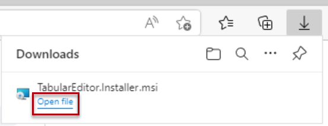
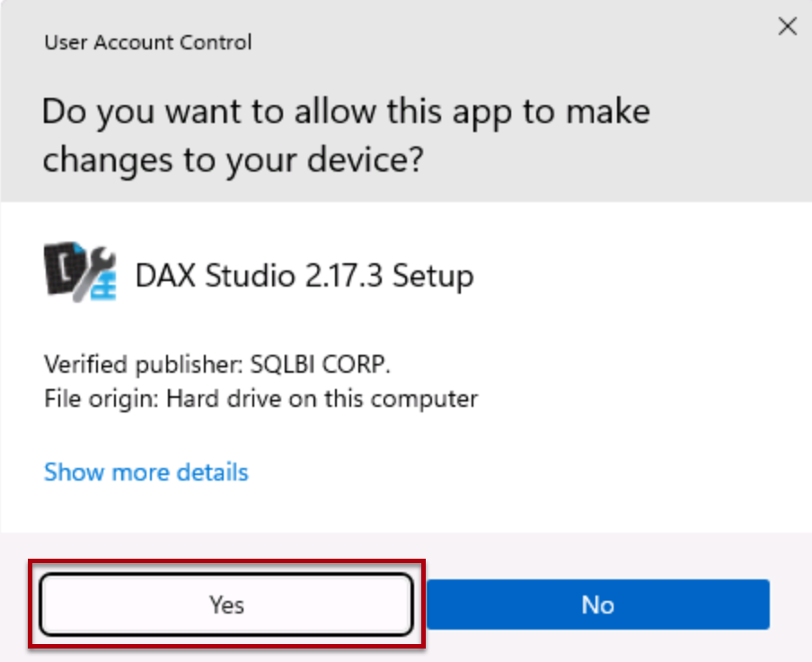

---
lab:
  title: ツールを使用して Power BI のパフォーマンスを最適化する
  module: Optimize enterprise-scale tabular models
---

# ツールを使用して Power BI のパフォーマンスを最適化する

## 概要

**このラボの推定所要時間: 30 分**

このラボでは、2 つの外部ツールを使用して、データ モデルと DAX クエリを開発、管理、最適化する方法について説明します。

このラボでは、次の作業を行う方法について説明します。

- ベスト プラクティス アナライザー (BPA) を使用する。

- DAX Studio を使用する。

## はじめに
### このコースのリポジトリを複製する

1. スタート メニューで、コマンド プロンプトを開きます

    

1. コマンド プロンプト ウィンドウで、次のように入力して D ドライブに移動します。

    `d:` 

   Enter キーを押します。

    


1. コマンド プロンプト ウィンドウで、次のコマンドを入力して、コース ファイルをダウンロードし、DP500 という名前のフォルダーに保存します。
    
    `git clone https://github.com/MicrosoftLearning/DP-500-Azure-Data-Analyst DP500`
   
1. リポジトリが複製されたら、コマンド プロンプト ウィンドウを閉じます。 
   
1. エクスプローラーで D ドライブを開き、ファイルがダウンロードされていることを確認します。

## ベスト プラクティス アナライザーを使用する

この演習では、Tabular Editor 2 をインストールし、ベスト プラクティス アナライザー (BPA) ルールを読み込みます。 BPA ルールを確認し、データ モデルに見つかった特定の問題に対処します。

"BPA は無料のサードパーティ製ツールです。モデリングの誤りや、モデルの設計とパフォーマンスを向上させるために行うことができる変更を通知します。これには、パフォーマンスを向上させるために適用できる名前付け、ユーザー エクスペリエンス、一般的な最適化に関する推奨事項が含まれます。詳細については、「[モデルのパフォーマンス向上のためのベスト プラクティス ルール](https://powerbi.microsoft.com/blog/best-practice-rules-to-improve-your-models-performance/)」を参照してください。"**


### Tabular Editor 2 をダウンロードしてインストールする

計算グループを作成できるようにするために、Tabular Editor 2 をダウンロードしてインストールします。

**重要:** *VM 環境に Tabular Editor 2 が既にインストールされている場合は、次のタスクに進みます。*

"Tabular Editor は、Analysis Services と Power BI 用の表形式モデルを作成するための代替ツールです。Tabular Editor 2 は、モデル内のデータにアクセスせずに BIM ファイルを編集できるオープンソース プロジェクトです。"**

1.  Power BI Desktop が閉じていることを確認します。

1.  Microsoft Edge で、Tabular Editor のリリース ページに移動します。

    ```https://github.com/TabularEditor/TabularEditor/releases```
    
1. **アセット**のセクションまで下にスクロールし、**TabularEditor.Installer.msi** ファイルを選択します。 これにより、ファイルのインストールが開始されます。

1. 完了したら、 **[ファイルを開く]** を選択してインストーラーを実行します。

    

1.  Tabular Editor インストーラー ウィンドウで、 **[次へ]** を選択します。

    

1.  **使用許諾契約書**のステップで、同意する場合は **[I agree] (同意する)** を選択し、 **[次へ]** を選択します。

1.  **インストール フォルダーの選択**のステップで、 **[次へ]** を選択します。

1.  **アプリケーション ショートカット**のステップで、 **[次へ]** を選択します。

1.  **インストールの確認**のステップで、 **[次へ]** を選択します。 

    "メッセージが表示されたら、 **[はい]** を選択してアプリによる変更を許可します。"**

1. インストールが完了したら、**[閉じる]** を選択します。

    "以上で、Tabular Editor がインストールされ、Power BI Desktop 外部ツールとして登録されました。"**

### Power BI Desktop を設定する

このタスクでは、事前に開発された Power BI Desktop ソリューションを開きます。

1. エクスプローラーで、**D:\DP500\Allfiles\13\Starter** フォルダーに移動します。

2. 事前に開発された Power BI Desktop ファイルを開くには、**Sales Analysis - Use tools to optimize Power BI performance.pbix** ファイルをダブルクリックします。

3. ファイルを保存するには、 **[ファイル]** リボン タブで **[名前を付けて保存]** を選択します。

4. **[名前を付けて保存]** ウィンドウで、**D:\DP500\Allfiles\13\MySolution** フォルダーに移動します。

5. **[保存]** を選択します。

6. **[外部ツール]** リボン タブを選択します。

    

7. このリボン タブから Tabular Editor を起動できることに注意してください。

    

    "この演習では後ほど Tabular Editor を使用して BPA を操作します。"**

### データ モデルを確認する

このタスクでは、データ モデルを確認します。

1. Power BI Desktop の左側で、 **[モデル]** ビューに切り替えます。

    

2. モデル図を使って、モデルの設計を確認します。

    

    モデルは、8 つのディメンション テーブルと 1 つのファクト テーブルで構成されます。**Sales** ファクト テーブルには販売注文の詳細が格納されます。これはクラシック スター スキーマ設計であり、製品ディメンションを表すスノーフレーク ディメンション テーブル (**Category* > **Subcategory** > **Product**) を含みます。***

    "この演習では、BPA を使用してモデルの問題を検出し、修正します。"**

### BPA ルールを読み込む

このタスクでは、BPA ルールを読み込みます。

"BPA ルールは、Tabular Editor のインストール中には追加されません。ダウンロードしてインストールする必要があります。"**

1. **[外部ツール]** リボンで、**[Tabular Editor]** を選択します。

    

    "Tabular Editor が新しいウィンドウで開き、Power BI Desktop でホストされているデータ モデルにライブ接続されます。Tabular Editor でモデルに加えた変更は、保存するまで Power BI Desktop に反映されません。"**

2. BPA ルールを読み込むには、 **[C# スクリプト]** タブを選択します。

    *注: これは、以前のバージョンの表形式エディターでは、[高度なスクリプト] タブと呼ばれている場合があります。*

    

3. 次のスクリプトを貼り付けます。

    "ヒント: スクリプトは、**D:\DP500\Allfiles\13\Assets\Snippets.txt** からコピーして貼り付けることができます。"**

    ```
    System.Net.WebClient w = new System.Net.WebClient(); 

    string path = System.Environment.GetFolderPath(System.Environment.SpecialFolder.LocalApplicationData);
    string url = "https://raw.githubusercontent.com/microsoft/Analysis-Services/master/BestPracticeRules/BPARules.json";
    string downloadLoc = path+@"\TabularEditor\BPARules.json";
    w.DownloadFile(url, downloadLoc);
    ```

4. スクリプトを実行するには、ツール バーの **[スクリプトを実行]** コマンドを選択します。

    

    "BPA ルールを使用するには、Tabular Editor を閉じてから再度開く必要があります。"**

5. Tabular Editor を閉じます。

6. Tabular Editor をもう一度開くには、Power BI Desktop の **[外部ツール]** リボンにある **[Tabular Editor]** を選択します。

    

### BPA ルールを確認する

このタスクでは、前のタスクで読み込んだ BPA ルールを確認します。

1. Tabular Editor のメニューで、 **[Tools] (ツール)**  >  **[Manage BPA Reles] (BPA ルールの管理)** を選択します。

    

2. **[Manage Best Practice Rules] (ベスト プラクティス ルールの管理)** ウィンドウの **[Rule collections] (ルール コレクション)** の一覧で、 **[Rules for the local user] (ローカル ユーザー向けルール)** を選択します。

    

3. **[Rules in collection] (コレクション内のルール)** の一覧で、ルール リストを下へスクロールします。

    "ヒント: 右下隅をドラッグすると、ウィンドウを拡大できます。"**

    "数秒以内に、Tabular Editor で各ルールに照らしてモデル全体がスキャンされ、各ルールの条件を満たすすべてのモデル オブジェクトのレポートが表示されます。"**

4. BPA によってルールがカテゴリにグループ化されていることに注意してください。

    "DAX 式のようにパフォーマンスの最適化に重点を置くルールもあれば、書式設定ルールのように外観を整えるためのルールもあります。"**

5. **[Severity] (重大度)** 列に注目します。

    "数字が大きいほど、ルールはより重要になります。"**

6. 一覧の一番下までスクロールし、 **[Set IsAvailableInMdx to false on non-attribute columns] (属性以外の列に対して IsAvailableInMdx を false に設定する)** ルールをオフにします。

    

    "個々のルールまたはルールのカテゴリ全体を無効にすることができます。BPA で無効なルールはモデルに対してチェックされません。この特定のルールを除くのは、ルールを無効にする方法を示すためです。"**

7. **[OK]** を選択します。

    

### BPA の問題に対処する

このタスクでは、BPA を開き、チェックの結果を確認します。

1. メニューで、 **[Tools] (ツール)**  >  **[Best Practice Analyzer] (ベスト プラクティス アナライザー)** を選択します (または **F10** キーを押します)。

    

2. **[Best Practice Analyzer] (ベスト プラクティス アナライザー)** ウィンドウで、必要に応じてウィンドウを最大化します。

3. カテゴリ別にグループ化された (考えられる) 問題の一覧に注目してください。

4. 最初のカテゴリで、 **'Product'** テーブルを右クリックし、 **[Ignore item] (項目を無視)** を選択します。

    

    "問題が実際には問題でない場合は、その項目を無視できます。ツール バーの **[Show ignored] (無視した項目を表示)** コマンドを使用すると、無視した項目をいつでも表示できます。"**

5. 一覧のさらに下にある **[Use the DIVIDE function for division] (除算に DIVIDE 関数を使用する)** カテゴリで、 **[Profit Margin]** を右クリックし、 **[Go to object] (オブジェクトに移動)** を選択します。

    

    "このコマンドを使用して Tabular Editor に切り替え、オブジェクトに焦点を合わせます。これにより、問題に修正を適用するのが簡単になります。"**

6. 式エディターで、次のように、より効率的な (かつ安全な) [DIVIDE](https://docs.microsoft.com/dax/divide-function-dax) 関数を使用するように DAX 数式を変更します。

    "ヒント: すべての数式は、**D:\DP500\Allfiles\13\Assets\Snippets.txt** からコピーして貼り付けることができます。"**

    ```
    DIVIDE ( [Profit], SUM ( 'Sales'[Sales Amount] ) )
    ```

7. モデルの変更を保存するには、ツール バーの **[Save changes to the connected database] (接続されているデータベースに変更を保存)** コマンドを選択します (または **Ctrl + S** キーを押します)。

    

    "変更を保存すると、Power BI Desktop データ モデルに変更がプッシュされます。"**

8. (フォーカス外の) **[Best Practice Analyzer] (ベスト プラクティス アナライザー)** ウィンドウに戻ります。

9. BPA にこの問題が表示されなくなったことに注意してください。

10. 問題の一覧を下にスクロールして、 **[Provide format string for "Date" columns] ("日付" 列の書式設定文字列を指定する)** カテゴリを見つけます。

    

11. **'Date' [Date] ('日付' [日付])** の問題を右クリックし、 **[Generate fix script] (修正スクリプトの生成)** を選択します。

    

    "このコマンドを使用して、C# スクリプトを生成し、クリップボードにコピーします。 **[Apply fix] (修正を適用)** コマンドを使ってスクリプトを生成して実行することもできますが、スクリプトを実行する前に確認 (および変更) した方が安全な場合があります。"**

12. BPA で修正スクリプトをクリップボードにコピーしたという通知が表示されたら、 **[OK]** を選択します。

13. Tabular Editor に切り替え、 **[C# スクリプト]** タブを選択します。

    *注: これは、以前のバージョンの表形式エディターでは、[高度なスクリプト] タブと呼ばれている場合があります。*
    
    

14. 修正スクリプトを貼り付けるには、ペイン内で右クリックし、**Ctrl + V** キーを押します。

    

    "書式設定文字列に変更を加えることもできます。"**

15. スクリプトを実行するには、ツール バーの **[スクリプトを実行]** コマンドを選択します。

    

16. モデルの変更を保存します。

17. Tabular Editor を閉じるには、メニューの **[File] (ファイル)**  >  **[Exit] (終了)** を選択します。

18. Power BI Desktop ファイルを保存します。

    

    "Tabular Editor の変更を確実に保存するには、Power BI Desktop ファイルも保存する必要があります。"**

## DAX Studio を使用する

DAX Studio をダウンロードしてインストールします。

"その Web サイトによると、DAX Studio は "Microsoft 表形式モデルに対して DAX クエリを実行および分析するための究極のツール" となっています。DAX の作成、診断、パフォーマンス チューニング、分析のための機能豊富なツールです。機能には、オブジェクトの参照、統合されたトレース、詳細な統計によるクエリ実行の内訳、DAX 構文の強調表示と書式設定が含まれます。"**

### DAX Studio をダウンロードする

このタスクでは、DAX Studio をダウンロードします。

DAX Studio をダウンロードしてインストールし、DAX クエリを最適化します。

1.  Microsoft Edge で、DAX Studio のダウンロード ページに移動します。

    ```https://daxstudio.org/downloads/```
    
1. **DAX Studio v.2.x.x (intaller)** を選択します。これにより、ファイルのインストールが開始されます。
    "注: DAX Studio のバージョンは、時間の経過に伴って多少変わります。最新のリリースをダウンロードしてください。"**

1. 完了したら、 **[ファイルを開く]** を選択してインストーラーを実行します。

    

1.  DAX Studio インストーラー ウィンドウで、 **[Install for all users (recommended)] (すべてのユーザー用にインストールする (推奨))** を選択します。

1. [ユーザー アカウント制御] ウィンドウで、[はい] を選択して、アプリがデバイスに変更を加えることを許可します。

    

1.  **使用許諾契約書**のステップで、ライセンス条項に同意する場合は **[I accept the agreement] (同意する)** を選択し、 **[次へ]** を選択します。

    

1. **[次へ]** を選択して、既定の宛先の場所を使用します。
1. **[次へ]** を選択して、既定のコンポーネントをインストールすることを選びます。
1. **[次へ]** を選択して、既定のスタート メニュー フォルダーにショートカットを配置します。
1. **[Create a desktop shortcut] (デスクトップ ショートカットを作成する)** を選び、[次へ] を選択します。

    
1. **[インストール]** を選択します。

1. 完了したら、 **[Launch DAX Studio] (DAX Studio を起動する)** が選択された状態で **[完了]** を選択します。 これで DAX Studio が開きます。
    

1. **[Connect] (接続)** ウィンドウで、 **[PBI / SSDT Model] (PBI / SSDT モデル)** オプションを選択します。

1. 対応するドロップダウン リストで、"**Sales Analysis - Use tools to optimize Power BI performance model**" が選択されていることを確認します。

    

    "**Sales Analysis - Use tools to optimize Power BI performance** スターター ファイルが開いていないと接続はできません。ファイルが開いていることを確認してください。"**

1. **[接続]** を選択します。

    

1. 必要に応じて、DAX Studio ウィンドウを最大化します。

### DAX Studio を使用してクエリを最適化する

このタスクでは、改善されたメジャーの数式を使用してクエリを最適化します。

"データ モデルの容量が小さい場合、クエリを最適化するのは難しいことに注意してください。この演習は、DAX クエリを最適化することよりも、DAX Studio を使用することに重点を置いています。"**

1. **[ファイル]** メニューで、 **[参照]** を選択します。

2. **[Open] (開く)** ウィンドウで、**D:\DP500\Allfiles\13\Assets** フォルダーに移動します。

3. **Monthly Profit Growth.dax** を選択します。

4. **[Open (開く)]** を選択します。

    

5. ファイル先頭にあるコメントを読み、それに続くクエリを確認します。

    "クエリ全体を理解することは重要ではありません。"**

    "このクエリでは、毎月の利益増加を判定する 2 つのメジャーを定義しています。現在、クエリには最初のメジャーのみが使用されています (72 行目)。使用されていないメジャーはクエリの実行に影響しません。"**

6. サーバー トレースを実行してパフォーマンス プロファイルのための詳細なタイミング情報を記録するには、 **[Home] (ホーム)** リボン タブで、 **[Traces] (トレース)** グループ内から **[Server Timings] (サーバーのタイミング)** を選択します。

    

7. スクリプトを実行するには、 **[Home] (ホーム)** リボン タブの **[Query] (クエリ)** グループ内から **[Run] (実行)** アイコンを選択します。

    

8. 下のペインでクエリ結果を確認します。

    "最後の列には、メジャーの結果が表示されます。"**

9. 下のペインで、 **[Server Timing] (サーバーの タイミング)** タブを選択します。

    

10. 左側にある統計情報を確認します。

    

    "左上から右下に向かって、統計には、クエリの実行にかかったミリ秒と、ストレージ エンジン (SE) CPU にかかった時間が示されます。この場合 (ご自分の結果は異なります)、数式エンジン (FE) に 73.5% の時間が使われ、SE に残りの 26.5% の時間が使われました。34 個の個別の SE クエリと 21 個のキャッシュ ヒットがありました。"**

11. クエリをもう一度実行し、すべての SE クエリが SE キャッシュから取得されていることに注意してください。

    "これは、結果が再利用のためにキャッシュされたためです。実際のテストでは、キャッシュをクリアすることが必要な場合があります。その場合は、 **[Home] (ホーム)** リボン タブで **[Run] (実行)** コマンドの下矢印を選択します。"**

    

    "2 番目のメジャー定義では、より効率的な結果が得られます。次に、2 番目のメジャーを使用するようにクエリを更新します。"**

12. 72 行目で、**Bad** という単語を **Better** に置き換えます。

    

13. クエリを実行し、サーバーのタイミングの統計情報を確認します。

    

14. もう一度実行すると、完全なキャッシュ ヒットが発生します。

    

    "この場合、変数とタイム インテリジェンス関数を使用した "better" のクエリの方がパフォーマンスが良く、クエリの実行時間がほぼ 50% 短縮されたと判断できます。"**

### 仕上げ

このタスクでは、完了作業を行います。

1. DAX Studio を閉じるには、 **[File] (ファイル)** リボン タブで **[Exit] (終了)** を選択します。

2. Power BI Desktop を閉じます。
