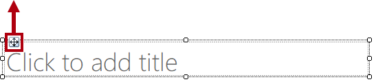
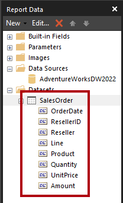
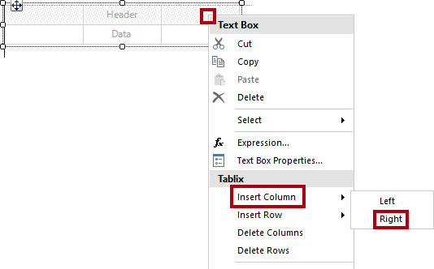
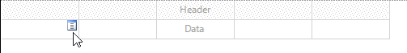
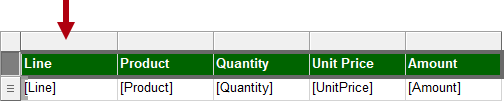
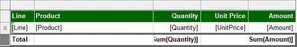
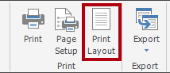

# ページ分割されたレポートの作成

## 概要

**このラボの推定所要時間: 45 分**

このラボでは、Power BI Report Builder を使用して、**AdventureWorksDW2022-DP500** SQL Server データベースをデータ ソースとする、ピクセル パーフェクトなページ分割されたレポート レイアウトを作成します。 次に、データ ソースとデータセットを作成し、レポート パラメーターも構成します。 このレポート レイアウトを使用すると、データを複数のページにわたってレンダリングしたり、PDF やその他の形式でエクスポートしたりすることができます。

最終的なレポートは次のようになります。


このラボでは、次の作業を行う方法について学習します。

- Power BI Report Builder を使用する

- 複数ページのレポート レイアウトをデザインする

- データ ソースを定義する

- データセットを作成する

- レポート パラメーターを作成する

- レポートを PDF にエクスポートする

## はじめに

この演習では、Power BI Report Builder を開いてレポートを作成し、保存します。

### このコースのリポジトリを複製する

1. スタート メニューで、コマンド プロンプトを開きます

    

1. コマンド プロンプト ウィンドウで、次のように入力して D ドライブに移動します。

    `d:` 

   Enter キーを押します。

    


1. コマンド プロンプト ウィンドウで、次のコマンドを入力して、コース ファイルをダウンロードし、DP500 という名前のフォルダーに保存します。
    
    `git clone https://github.com/MicrosoftLearning/DP-500-Azure-Data-Analyst DP500`
   
1. リポジトリが複製されたら、コマンド プロンプト ウィンドウを閉じます。 
   
1. エクスプローラーで D ドライブを開き、ファイルがダウンロードされていることを確認します。

### レポートを作成する

このタスクでは、Power BI Report Builder を開いてレポートを作成し、保存します。

1. Power BI Report Builder を開くには、タスク バーで **Power BI Report Builder** のショートカットを選択します。

    

1. Power BI report Builder を最新バージョンに更新するように求められたら、 **[キャンセル]** を選択します。

2. Power BI Report Builder ウィンドウで新しいレポートを作成するには、 **[作業の開始]** ウィンドウで **[空のレポート]** を選択します。

    

  
3. レポートを保存するには、 **[ファイル]** タブ (左上にあります) を選択し、 **[保存]** を選択します。

    

4. **[レポートとして保存]** ウィンドウで、**D:\DP500\Allfiles\15\MySolution** フォルダーに移動します。

5. **[名前]** ボックスに「**Sales Order Report**」と入力します。

6. **[保存]** を選択します。

## レポートのレイアウトを作成する

この演習では、レポート レイアウトを作成し、最終的なレポート デザインを確認します。

### レポート ヘッダーを構成する

このタスクでは、レポート ヘッダーを構成します。

1. レポート デザイナーで、既定のレポート レイアウトを確認します。これは本文領域とレポート フッター領域で構成されています。

    

    *本文にはレポート タイトルのためのテキスト ボックスが 1 つ含まれ、レポート フッターにはレポートの実行時間を示すテキスト ボックスが 1 つ含まれています。*

    "既定のデザインでは、レポート タイトルは、最初にレンダリングされたページの本文に 1 回レンダリングされます。ただし、ここでは、レポート ヘッダー領域を追加し、レポート タイトル テキスト ボックスをこの領域に移動して、レポート デザインを変更します。これにより、レポート タイトルは各ページに繰り返されます。また、会社のロゴの画像も追加します。"**

2. レポート ヘッダー領域を追加するには、 **[挿入]** リボン タブの **[ヘッダーとフッター]** グループ内にある **[ヘッダー]** を開き、 **[ヘッダーの追加]** を選択します。

    

3. レポート デザイナーで、レポート ヘッダー領域がレポート レイアウトに追加されていることを確認します。

4. 本文テキスト ボックスを選択するには、[クリックしてタイトルを追加] テキスト ボックスを選択します。

5. テキスト ボックスを移動するには、4 方向矢印アイコンを選択し、ヘッダー領域にドラッグしてレポート ヘッダー領域の左上端にドロップします。

    

6. レポート タイトル テキスト ボックスのテキストを変更するには、テキスト ボックス内を選択し、「**Sales Order Report**」と入力します。

    "テキスト ボックスのサイズを変更するには、最初に **[プロパティ]** ペインを開きます。場所とサイズのプロパティをきめ細かく制御するには、 **[プロパティ]** ペインを使用する必要があります。"**

7. **[表示]** リボン タブの **[表示/非表示]** グループ内で、 **[プロパティ]** をオンにします。

    

8. レポート タイトル テキスト ボックスにフォーカスを設定するには、最初にテキスト ボックスの外側の領域を選択し、テキスト ボックスを再度選択します。

    *テキスト ボックスの境界線が強調表示され、境界線上にサイズ変更ハンドル (小さい円) が表示されているときは、テキスト ボックスが選択されています。*

9. **[プロパティ]** ペイン (右側にあります) で、リストを下方向にスクロールして **[位置]** グループを見つけます。

    

    " **[位置]** グループでは、レポート アイテムの場所とサイズの正確な値を設定できます。"**

    "重要: このラボで指示されているとおりに値を入力します。ラボの最後にページ レンダリングを実現するには、ピクセル パーフェクトなレイアウトが必要です。"**

10. **[位置]** グループ内の **[場所]** グループを展開し、**[左]** および **[上]** プロパティがそれぞれ **[0in]** に設定されていることを確認します。

    "ラボ仮想マシンのリージョン設定が米国に設定されているため、場所とサイズの単位はインチです。リージョンでメトリック測定を使用する場合、センチメートルが既定の単位になります。"**

11. **[位置]** グループ内の **[サイズ]** グループを展開し、**[幅]** プロパティを **[4]** に設定します。

    


12. 画像を挿入するには、 **[挿入]** リボン タブの **[レポート アイテム]** グループ内から **[画像]** を選択します。

    

13. 画像をレポート デザインに追加するには、レポート タイトル テキスト ボックスの右側にあるレポート ヘッダー領域内の領域を選択します。

14. **[画像のプロパティ]** ウィンドウで、画像ファイルからインポートするには、 **[インポート]** を選択します。

    

15. **[開く]** ウィンドウで、**D:\DP500\Allfiles\15\Assets** フォルダーに移動し、 **[AdventureWorksLogo.jpg]** ファイルを選択します。

16. **[Open (開く)]** を選択します。

17. **[画像のプロパティ]** ウィンドウで、 **[OK]** を選択します。

18. レポート デザイナーで、画像が追加され、フォーカスが設定されていることに注意してください。

 

19. 画像の位置指定とサイズ変更を行うには、**[プロパティ]** ペインで次のプロパティを構成します。

    |  **プロパティ** | **Value** |
    |--- | --- |
    |  [位置] > [場所] > [左]| 5 |
    |  [位置] > [場所] > [上]| 0 |
    |  [位置] > [サイズ] > [幅]| 1 |
    |  [位置] > [サイズ] > [高さ]| 1 |


20. レポート ヘッダー領域のサイズを変更するには、まず、領域内の空白領域を選択して領域にフォーカスを設定します。

21. **[プロパティ]** ペインで、 **[全般]**  >  **[高さ]** プロパティを **[1]** に設定します。

22. レポート ヘッダー領域に 1 つのテキスト ボックスと画像が含まれ、次のようになっていることを確認します。

    

23. レポートを保存するには、 **[ファイル]** タブで **[保存]** を選択します。

    "ヒント: 左上にあるディスク アイコンを選択することもできます。"**

    

    *これで、データベース クエリの結果を取得するようにレポートを構成する準備ができました。*


### データを取得する

このタスクでは、データ ソースとデータセットを作成して、**AdventureWorksDW2022-DP500** SQL Server データベースからクエリ結果を取得します。

1. **[レポート データ]** ペイン (左側にあります) で、**[データ ソース]** フォルダーを右クリックし、**[データ ソースの追加]** を選択します。

    

    "クラウドまたはオンプレミスのデータベース、または Power BI データセットからデータを取得することができます。"**

2. **[データ ソースのプロパティ]** ウィンドウで、 **[名前]** ボックス内のテキストを「**AdventureWorksDW2022**」に置き換えます。

3. **[接続の種類の選択]** ドロップダウン リストで、**[Microsoft SQL Server]** が選択されていることを確認します。

4. 接続文字列をビルドするには、 **[ビルド]** を選択します。

    


5. **[接続プロパティ]** ウィンドウで、**[サーバー名]** ボックスに「**localhost**」と入力します。

    "このラボでは、**localhost** を使用して SQL Server データベースに接続します。ただし、ゲートウェイ データ ソースでは**localhost** を解決できないため、独自のソリューションを作成する場合、この方法は推奨されません。"**

6. **[データベース名の選択または入力]** ドロップダウン リストで、 **[AdventureWorksDW2022-DP500]** を選択します。

7. **[OK]** を選択します。

8. **[データ ソースのプロパティ]** ウィンドウで、 **[OK]** を選択します。

9. **[レポート データ]** ペインで、 **[AdventureWorksDW2022]** データ ソースが追加されていることを確認します。

    

10. データセットを作成するには、 **[レポート データ]** ペインで **[AdventureWorksDW2022]** データ ソースを右クリックし、 **[データセットの追加]** を選択します。

    

    *レポート データセットは、目的と構造が Power BI データセットとは異なります。*

11. **[データセットのプロパティ]** ウィンドウで、**[名前]** ボックス内のテキストを「**SalesOrder**」に置き換えます。


12. 定義済みのクエリをインポートするには、 **[インポート]** を選択します。

    

13. **[クエリのインポート]** ウィンドウで、**D:\DP500\Allfiles\15\Assets** フォルダーに移動し、 **[SalesOrder.sql]** ファイルを選択します。

14. **[Open (開く)]** を選択します。

15. **[クエリ]** ボックスで、クエリを確認します。必ずクエリ テキストの一番下までスクロールしてください。

    "クエリ ステートメントの詳細を理解することは重要ではありません。これは、販売注文行の詳細を取得するように設計されています。WHERE 句には、クエリ結果を単一の販売注文に制限する述語が含まれています。ORDER BY 句を使用すると、確実に行が行番号順に返されます。"**

16. WHERE 句で、 **@SalesOrderNumber** が使用されていることに注意してください。これはクエリ パラメーターを表しています。

    

    "クエリ パラメーターは、クエリ実行時に渡される値のプレースホルダーです。レポート ユーザーに対して単一の販売注文番号を要求し、それをクエリ パラメーターに渡すようにレポート パラメーターを構成します。"**

17. **[OK]** を選択します。


18. **[レポート データ]** ペインで、**SalesOrder** データセットとそのフィールドが追加されていることを確認します。

    

    "フィールドは、レポート レイアウトでデータ領域を構成するために使用されます。これらは、データセット クエリ列から派生したものです。"**

19. レポートを保存します。

### レポート パラメーターを構成する

このタスクでは、既定値を使用してレポート パラメーターを構成します。

1. **[レポート データ]** ペインで、**[パラメーター]** フォルダーを展開して **SalesOrderNumber** レポート パラメーターを表示します。

    

    "**SalesOrderNumber** レポート パラメーターは、データセットの作成時に自動的に追加されました。これは、データセット クエリに **@SalesOrderNumber** クエリ パラメーターが含まれていたためです。"**

2. レポート パラメーターを編集するには、**SalesOrderNumber** レポート パラメーターを右クリックし、**[パラメーターのプロパティ]** を選択します。

    

3. **[レポート パラメーターのプロパティ]** ウィンドウで、左側にある **[既定値]** ページを選択します。

    

4. **[値の指定]** オプションを選択します。

    

5. 既定値を追加するには、 **[追加]** を選択します。


6. **[値]** ドロップダウン リストで、テキストを「**43659**」に置き換えます。

    

    *販売注文 43659 は、レポート デザインをテストするために最初に使用する値です。*

7. **[OK]** を選択します。

8. レポートを保存します。

    *次に、販売注文について説明するテキスト ボックスを追加して、レポート ヘッダー領域のデザインを完成させます。*

### レポート ヘッダーのレイアウトを完成させる

このタスクでは、テキスト ボックスを追加して、レポート ヘッダー領域のデザインを完成させます。

1. レポート ヘッダー領域にテキスト ボックスを追加するには、 **[挿入]** リボン タブの **[レポート アイテム]** グループ内にある **[テキスト ボックス]** を選択します。

    

2. レポート ヘッダー領域内で、レポート タイトル テキスト ボックスのすぐ下を選択します。

3. 新しいテキスト ボックスに、「**Sales Order:** 」とその後にスペースを 1 つ入力します。

4. プレースホルダーを挿入するには、入力したスペースの直後を右クリックし、**[プレースホルダーの作成]** を選択します。

    


5. **[プレースホルダー プロパティ]** ウィンドウで、 **[値]** ドロップダウン リストの右側にある **[fx]** ボタンを選択します。

    

    "**fx** ボタンを使用すると、カスタム式を入力できます。この式は、販売注文番号を返すために使用されます。"**

6. **[式]** ウィンドウの **[カテゴリ]** リストで、**[パラメーター]** を選択します。

    

7. **[値]** リストで、**SalesOrderNumber** パラメーターをダブルクリックします。

8. 式ボックスで、**SalesOrderNumber** レポート パラメーターへのプログラムによる参照が追加されたことを確認します。

    

9. **[OK]** を選択します。

10. **[プレースホルダー プロパティ]** ウィンドウで、 **[OK]** を選択します。

11. レポート ヘッダー領域の空白領域を選択し、新しいテキスト ボックスを選択します。

12. **[プロパティ]** ペインで、次の位置プロパティを構成します。

    |  **プロパティ**| **Value** |
    | --- | --- |
    |  [位置] > [場所] > [左]| 0 |
    |  [位置] > [場所] > [上]| 0.5 |
    |  [位置] > [サイズ] > [幅]| 4 |
    |  [位置] > [サイズ] > [高さ]| 0.25 |


13. テキスト ボックスのテキストの一部を書式設定するには、新しいテキスト ボックス内で、テキスト "**Sales Order:**" のみを選択します。

    

14. **[ホーム]** リボン タブで、 **[フォント]** グループ内にある **[太字]** コマンドを選択します。

    

15. レポート ヘッダー領域にテキスト ボックスをもう 1 つ追加し、テキスト「**Reseller:**」とその後にスペースを 1 つ入力します。

    "ヒント: キャンバスを右クリックし、 **[挿入]**  >  **[テキスト ボックス]** の順に選択してテキスト ボックスを追加することもできます。"**

16. スペースの後にプレースホルダーを挿入し、式を使用するようにプレースホルダーの値を設定します。


17. **[式]** ウィンドウの **[カテゴリ]** リストで、**[データセット]** を選択します。

    

18. 式の値が **First(Reseller)** 値に基づくようにします。

19. **[プロパティ]** ペインで、次の位置プロパティを構成します。

    |  **プロパティ**| **Value** |
    | --- | --- |
    |  [位置] > [場所] > [左]| 0 |
    |  [位置] > [場所] > [上]| 0.75 |
    |  [位置] > [サイズ] > [幅]| 4 |
    |  [位置] > [サイズ] > [高さ]| 0.25 |


20. "**Reseller:** " テキストを太字として書式設定します。

21. レポート ヘッダー領域に 3 番目 (最後) のテキスト ボックスを追加し、テキスト「**Order Date:**」とその後にスペースを 1 つ入力します。

22. スペースの後にプレースホルダーを挿入し、**[データセット]** カテゴリの **First(OrderDate)** 値に基づく式を使用するようにプレースホルダーの値を設定します。

    


23. 日付値の形式を設定するには、**[プレースホルダー プロパティ]** ウィンドウで **[数値]** ページを選択します。

    

24. **[カテゴリ]** リストで、**[日付]** を選択します。

    

25. **[タイプ]** リストで、適切な日付形式のタイプを選択します。

26. **[プレースホルダー プロパティ]** ウィンドウで、 **[OK]** を選択します。

27. **[プロパティ]** ペインで、次の位置プロパティを構成します。

    |  **プロパティ**| **Value** |
    | --- | --- |
    |  [位置] > [場所] > [左]| 0 |
    |  [位置] > [場所] > [上]| 1 |
    |  [位置] > [サイズ] > [幅]| 4 |
    |  [位置] > [サイズ] > [高さ]| 0.25 |


28. "**Order Date:** " テキストを太字として書式設定します。

29. 最後に、レポート ヘッダー領域の空白領域を選択します。

30. **[プロパティ]** ペインで、**[高さ]** プロパティを **[1.5]** に設定します。


31. レポート ヘッダー領域が次のようになっていることを確認します。

    

32. レポートを保存します。

33. レポートをプレビューするには、 **[ホーム]** リボン タブの **[ビュー]** グループ内にある **[実行]** を選択します。

    

    "レポートを実行すると、レポートが HTML 形式でレンダリングされます。唯一のレポート パラメーターには既定値が設定されているため、レポートは自動的に実行されます。"**

34. レンダリングされたレポートが次のようになっていることを確認します。

    


35. デザイン ビューに戻るには、 **[実行]** リボン タブの **[ビュー]** グループ内にある **[デザイン]** を選択します。

    

    *次に、レポート本文にテーブルを追加して、書式設定されたレイアウトの販売注文明細行を表示します。*

### テーブル データ領域を追加する

このタスクでは、レポート本文にテーブル データ領域を追加します。

1. **[挿入]** リボン タブの **[データ領域]** グループにある **[テーブル]** を開き、 **[テーブルの挿入]** を選択します。

    

2. テーブルを追加するには、レポート本文内の空白領域を選択します。

3. **[プロパティ]** ペインで、次の位置プロパティを構成します。

    |  **プロパティ**| **Value** |
    | --- | --- |
    |  [位置] > [場所] > [左]| 0 |
    |  [位置] > [場所] > [上]| 0 |


    "テーブルには、5 つの列が表示されます。既定では、テーブル テンプレートに含まれる列は 3 つのみです。"**


4. テーブルに列を追加するには、最後の列の任意のセルを右クリックし、**列の挿入**  >  **[右]** の順に選択します。

    

5. 最後の手順を繰り返して、2 番目の新しい列を追加します。

6. 最初の列の 2 行目のセルの上にカーソルを置くと、フィールド ピッカー アイコンが表示されます。

    

7. フィールド ピッカー アイコンを選択し、 **[Line]** フィールドを選択します。

    

8. テーブルの最初の行 (ヘッダー) にテキスト値が含まれ、詳細行にフィールド参照が含まれていることを確認します。

    

9. 続く 4 つの列に、次のフィールドを順番どおりに追加します。

    - Product

    - Quantity

    - UnitPrice

    - Amount

10. テーブルのデザインが次のようになっていることを確認します。

    

11. レポートを保存します。

12. レポートをプレビューします。

    

    

    "テーブルには、ヘッダーと 12 行の販売注文明細行が含まれます。テーブル レイアウトを書式設定することで多くの改善を行うことができます。"**

    *次のタスクでは、以下のことを行います。*

    - *背景色と太字フォント スタイルを使用してテーブル ヘッダーを書式設定する*

    - *列幅を変更して余分な空白を削除し、長いテキスト値が折り返されないようにする*

    - *最初の列の値を左揃えにする*

    - *最後の 3 つの列の値を右揃えにする*

    - *通貨記号 (米国ドル) を使用して通貨値を書式設定する*

    - *テーブルの合計行を追加して書式設定する*


### テーブル データ領域を書式設定する

このタスクでは、テーブル データ領域を書式設定します。

1. デザイン ビューに戻ります。

2. テーブル内の任意のセルを選択すると、灰色のセル ガイドが表示されます (データ領域の上部と左側に表示されます)。

    

    *セル ガイドは、行または列全体を構成するのに役立ちます。*

3. テーブル ヘッダーを書式設定するには、ヘッダー行のガイドを選択します。

    

    "行または列のガイドを選択すると、その行または列内のすべてのセルが選択されます。各セルは実際にはテキスト ボックスです。単一のテキスト ボックスまたは複数選択したテキスト ボックスを書式設定するには、 **[プロパティ]** ペイン、またはリボン コマンドを使用します。"**

4. **[プロパティ]** ペイン (またはリボン) で、次の位置プロパティを構成します。

    |  **プロパティ**| **Value** |
    | --- | --- |
    |  [塗りつぶし] > [背景色]| 濃い緑 (ヒント: 各色の上にカーソルを置くと、その名前が表示されます) |
    |  [フォント] > [色]| White |
    |  [フォント] > [フォント] > [フォントの太さ]| 太字 |


5. 最初の列のガイドを選択します。

    

6. **[プロパティ]** ペインで、 **[位置]**  >  **[サイズ]**  >  **[幅]** プロパティを **[0.5]** に設定します。

7. 2 番目の列の幅を **[2.5]** に設定します。

8. **[Quantity]** 列ガイドを選択し、**Ctrl** キーを押したまま、最後の 2 つの列ヘッダー ガイド (**Unit Price** と **Amount**) を選択します。

9. **[プロパティ]** ペイン (またはリボン) で、 **[配置]**  >  **[TextAlign]** プロパティを **[右]** に設定します。

10. **[Line]** 詳細テキスト ボックスを左揃えに設定します。

    

11. **[ホーム]** リボン タブの **[数値]** グループ内で、最後の 2 つの (ヘッダーではなく) 詳細テキスト ボックス (**[UnitPrice]** と **[Amount]**) を、通貨記号で書式設定します。

    

    


12. テーブルに合計行を追加するには、**[Amount]** 詳細テキスト ボックスを右クリックし、**[合計の追加]** を選択します。

    

13. テーブル フッターを表す新しい行が追加され、式によって **[Quantity]** 値の合計が評価されることを確認します。

14. 最後の手順を繰り返して、**[Amount]** 詳細テキスト ボックスの合計を追加します。

15. テーブル フッター行の最初のセルに、「**Total**」と入力します。

16. フッター行のすべてのテキスト ボックスを、太字で書式設定します。

17. テーブルのデザインが次のようになっていることを確認します。

    


18. テーブルの後にある空白を削除するには、レポート本文とレポート フッター領域の間にある破線の上にカーソルを置き、テーブルの下端に触れるまで上方向にドラッグします。

    

19. レポートを保存します。

20. レポートをプレビューします。

21. レンダリングされたレポートが次のようになっていることを確認します。

    

22. **[Sales Order Number]** パラメーター ボックスで、値を「**51721**」に置き換えます。

    

23. レポートを再実行するには、 **[レポートの表示]** を選択します。

    

    *この販売注文には72 の販売注文明細行が含まれているため、データは多数のページにわたってレンダリングされます。*

24. レポートの 2 番目のページに移動するには、 **[実行]** リボン タブの **[ナビゲーション]** グループ内にある **[次へ]** を選択します。

    

25. ページ 2 ではテーブル ヘッダーが表示されないことに注意してください。

    *この問題には、次のタスクで対処します。*

26. ページの一番下までスクロールして、レポート フッターに実行時間のみが表示されていることを確認します。

    *次のタスクでは、ページ番号を追加してフッター テキストを改善します。*

### レポートのデザインを完成させる

このタスクでは、複数ページのレポートが適切にレンダリングされるようにして、レポートのデザインを完成させます。

1. デザイン ビューに切り替えます。

2. テーブル ヘッダーがすべてのページに繰り返し表示されるようにするには、まず、テーブルの任意のテキスト ボックスを選択します。

3. **[グループ化]** ペイン (レポート デザイナーの下部にあります) で、 **[列グループ]** の右端にある下矢印を選択し、 **[詳細設定モード]** を選択します。

    

4. **[行グループ]** セクションで、最初の静的グループを選択します。

    

    *これにより、テーブル ヘッダー行が選択されました。*

5. **[プロパティ]** ペインで、 **[その他]**  >  **[新しいページごとに表示**] プロパティを **[True]** に設定します。

    *これにより、(テーブル ヘッダーを表す) 最初の静的グループが、すべてのページに繰り返し表示されます。*

6. テーブル フッター領域で、**[ExecutionTime]** テキスト ボックスを右クリックし、**[式]** を選択します。

    

7. **[式]** ウィンドウの式ボックスで、1 つのスペースとその後に「 **&amp; " | Page " &amp;** 」を追加し、次の式を生成します。


    ```
    =Globals!ExecutionTime & " | Page " &
    ```


8. 最後のアンパサンド (&) の後にスペース 1 つがあることを確認します。

9. **[カテゴリ]** リストで、**[組み込みフィールド]** を選択します。

    

10. ページ番号値を式に挿入するには、**[項目]** リストで、**[PageNumber]** をダブルクリックします。

11. 式全体が次のようになっていることを確認します。

    

12. **[OK]** を選択します。

13. テキスト ボックスの左辺をドラッグして、レポート ページの幅になるまで幅を広げます。

    

    "レポートの設計が完了しました。最後に、ページの幅が 6 インチちょうどに設定されており、レポート パラメーターの既定値が削除されていることを確認します。"**

14. レポートの本文を選択するには、任意のテーブルのテキスト ボックスを右クリックし、 **[選択]**  >  **[本文]** の順に選択します。

    

    *テーブルがレポート本文全体を占めているときにレポート本文を選択するには、この方法を使用する必要があります。*

15. **[プロパティ]** ペインで、 **[位置]**  >  **[サイズ]**  >  **[幅]** プロパティが **[6]** に設定されていることを確認します。

    "印刷形式にレンダリングするとテーブルが複数のページにまたがるため、幅を 6 インチ以下にすることが重要です。"**

16. **[レポート データ]** ペインで、**[SalesOrderNumber]** レポート パラメーターのプロパティを開きます。

17. **[既定値]** ページで、**[既定値なし]** オプションを選択します。

    

18. **[OK]** を選択します。

19. レポートを保存します。

  

### 完成したレポートを確認する

このタスクでは、レポートを印刷レイアウト モードで確認します。

1. レポートをプレビューします。

2. **[Sales Order Number]** パラメーター ボックスに、値「**51721**」を入力します。

3. **[実行]** リボン タブの **[印刷]** グループ内にある **[印刷レイアウト]** を選択します。

    

    *印刷レイアウト モードでは、厳密なページ サイズで印刷されたときのレポートの外観をプレビューできます。*

4. ページ 2 と 3 に移動します。

    "このラボでは、レポートを発行しません。ページ分割されたレポートは、ライセンス モードが **Premium Per User** または **Premium per capacity** に設定されているワークスペースに格納されている場合、およびその容量でページ分割されたレポート ワークロードが有効になっている場合にのみ、Power BI サービスにレンダリングされることに注意してください。"**
