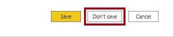
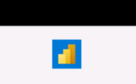
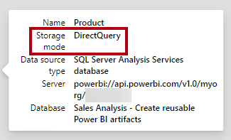
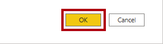
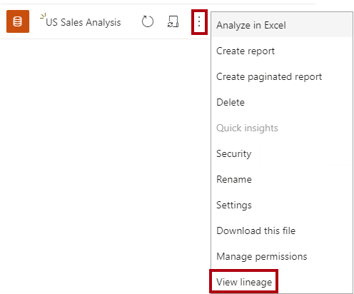

---
lab:
  title: 再利用可能な Power BI アセットを作成する
  module: Manage the analytics development lifecycle
---

# <a name="create-reusable-power-bi-assets"></a>再利用可能な Power BI アセットを作成する

## <a name="overview"></a>概要

**このラボの推定所要時間: 45 分**

このラボでは、コア データセットを拡張する特殊な Power BI データセットを作成します。 特殊化されたデータセットにより、1 人当たりの米国の売上の分析が可能になります。

このラボでは、次の作業を行う方法について説明します。

- ライブ接続を作成します。

- ローカル DirectQuery モデルを作成します。

- 系列ビューを使って、依存する Power BI 資産を検出します。

## <a name="get-started"></a>はじめに

この演習では、環境を準備します。

### <a name="clone-the-repository-for-this-course"></a>このコースのリポジトリを複製する

1. スタート メニューで、コマンド プロンプトを開きます

    

1. コマンド プロンプト ウィンドウで、次のように入力して D ドライブに移動します。

    `d:` 

   Enter キーを押します。

    


1. コマンド プロンプト ウィンドウで、次のコマンドを入力して、コース ファイルをダウンロードし、DP500 という名前のフォルダーに保存します。
    
    `git clone https://github.com/MicrosoftLearning/DP-500-Azure-Data-Analyst DP500`
   
1. リポジトリが複製されたら、コマンド プロンプト ウィンドウを閉じます。 
   
1. エクスプローラーで D ドライブを開き、ファイルがダウンロードされていることを確認します。

### <a name="sign-in-to-the-power-bi-service"></a>Power BI サービスにサインインする

このタスクでは、Power BI サービスにサインインし、試用版ライセンスを開始して、ワークスペースを作成します。

重要: VM 環境に Power BI を既にセットアップしてある場合は、次のタスクに進みます。**

1. Web ブラウザーで、[https://powerbi.com](https://powerbi.com/) にアクセスします。

2. ラボの資格情報を使ってサインイン プロセスを完了します。

    重要: Power BI Desktop からのサインインに使ったのと場合と同じ資格情報を使う必要があります。**

3. 右上にあるプロファイル アイコンを選んでから、 **[無料体験する]** を選びます。

    

4. メッセージが表示されたら、 **[無料体験する]** を選択します。

    

5. 残りのタスクをすべて行って、試用版のセットアップを完了します。

    ヒント: Power BI の Web ブラウザー エクスペリエンスは、**Power BI サービス**と呼ばれます。**

### <a name="create-a-workspace"></a>ワークスペースの作成

このタスクでは、ワークスペースを作成します。

1. Power BI サービスでワークスペースを作成するには、**ナビゲーション** ウィンドウ (左側) で **[ワークスペース]** を選んでから、 **[ワークスペースの作成]** を選びます。

    


2. **[ワークスペースの作成]** ペイン (右側) で、 **[ワークスペース名]** ボックスにワークスペースの名前を入力します。

    ワークスペース名はテナント内で一意である必要があります。**

    

3. **[保存]** を選択します。

    

    作成されると、ワークスペースが開きます。次のタスクでは、データセットをこのワークスペースに発行します。**

### <a name="set-up-power-bi-desktop"></a>Power BI Desktop を設定する

このタスクでは、Power BI Desktop を設定します。

1. エクスプローラーを開くには、タスク バーで**エクスプローラー**のショートカットを選択します。

    

2. **D:\DP500\Allfiles\16\Starter** フォルダーに移動します。

3. 開発済みの Power BI Desktop ファイルを開くには、**Sales Analysis - Create reusable Power BI artifacts.pbix** ファイルをダブルクリックします。

4. まだサインインしていない場合は、Power BI Desktop の右上隅にある **[サインイン]** を選びます。 ラボの資格情報を使ってサインイン プロセスを完了します。

    

### <a name="review-the-data-model"></a>データ モデルを確認する

このタスクでは、データ モデルを確認します。

1. Power BI Desktop の左側で、 **[モデル]** ビューに切り替えます。

    

2. モデル図を使って、モデルの設計を確認します。

    

    モデルは、6 つのディメンション テーブルと 1 つのファクト テーブルで構成されます。**Sales** ファクト テーブルには販売注文の詳細が格納されます。これは、クラシック スター スキーマ設計です。**

### <a name="publish-the-data-model"></a>データ モデルを発行する

このタスクでは、データ モデルを発行します。

1. レポートを発行するには、 **[ホーム]** リボン タブの **[発行]** を選びます。 

    変更を保存するかどうかを確認するウィンドウで、 **[保存]** を選びます。**

    

2. **[Power BI へ発行]** ウィンドウで、自分のワークスペース (個人用ワークスペースではない) を選んで **[選択]** を選びます。

    

3. 発行が成功したら、 **[了解]** を選びます。

    

    モデルは、発行されると Power BI データセットになります。このラボでは、このデータセットは、ビジネス アナリストが拡張して特殊なデータセットを作成できるコア データセットです。次の演習では、特定のビジネス要件を解決するための特殊なデータセットを作成します。**

4. Power BI Desktop を閉じます。

5. 変更を保存するかどうかを確認するウィンドウで、 **[保存しない]** を選びます。

    

## <a name="create-a-specialized-dataset"></a>特殊なデータセットを作成する

この演習では、1 人当たりの米国の売上を分析できるように、特殊なデータセットを作成します。 コア データセットには母集団の値が含まれていないため、モデルを拡張するための新しいテーブルを追加します。

### <a name="create-a-live-connection"></a>ライブ接続を作成する

このタスクでは、前の演習で発行した **Sales Analysis - Create reusable Power BI artifacts** データセットへのライブ接続を使用する新しいレポートを作成します。

1. Power BI Desktop を開くには、タスク バーにある **Power BI Desktop** のショートカットを選択します。

    

2. [作業の開始] ウィンドウの右上にある **[X]** を選択します。

    

3. ファイルを保存するには、 **[ファイル]** リボンの **[名前を付けて保存]** を選びます。

4. **[名前を付けて保存]** ウィンドウで、**D:\DP500\Allfiles\16\MySolution** フォルダーに移動します。

5. **[ファイル名]** ボックスに「**US Sales Analysis**」と入力します。

    

6. **[保存]** を選択します。

7. ライブ接続を作成するには、 **[ホーム]** リボン タブの **[データ]** グループ内から、 **[Power BI データセット]** を選択します。

    

8. **[レポートを作成するデータセットの選択]** ウィンドウで、**Sales Analysis - Create reusable Power BI artifacts** データセットを選択します。

    

9. **［作成］** を選択します

    

10. 左下のステータス バーで、レポートがデータセットにライブ接続されていることがわかります。

    

11. **[モデル]** ビューに切り替えます。

    

12. 必要に応じてモデル図を画面に合わせるには、右下にある **[画面に合わせる]** を選択します。

    

13. テーブル ヘッダーの上にカーソルを置くと、ヒントが表示されます。データ ソースの種類が SQL Server Analysis Services で、サーバーがワークスペースを参照し、データベースがデータセットであることに注意してください。

    

    これらのプロパティは、テーブルがリモート モデルでホストされることを示します。次のタスクでは、モデルを拡張するように変更します。このプロセスにより、さまざまな方法で変更できるローカル DirectQuery モデルが作成されます。**

14. Power BI Desktop ファイルを保存します。

    

### <a name="create-a-local-directquery-model"></a>ローカル DirectQuery モデルを作成する

このタスクでは、ローカル DirectQuery モデルを作成します。

1. **[ホーム]** リボン タブの **[モデリング]** グループ内から、 **[このモデルに変更を加える]** を選択します。

    

    注: このモデルに変更を加えるオプションが表示されない場合は、プレビュー機能である PBI データセットおよび AS 用の DirectQuery を有効にする必要があります**
    - **[ファイル]**  >  **[オプションと設定]**  >  **[オプション]** に移動し、プレビュー機能のセクションで [Power BI データセットおよび Analysis Services 用の DirectQuery] チェックボックスをオンにしてこのプレビュー機能を有効にします。 変更内容を有効にするために、Power BI Desktop の再起動が必要な場合があります。 

2. メッセージが表示されたら、ダイアログ ウィンドウのメッセージを読み、 **[ローカル モデルの追加]** を選択します。

    

    これで、モデルが DirectQuery モデルになりました。特定のテーブルまたは列のプロパティを変更するか、計算列を追加することで、モデルを拡張できるようになりました。他のデータ ソースから提供されるデータの新しいテーブルを使用してモデルを拡張することもできます。米国の母集団データをモデルに追加するためのテーブルを追加します。**

3. 任意のテーブル ヘッダーの上にカーソルを置くと、ヒントが表示されます。テーブル ストレージ モードが **DirectQuery** に設定されていることに注意してください。

    

### <a name="design-the-report-layout"></a>レポートのレイアウトをデザインする

このタスクでは、米国の州の売上を分析するためのレポート レイアウトをデザインします。

1. **レポート** ビューに切り替えます。

    

2. **[フィールド]** ウィンドウ (右側にあります) で、**Reseller** テーブルを展開して開きます。

3. **Country-Region** フィールドを右クリックし、 **[フィルターに追加]**  >  **[レポートレベルのフィルター]** を選択します。

    

4. **[フィルター]** ペイン ( **[視覚化]** ペインの左側にあります) を展開して開きます。

5. **[フィルター]** ペインの **[すべてのページでのフィルター]** セクションにある **Country-Region** カードで、 **[United States]** を選択します。

    

6. テーブル ビジュアルを追加するには、 **[視覚化]** ペインでテーブル ビジュアル アイコンを選択します。

    

7. ページ全体に表示されるようにテーブルの位置とサイズを変更します。

8. **[フィールド]** ペインで、**Reseller** テーブル内から **State-Province** フィールドをドラッグし、テーブル ビジュアルにドロップします。

    

9. **[フィールド]** ペインで、**Sales** テーブルを展開し、**Sales Amount** フィールドをテーブル ビジュアルに追加します。

    

10. 売上金額の降順で州を並べ替えるには、**Sales Amount** ヘッダーを選択します。

    

    このレポート レイアウトで米国の州の売上に関する基本的な詳細情報が示されるようになりました。ただし、追加の要件として、1 人当たりの売上を表示し、そのメジャーの降順で州を並べ替える必要があります。**

### <a name="add-a-table"></a>テーブルの追加

このタスクでは、Web ページから提供される米国の人口データのテーブルを追加します。

1. **[モデル]** ビューに切り替えます。

    

2. **[ホーム]** リボン タブの **[データ]** グループ内から **[データを取得]** を選択し、次に **[Web]** を選択します。

    

3. **[URL]** ボックスに次のファイル パスを入力します: **D:\DP500\Allfiles\16\Assets\us-resident-population-estimates-2020.html**

    このラボの目的上、Power BI Desktop でファイル システムから Web ページにアクセスします。**

    ヒント: ファイル パスは、**D:\DP500\Allfiles\16\Assets\Snippets.txt** ファイルからコピーして貼り付けることができます。**

4. **[OK]** を選択します。

    

5. **[ナビゲーター]** ウィンドウの右側で、 **[Web ビュー]** に切り替えます。

    

    この Web ページには、2020 年 4 月の国勢調査に基づいた米国居住者の推定人口が表示されます。**

6. ツリー ビューに戻ります。

    

7. 左側の **Table 2** を選択します。

    

8. テーブル ビューのプレビューに注目してください。

    このデータ テーブルには、モデルで 1 人当たりの売上を計算するために必要なデータが含まれています。変換を適用してデータを準備する必要があります。具体的には、**United States** の行を削除し、**RANK** 列を削除して、**STATE** 列と **NUMBER** 列の名前を変更します。**

9. データを準備するには、 **[データの変換]** を選択 します。

    

10. [Power Query エディター] ウィンドウの **[クエリの設定]** ペイン (右側にあります) にある **[名前]** ボックスで、テキストを「**US Population**」に置き換え、**Enter** キーを押します。

    

11. **United States** 行を削除するには、**STATE** 列ヘッダーの下矢印を選択し、**United States** 項目 (一覧の一番下までスクロールします) の選択を解除します。

    

12. **[OK]** を選択します。

    

13. **RANK** 列を削除するには、列ヘッダーを右クリックし、 **[削除]** を選択します。

    

14. **STATE** 列の名前を変更するには、列ヘッダーをダブルクリックし、テキストを「**State**」に置き換えて、**Enter** キーを押します。

15. **NUMBER** 列の名前を「**Population**」に変更します。

    

16. クエリを適用するには、 **[ホーム]** リボン タブの **[閉じる]** グループ内から **[閉じて適用]** アイコンを選択します。

    

17. 潜在的なセキュリティ リスクに関するメッセージが表示されたら、通知を読み、 **[OK]** を選択します。

    

    Power BI Desktop で、モデル テーブルを作成するためのクエリが適用されます。人口のデータをモデルにインポートする新しいテーブルが追加されます。**

18. **US Population** テーブルの位置を **Reseller** テーブルの近くに変更します。

19. モデル リレーションシップを作成するには、**US Population** テーブルから **State** 列をドラッグし、**Reseller** テーブルの **State-Province** 列にドロップします。

    

20. **[リレーションシップの作成]** ウィンドウの **[クロス フィルターの方向]** ボックスの一覧で、 **[両方]** を選択します。

    

    **Reseller** テーブルの各行にはリセラーが格納されるため、**State-Province** 列に示されている値には重複する値が含まれます (たとえば、カリフォルニア州には多くのリセラーが存在します)。リレーションシップを作成すると、Power BI Desktop で列のカーディナリティが自動的に決定され、それが多対一リレーションシップであることが検出されました。フィルターが **Reseller** テーブルから **US Population** テーブルに確実に反映されるようにするには、リレーションシップを双方向でクロス フィルター処理する必要があります。**

21. **[OK]** を選択します。

    

22. 新しいテーブルを非表示にするには、**US Population** テーブルのヘッダーで表示アイコンを選択します。

    

    レポート作成者にテーブルを表示する必要はありません。**

### <a name="add-a-measure"></a>メジャーを追加する

このタスクでは、1 人当たりの売上を計算するメジャーを追加します。

1. **レポート** ビューに切り替えます。

    

2. **[フィールド]** ペインで、 **[Sales]** テーブルを右クリックし、 **[新しいメジャー]** を選択します。

    

3. 数式バーに、次のメジャーの定義を入力します。

    ヒント: メジャー定義は、**D:\DP500\Allfiles\16\Assets\Snippets.txt** ファイルからコピーして貼り付けることができます。**

    ```
    Sales per Capita =
    DIVIDE(
    SUM(Sales[Sales Amount]),
    SUM('US Population'[Population])
    )
    ```

    **Sales per Capita** という名前のメジャーでは、DAX [DIVIDE](https://docs.microsoft.com/dax/divide-function-dax) 関数を使用して、**Sales Amount** 列の合計を **Population** 列の合計で除算します。**

4. **[メジャー ツール]** コンテキスト リボン タブの **[書式設定]** グループ内で、小数点以下の桁数ボックスに「**4**」を入力します。

    

5. マトリックス ビジュアルにメジャーを追加するには、 **[フィールド]** ペインの **Sales** テーブル内から、**Sales per Capita** フィールドをテーブル ビジュアルにドラッグします。

    このメジャーでは、Power BI サービス内のリモート モデルから提供されるデータと、新しいモデルに対してローカルな、インポートされたテーブルのデータを組み合わせることで、結果が評価されます。**

6. 1 人当たりの売上の降順で州を並べ替えるには、**Sales per Capita** 列ヘッダーを選択します。

    

### <a name="publish-the-solution"></a>ソリューションの発行

このタスクでは、特殊なデータ モデルとレポートで構成されるソリューションを発行します。

1. Power BI Desktop ファイルを保存します。

    

2. ソリューションを発行するには、 **[ホーム]** リボン タブの **[発行]** を選びます。

    

3. **[Power BI へ発行]** ウィンドウで、自分のワークスペースを選んで **[選択]** を選びます。

    

4. 発行が成功したら、 **[了解]** を選びます。

    

5. Power BI Desktop を閉じます。

6. 変更を保存するかどうかを確認するウィンドウで、 **[保存しない]** を選びます。

    

### <a name="review-the-specialized-dataset"></a>特殊なデータセットを確認する

このタスクでは、Power BI サービス内の特殊なデータセットを確認します。

1. Power BI サービス (Web ブラウザー) に切り替えます。

2. ワークスペースのランディング ページで、**US Sales Analysis** レポートと **US Sales Analysis** データセットに注目してください。

    


3. **US Sales Analysis** データセットをカーソルでポイントし、省略記号が表示されたら、省略記号を選んで、 **[View lineage] (データ系列の表示)** を選びます。

    

    **[View lineage] (データ系列の表示)** オプションでは、Power BI アセット間の依存関係の検出がサポートされています。これは、たとえばコア データセットに変更を発行する場合などに重要です。系列ビューには、テストが必要になる可能性がある依存データセットが表示されます。**

4. 系列ビューで、レポート、**US Sales Analysis** データセット、**Sales Analysis - Create reusable Power BI artifacts** データセットの間の接続に注目してください。

    

    Power BI データセットが他のデータセットに関連する場合は、チェーンと呼ばれます。このラボでは、**US Sales Analysis** データセットを **Sales Analysis - Create reusable Power BI artifacts** データセットにチェーンし、特殊な目的で再利用できるようにしています。**
